---
order:
pcx-content-type: tutorial
---

# DNS over Discord

1.1.1.1 works from a Discord server, thanks to the [@1.1.1.1 bot](https://cfl.re/3nM6VfQ).

To start using the DNS over Discord bot, invite it to your Discord server using this link: <https://cfl.re/3nM6VfQ>

## dig command

Once the bot is in your server, type `/dig` to begin using the bot's main command — performing DNS lookups. This will provide a native interface within Discord that allows you to specify the domain to lookup, an optional DNS record type and an optional flag for a short result.

If only a domain is given for the command, the bot will default to looking for 'A' DNS records, and will return the full format result, not the short form.

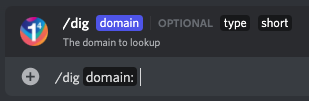

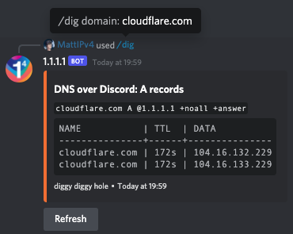

*`/dig domain: cloudflare.com`*

### Supported record types

Discord has a limit of 25 options in slash commands, so DNS over Discord offers the 25 most common DNS record types to choose from:

*   A
*   AAAA
*   CAA
*   CDNSKEY
*   CDS
*   CERT
*   CNAME
*   DNSKEY
*   DS
*   HINFO
*   HTTPS
*   LOC
*   MX
*   NAPTR
*   NS
*   PTR
*   SMIMEA
*   SOA
*   SPF
*   SRV
*   SSHFP
*   SVCB
*   TLSA
*   TXT
*   URI

To query other DNS record types, or multiple record types at once, use the `/multi-dig` command.

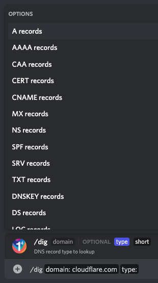

### Short form response

Much like the dig command itself, DNS over Discord has an optional flag in the dig command that allows the user to request a response in the short form.

When this is requested, the name and TTL columns will be excluded, with just the data column returned without the table formatting, similar to the equivalent dig command response.

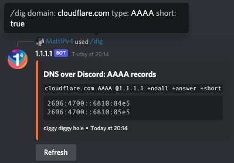

*`/dig domain: cloudflare.com type: AAAA short: true`*

### Refreshing existing results

As part of the response that the DNS over Discord bot returns for dig commands, there is a button to refresh the results.

Any user can press this button, triggering the bot to re-request the DNS query in the message and update the results in the message.

The refresh button is available on all responses to the dig command, including those that resulted in an error, such as an unknown domain or no records found.

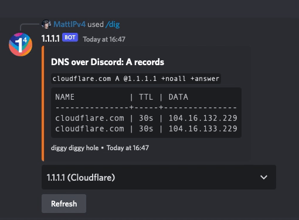

*`/dig domain: cloudflare.com`*

## multi-dig command

If you want to look up multiple DNS record types at once, use the `/multi-dig` command. This allows you to specify any supported DNS record type, and multiple types separated by a space.

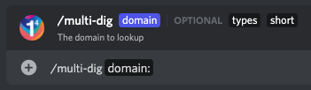

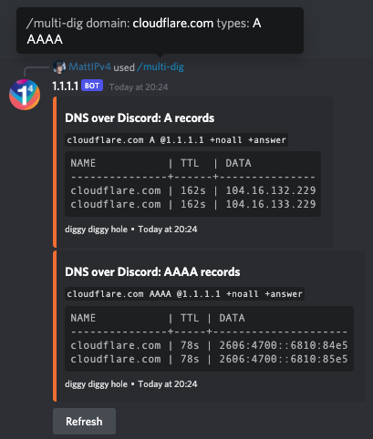

*`/multi-dig domain: cloudflare.com types: A AAAA`*

### Supported record types

When providing DNS record types for the `/multi-dig` command, Discord will not prompt you with options. Please provide a space-separated list of valid DNS record types to lookup, as any invalid options will be silently dropped. 'A' records will be used as the default if no valid types are given.

The following DNS record types are supported and considered valid by the bot:

*   A
*   AAAA
*   AFSDB
*   APL
*   CAA
*   CDNSKEY
*   CDS
*   CERT
*   CNAME
*   CSYNC
*   DHCID
*   DLV
*   DNAME
*   DNSKEY
*   DS
*   EUI48
*   EUI64
*   HINFO
*   HIP
*   HTTPS
*   IPSECKEY
*   KEY
*   KX
*   LOC
*   MX
*   NAPTR
*   NS
*   NSEC
*   NSEC3
*   NSEC3PARAM
*   OPENPGPKEY
*   PTR
*   RP
*   SMIMEA
*   SOA
*   SPF
*   SRV
*   SSHFP
*   SVCB
*   TA
*   TKEY
*   TLSA
*   TXT
*   URI
*   ZONEMD

*Use '\*' (asterisk) in place of a record type to get DNS results for all supported types.*

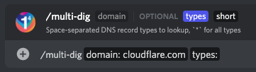

### Short form response

Like the main dig command, the multi-dig command also supports the optional short flag after the types have been specified in the slash command.

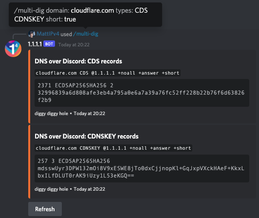

*`/multi-dig domain: cloudflare.com types: CDS CDNSKEY short: true`*

### Refreshing existing results

The multi-dig command also provides a refresh button below each set of DNS results requested (or after each block of 10 DNS record types if more than 10 were requested).

As with the dig command, any user can press the refresh button to refresh the displayed DNS results, including for DNS queries that had previously failed.

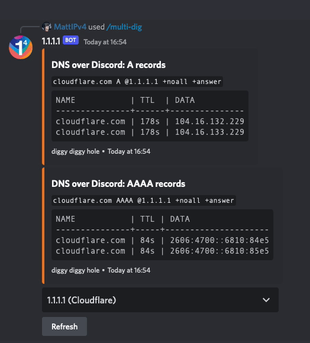

*`/multi-dig domain: cloudflare.com types: A AAAA`*

## whois command

The `/whois` command allows you to perform an RDAP/WHOIS lookup right in Discord for a given domain, IP or ASN.

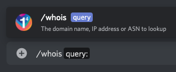

### Examples

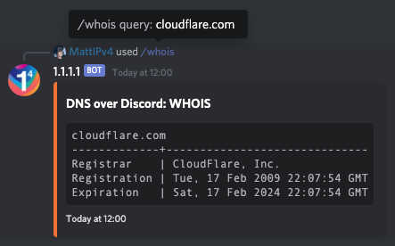

*`/whois query: cloudflare.com`*

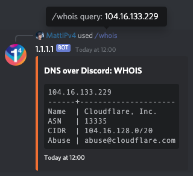

*`/whois query: 104.16.132.229`*

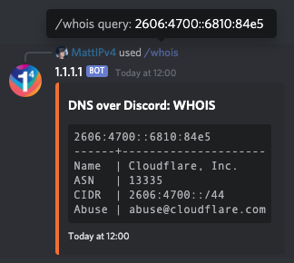

*`/whois query: 2606:4700::6810:84e5`*

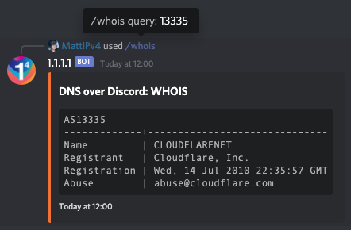

*`/whois query: 13335`*

## Other commands

The bot also has a set of helper commands available to get more information about the bot and quick links.

### help command

The `/help` command provides in-Discord documentation about all the commands available in the 1.1.1.1 DNS over Discord bot.

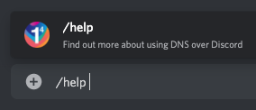

*`/help`*

### privacy command

The `/privacy` command displays the privacy policy notice for using the 1.1.1.1 DNS over Discord bot. This notice can also be viewed at <https://dns-over-discord.v4.wtf/privacy>.

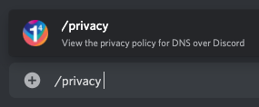

*`/privacy`*

### github command

The DNS over Discord bot is open-source, and the `/github` command provides a quick link to access the GitHub repository. The GitHub repository can be accessed at <https://github.com/MattIPv4/DNS-over-Discord/>.

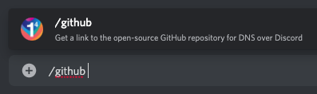

*`/github`*

### invite command

The `/invite` command provides the user with a quick link to invite the 1.1.1.1 DNS over Discord bot to another Discord server.
The bot can be invited at any time with <https://cfl.re/3nM6VfQ>.

*`/invite`*

***

## Development

The DNS over Discord bot is deployed on [Cloudflare Workers](https://workers.cloudflare.com/).

You can find the source code for the bot on GitHub, as well as information on getting started with contributing to the project, at <https://github.com/MattIPv4/DNS-over-Discord/>.
