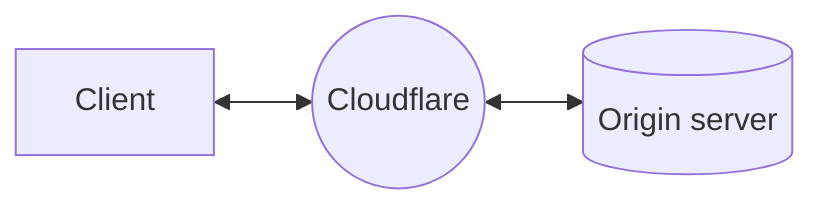
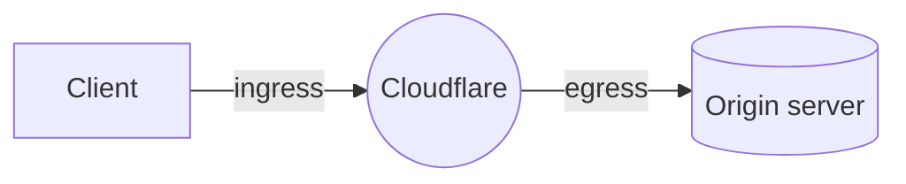

# How Cloudflare Aegis works


Cloudflare Aegis is available in early access to Enterprise customers. Contact your account team to request access.


When you use Cloudflare [as a reverse proxy](/fundamentals/concepts/how-cloudflare-works/#how-cloudflare-works-as-a-reverse-proxy), [Cloudflare's globl network](https://www.cloudflare.com/network/) sits between client requests and your origin servers.

Zooming in to what happens as a request routes through Cloudflare, you can consider two parts of the process: ingress and egress.

