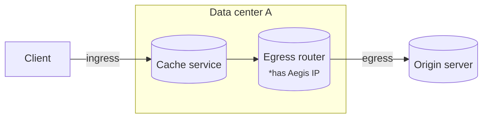
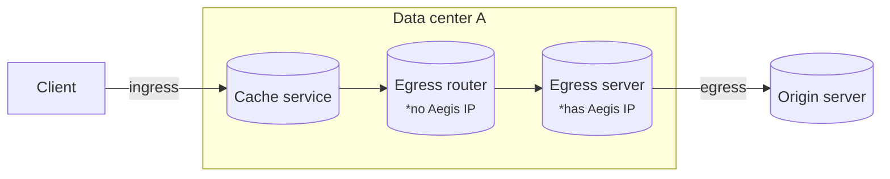
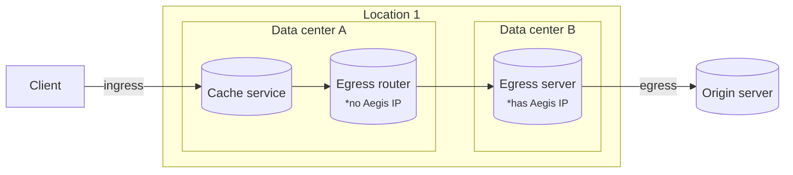
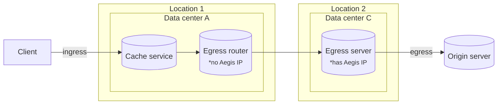

# Connection forwarding

```mermaid
flowchart LR
        accTitle: Cloudflare Aegis and connection forwarding
        accDescr: Diagram showing IPv4 connection forwarding for Cloudflare Aegis - Same data center.
        A[Client]
        subgraph Data center A
        X[(Cache service)] --> B[(Egress router <br/> <small>*has Aegis IP</small>)]
        end
        C[(Origin server)]

        A --ingress--> X
        B --egress--> C
```

```mermaid
flowchart LR
        accTitle: Cloudflare Aegis and connection forwarding
        accDescr: Diagram showing IPv4 connection forwarding for Cloudflare Aegis - Same data center.
        A[Client]
        subgraph Data center A
        X[(Cache service)] --> B[(Egress router <br/> <small>*no Aegis IP</small>)]
        B --> Y[(Egress server <br/> <small>*has Aegis IP</small>)]
        end
        C[(Origin server)]

        A --ingress--> X
        Y --egress--> C
```

```mermaid
flowchart LR
        accTitle: Cloudflare Aegis and connection forwarding
        accDescr: Diagram showing IPv4 connection forwarding for Cloudflare Aegis - Different data center.
        A[Client]
        subgraph Location 1
        subgraph Data center A
        X[(Cache service)] --> B[(Egress router <br/> <small>*no Aegis IP</small>)]
        end
        subgraph Data center B
        B --> Y[(Egress server <br/> <small>*has Aegis IP</small>)]
        end
        end
        C[(Origin server)]


        A --ingress--> X
        Y --egress--> C
```

```mermaid
flowchart LR
        accTitle: Cloudflare Aegis and connection forwarding
        accDescr: Diagram showing IPv4 connection forwarding for Cloudflare Aegis - Different location.
        A[Client]
        subgraph Location 1
          subgraph Data center A
          X[(Cache service)] --> B[(Egress router <br/> <small>*no Aegis IP</small>)]
          end
        end
        subgraph Location 2
          subgraph Data center C
            B --> Y[(Egress server <br/> <small>*has Aegis IP</small>)]
          end
        end
        C[(Origin server)]


        A --ingress--> X
        Y --egress--> C
```