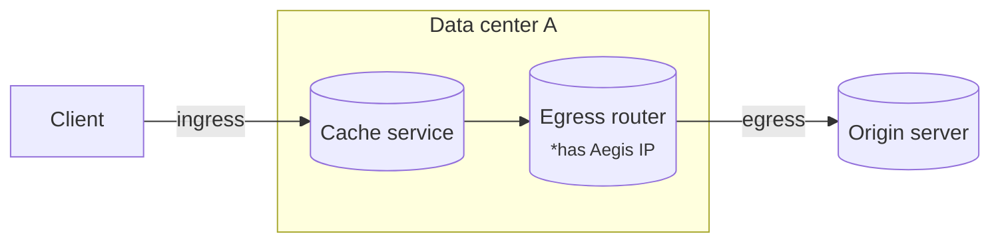
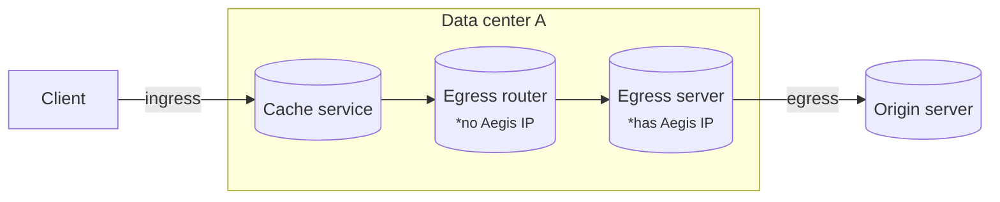
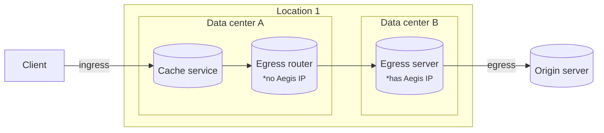
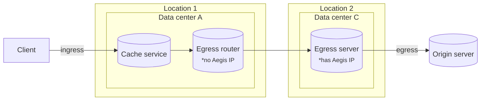

# Connection forwarding

After a request reaches Cloudflare on an ingress data center, and the cache service sends a request for the egress router to connect to your origin, the following scenarios are possible:

## Traffic can egress from the same server

If the server running the egress router has access to an applicable Aegis IP, traffic egresses from that server.

## Connection forwarding is needed

If the server does not have access to an applicable Aegis IP, the following options are checked and the first that is possible will take place:

* Another server in the same data center has access to an applicable Aegis IP and the connection is forwarded to that server.

* Another data center in the same location has access to an applicable Aegis IP and the connection is forwarded to that data center.

* Another data center in a different location has access to an applicable Aegis IP. The closest location is selected and connection is forwarded to that location.

