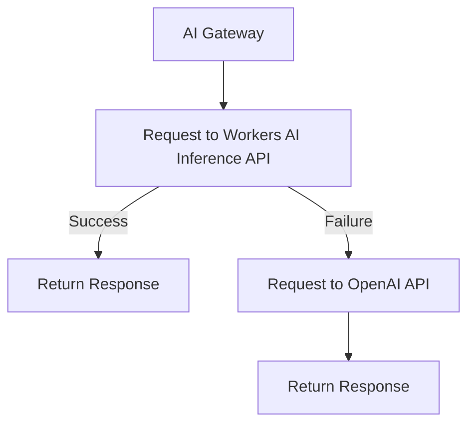

# Provider and model fallbacks

Specify model or provider fallback with your [Universal endpoint](/ai-gateway/providers/universal/) to specify what to do if a request fails.

## Example

For example, you could set up a gateway endpoint that:
1. Sends a request to Workers AI Inference API.
2. If that request fails, proceeds to OpenAI.

 

You can add as many fallbacks as you need, just by adding another object in the array.

