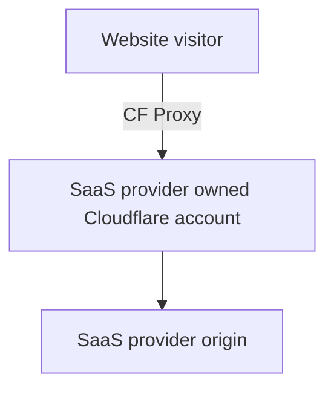
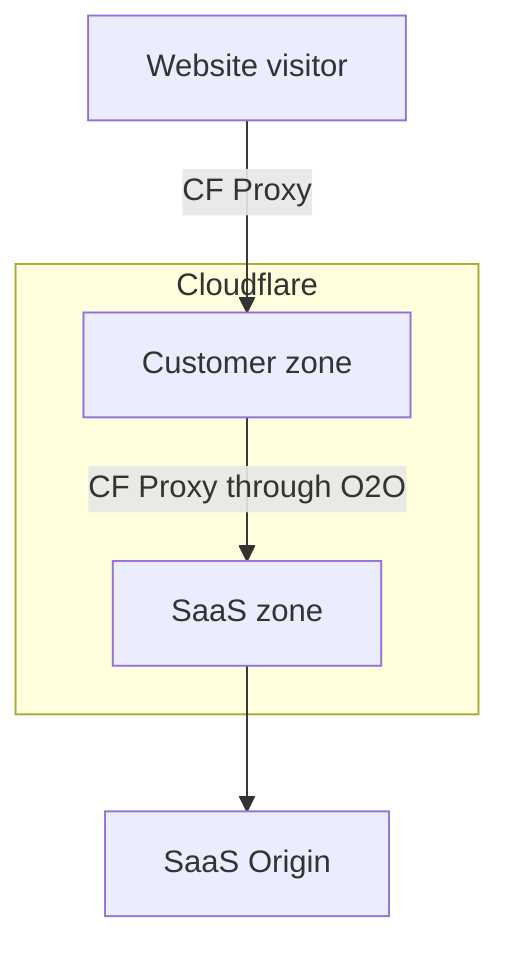

# How Orange-to-Orange (O2O) works

Orange-to-orange (O2O) is when a Cloudflare zone sends proxied traffic to another Cloudflare zone through Cloudflare.

## Without O2O

Without O2O, the settings of your SaaS provider override whatever settings are applied to your own Cloudflare zone.

## With O2O

With O2O, Cloudflare can apply the settings specified by both you and your SaaS provider.

