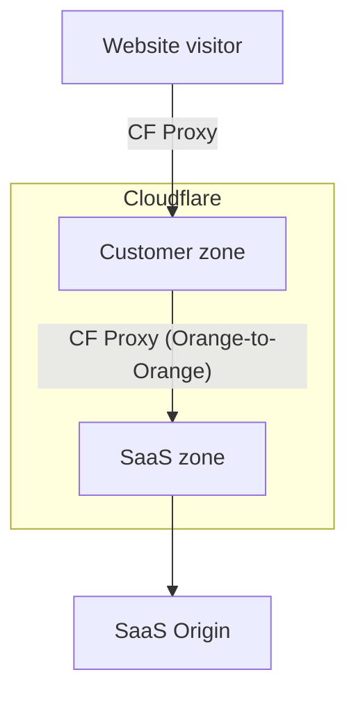

# How Orange-to-Orange (O2O) works

Orange-to-orange (O2O) is when a Cloudflare zone sends proxied traffic to another Cloudflare zone through Cloudflare.

This setup is commonly used when a Cloudflare Enterprise customer sending traffic to a [Cloudflare for SaaS customer](/cloudflare-for-platforms/cloudflare-for-saas/saas-customers/provider-guides/).

