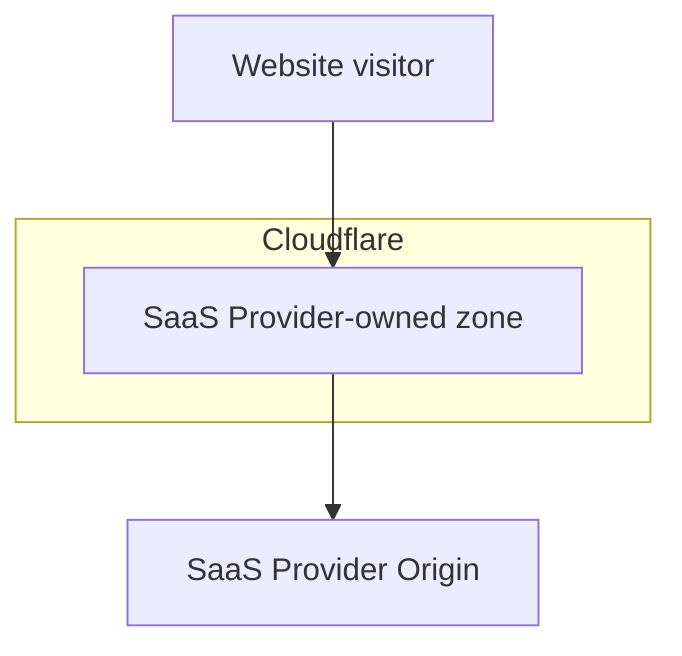
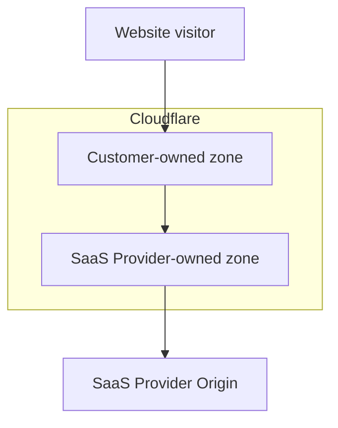

# How Orange-to-Orange (O2O) works

Orange-to-Orange (O2O) is a specific traffic routing configuration where traffic routes through two Cloudflare zones: the first Cloudflare zone is owned by customer 1 and the second Cloudflare zone is owned by customer 2, who is considered a SaaS Provider.

If one or more hostnames are onboarded to a SaaS Provider that uses Cloudflare products as part of their platform, specifically the [Cloudflare for SaaS product](/cloudflare-for-platforms/cloudflare-for-saas/), those hostnames will be created as Custom Hostnames in the SaaS Provider's zone. The Custom Hostnames must be activated to give the SaaS Provider permission to route traffic for the hostname through their zone.

## Without O2O

If you do not have your own Cloudflare zone and have only onboarded one or more of your hostnames to a SaaS Provider, then O2O will not be enabled.

Without O2O enabled, the settings configured in the SaaS Provider's zone will be applied to the traffic.

## With O2O

If you have your own Cloudflare zone and your zone contains a **Proxied** DNS record matching the Custom Hostname with a **CNAME** target provided by the SaaS Provider, then O2O will be enabled.

With O2O enabled, the settings configured in your Cloudflare zone will be applied to the traffic first, and then the settings configured in the SaaS Provider's zone will be applied to the traffic second.

