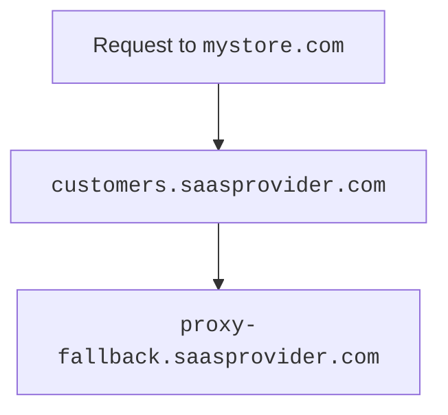

# Configuring Cloudflare for SaaS

---

## Before you begin

Before you start creating custom hostnames:

1. [Add](/fundamentals/get-started/setup/add-site/) your zone to Cloudflare on a **Free** plan.
2. [Enable](/cloudflare-for-platforms/cloudflare-for-saas/start/enable/) Cloudflare for SaaS for your zone.
3. (optional) Review the following documentation:

  - [API documentation](/fundamentals/api/) (if you have not worked with the Cloudflare API before).
  - [Hostname prioritization](/ssl/reference/certificate-and-hostname-priority/#hostname-priority-ssl-for-saas).
  - [Certificate validation](/cloudflare-for-platforms/cloudflare-for-saas/security/certificate-management/issue-and-validate/validate-certificates/).

---

## Initial setup

When you first [enable](/cloudflare-for-platforms/cloudflare-for-saas/start/enable/) Cloudflare for SaaS, you need to perform a few steps prior to creating any custom hostnames.

### Step 1 — Create fallback origin

The fallback origin is where Cloudflare will route traffic sent to your custom hostnames (must be proxied).



If you are an Enterprise customer, you can route custom hostnames to distinct origins by using [custom origin server](/cloudflare-for-platforms/cloudflare-for-saas/start/advanced-settings/custom-origin/).



To create your fallback origin:

1. [Create](/dns/manage-dns-records/how-to/create-dns-records/#create-dns-records) a proxied `A`, `AAAA`, or `CNAME` record pointing to the IP address of your **fallback origin** (where Cloudflare will send custom hostname traffic).

  

  | **Type** | **Name** | **IPv4 address** | **Proxy status** |
  | -------- | -------- | ---------------- | ---------------- |
  | `A`        | `proxy-fallback` | `192.0.2.1` | Proxied       |

  

2. Designate that record as your **fallback origin**.

  
  
  
  1. Log into the [Cloudflare dashboard](https://dash.cloudflare.com).
  2. Select your account and zone.
  3. Go to **SSL/TLS** > **Custom Hostnames**. 
  4. For **Fallback Origin**, enter the hostname for your fallback origin.
  5. Click **Add Fallback Origin**.
  
  
  
  
  Using the hostname of the record you just created, [update the fallback origin value](/api/operations/custom-hostname-fallback-origin-for-a-zone-update-fallback-origin-for-custom-hostnames).
  
  
  

3. Once you have added the fallback origin, confirm that its status is **Active**.

  When Cloudflare marks your fallback origin as **Active**, that only reflects that we are ready to send traffic to that DNS record.

  You need to make sure your DNS record is sending traffic to the correct origin location.
  
  

### Step 2 (optional) — Create CNAME target

The `CNAME` target — optional, but highly encouraged — provides a friendly and more flexible place for customers to [route their traffic](#step-5--have-customer-create-a-cname-record). You may want to use a subdomain such as `customers.<SAAS_PROVIDER>.com`.

[Create](/dns/manage-dns-records/how-to/create-dns-records/#create-dns-records) a proxied `CNAME` that points your `CNAME` target to your fallback origin (can be a wildcard such as `*.customers.saasprovider.com`).



| **Type** | **Name** | **IPv4 address** | **Proxy status** |
| -------- | -------- | ---------------- | ---------------- |
| `CNAME`       | `.customers` | `proxy-fallback.saasprovider.com` | Proxied       |



---

## Per-hostname setup

You need to perform the following steps for each custom hostname.

### Step 1 — Plan for validation

Before you create a hostname, you need to plan for:

1. [Certificate validation](/cloudflare-for-platforms/cloudflare-for-saas/security/certificate-management/issue-and-validate/validate-certificates/): Upon successful validation, the certificates are deployed to Cloudflare’s global network.
2. [Hostname validation](/cloudflare-for-platforms/cloudflare-for-saas/domain-support/hostname-validation/): Upon successful validation, Cloudflare proxies traffic for this hostname.

You must complete both these steps for the hostname to work as expected.



Depending on which method you select for each of these options, additional steps might be required for you and your customers.



### Step 2 — Create custom hostname

After planning for certification and hostname validation, you can create the custom hostname.

To create a custom hostname:




















### Step 3 — Have customer create CNAME record

To finish the custom hostname setup, your customer needs to set up a `CNAME` record at their authoritative DNS that points to [`CNAME` target](#step-2-optional--create-cname-target) [^1].



Before your customer does this step, confirm that the hostname's **Certificate status** and **Hostname status** are both **Active**. 

If not, confirm that you are using a method of [certificate](/cloudflare-for-platforms/cloudflare-for-saas/security/certificate-management/issue-and-validate/validate-certificates/http/#http-automatic) or [hostnames](/cloudflare-for-platforms/cloudflare-for-saas/domain-support/hostname-validation/realtime-validation/) validation that occurs after your customer adds their `CNAME` record.



Your customer's `CNAME` record might look like the following:

```txt
mystore.com CNAME customers.saasprovider.com
```

This record would route traffic in the following way:


<br/>

Requests to `mystore.com` would go to your `CNAME` target (`customers.saasprovider.com`), which would then route to your fallback origin (`proxy-fallback.saasprovider.com`).

[^1]: If you have [regional services](/data-localization/regional-services/) set up for your custom hostnames, Cloudflare always uses the processing region associated with your CNAME target record (instead of the processing region of any [custom origins](/cloudflare-for-platforms/cloudflare-for-saas/start/advanced-settings/custom-origin/)).

#### Service continuation

If your customer is also using Cloudflare for their domain, they should keep their `CNAME` record in place for as long as they want to use your service.

For more details, refer to [Remove custom hostnames](/cloudflare-for-platforms/cloudflare-for-saas/domain-support/remove-custom-hostnames/).