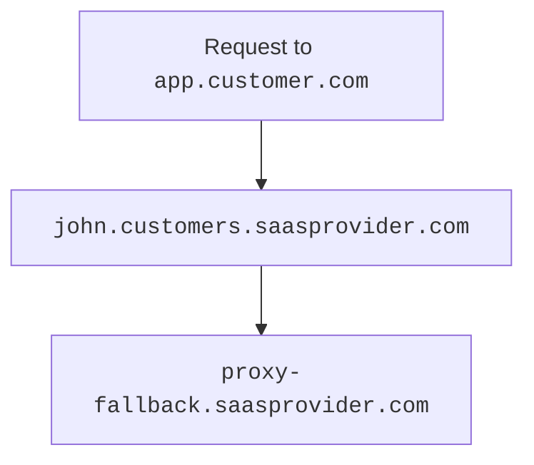

# Configuring Cloudflare for SaaS

---

## Prerequisites

Before you start creating custom hostnames:

1. [Add](/fundamentals/get-started/setup/add-site/) your zone on a **Free** plan and activate it on a [full setup](/dns/zone-setups/full-setup/) or [partial setup](/dns/zone-setups/partial-setup/).
2. [Enable](/cloudflare-for-platforms/cloudflare-for-saas/start/enable/) Cloudflare for SaaS for your zone.
3. (optional) Review the following documentation:
  - [API documentation](/fundamentals/api/) (if you have not worked with the Cloudflare API before).
  - [Hostname priority (Cloudflare for SaaS)](/ssl/reference/certificate-and-hostname-priority/#hostname-priority-ssl-for-saas) (if there are multiple proxied DNS records for a custom hostname, because Cloudflare must prioritize which record controls the zone settings and associated origin server).

---

## Initial setup

When you first [enable](/cloudflare-for-platforms/cloudflare-for-saas/start/enable/) Cloudflare for SaaS, you need to perform a few steps prior to creating any custom hostnames.

### Step 1 — Create fallback origin

The fallback origin is where Cloudflare will route traffic sent to your custom hostnames (must be proxied).

<details>
<summary>If you need more flexibility</summary>
<div>

You can also [use a Worker as your origin](/cloudflare-for-platforms/cloudflare-for-saas/start/advanced-settings/worker-as-origin/) or [create a custom origin server](/cloudflare-for-platforms/cloudflare-for-saas/start/advanced-settings/custom-origin/) to send traffic from one or more custom hostnames somewhere besides your default proxy fallback.

</div>
</details>

To create your fallback origin:

1. [Create](/dns/manage-dns-records/how-to/create-dns-records/#create-dns-records) a proxied `A`, `AAAA`, or `CNAME` record pointing to the IP address of your **fallback origin** (where Cloudflare will send custom hostname traffic).

  

  | **Type** | **Name** | **IPv4 address** | **Proxy status** |
  | -------- | -------- | ---------------- | ---------------- |
  | `A`        | `proxy-fallback` | `192.0.2.1` | Proxied       |

  

2. Designate that record as your **fallback origin**.

  
  
  
  1. Log into the [Cloudflare dashboard](https://dash.cloudflare.com).
  2. Select your account and zone.
  3. Go to **SSL/TLS** > **Custom Hostnames**. 
  4. For **Fallback Origin**, enter the hostname for your fallback origin.
  5. Click **Add Fallback Origin**.
  
  
  
  
  Using the hostname of the record you just created, [update the fallback origin value](/api/operations/custom-hostname-fallback-origin-for-a-zone-update-fallback-origin-for-custom-hostnames).
  
  
  

3. Once you have added the fallback origin, confirm that its status is **Active**.

  When Cloudflare marks your fallback origin as **Active**, that only reflects that we are ready to send traffic to that DNS record.

  You need to make sure your DNS record is sending traffic to the correct origin location.
  
  

### Step 2 (optional) — Create CNAME target

The `CNAME` target — optional, but highly encouraged — provides a friendly and more flexible place for customers to [route their traffic](#step-5--have-customer-create-a-cname-record).

We suggest using a domain other than your main company domain (`example.cloud` instead of `example.com`) to lower risk and add flexibility to your custom hostname management.

[Create](/dns/manage-dns-records/how-to/create-dns-records/#create-dns-records) a proxied `CNAME` that points your `CNAME` target to your fallback origin (can be a wildcard such as `*.customers.saasprovider.com`).



| **Type** | **Name** | **IPv4 address** | **Proxy status** |
| -------- | -------- | ---------------- | ---------------- |
| `CNAME`       | `*.customers` | `proxy-fallback.saasprovider.com` | Proxied       |



---

## Per-hostname setup

You need to perform the following steps for each custom hostname.

### Step 1 — Plan for validation and verification

Before you create a hostname, you need to plan for:

- [Certificate Validation](/cloudflare-for-platforms/cloudflare-for-saas/security/certificate-management/issue-and-validate/validate-certificates/): Upon successful validation, the certificates are deployed to Cloudflare’s global network.
- [Hostname Verification](/cloudflare-for-platforms/cloudflare-for-saas/domain-support/hostname-verification/): Upon successful verification, Cloudflare proxies traffic for this hostname.



Depending on which method you select for each of these options, additional steps might be required for you and your customers.



### Step 2 - Create custom hostname

After planning for certification validation and hostname verification, you can create the custom hostname.

To create a custom hostname:




















### Step 3 — Have customer create CNAME record

To finish the custom hostname setup, your customer needs to set up a `CNAME` record at their authoritative DNS that points to [`CNAME` target](#step-2-optional--create-cname-target) [^1].



Before your customer does this, confirm that you are prepared for both [certificate validation](/cloudflare-for-platforms/cloudflare-for-saas/security/certificate-management/issue-and-validate/validate-certificates/) and [hostname verification](/cloudflare-for-platforms/cloudflare-for-saas/domain-support/hostname-verification/). 

Otherwise, you may cause issues with their domain.



Your customer's `CNAME` record might look like the following:

```txt
app CNAME john.customers.saasprovider.com
```

This record would route traffic in the following way:


<br/>

Requests to `app.customer.com` would go to your `CNAME` target (`john.customers.saasprovider.com`), which would then route to your fallback origin (`proxy-fallback.saasprovider.com`).

[^1]: If you have [regional services](/data-localization/regional-services/) set up for your custom hostnames, Cloudflare always uses the processing region associated with your CNAME target record (instead of the processing region of any [custom origins](/cloudflare-for-platforms/cloudflare-for-saas/start/advanced-settings/custom-origin/)).