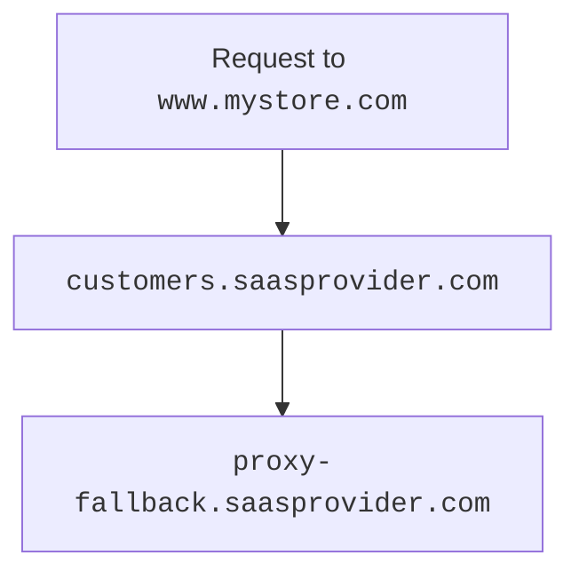

# Configuring Cloudflare for SaaS

---



---

## Initial setup


<br/>

### Step 1 — Create fallback origin



### Step 2 (optional) — Create CNAME target

The `CNAME` target — optional, but highly encouraged — provides a friendly and more flexible place for customers to [route their traffic](#step-3--have-customer-create-cname-record). You may want to use a subdomain such as `customers.<SAAS_PROVIDER>.com`.

[Create](/dns/manage-dns-records/how-to/create-dns-records/#create-dns-records) a proxied `CNAME` that points your `CNAME` target to your fallback origin (can be a wildcard such as `*.customers.saasprovider.com`).



| **Type** | **Name** | **IPv4 address** | **Proxy status** |
| -------- | -------- | ---------------- | ---------------- |
| `CNAME`       | `.customers` | `proxy-fallback.saasprovider.com` | Proxied       |



---

## Per-hostname setup



### Step 3 — Have customer create CNAME record

To finish the custom hostname setup, your customer needs to set up a `CNAME` record at their authoritative DNS that points to your [`CNAME` target](#step-2-optional--create-cname-target) [^1].



Your customer's `CNAME` record might look like the following:

```txt
www.mystore.com CNAME customers.saasprovider.com
```

This record would route traffic in the following way:


<br/>

Requests to `www.mystore.com` would go to your `CNAME` target (`customers.saasprovider.com`), which would then route to your fallback origin (`proxy-fallback.saasprovider.com`).

[^1]: 

#### Service continuation


