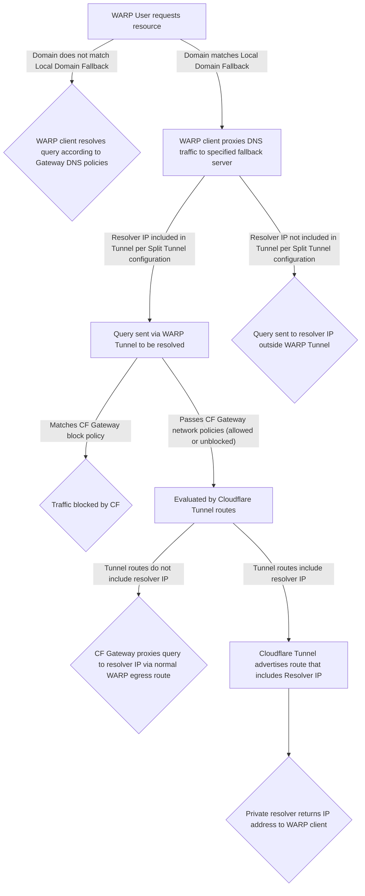

# Traffic routing with WARP

When the WARP client is deployed on a device, Cloudflare processes all DNS requests and network traffic by default. However, under certain circumstances, you may need to exclude specific DNS requests or network traffic from WARP.

There are three settings you can configure:

*   **Use [Local Domain Fallback](/cloudflare-one/connections/connect-devices/warp/configure-warp/route-traffic/local-domains/)** to instruct the WARP client to proxy DNS requests for a specified domain to a resolver that is not Cloudflare Gateway. This is useful when you have private hostnames that would not otherwise resolve on the public Internet.



DNS requests to domain names entered here will not be encrypted, monitored or subject to DNS policies by Cloudflare Gateway.



*   **Use the [Split Tunnels](/cloudflare-one/connections/connect-devices/warp/configure-warp/route-traffic/split-tunnels/) Exclude mode** to instruct the WARP client to ignore traffic to a specified set of IP addresses or domains. Any traffic that is destined to an IP address or domain defined in the Split Tunnels Exclude configuration will be ignored by the WARP client and handled by the local machine. Use this mode when you want the majority of your traffic encrypted and processed by Gateway, but need to exclude certain routes due to app compatibility, or if you need WARP to run alongside a VPN.

*   **Use the [Split Tunnels](/cloudflare-one/connections/connect-devices/warp/configure-warp/route-traffic/split-tunnels/) Include mode** mode to instruct the WARP client to only handle traffic to a specified set of IP addresses or domains. Any traffic that is not included by IP address or domains defined in the Split Tunnel Include configuration will be ignored by the WARP client and handled by the local machine. Use this mode when you only want specific traffic processed by Gateway, such as when using Tunnels for a specific resource.



Traffic excluded from WARP by Split Tunnel configuration will not be encrypted, managed or monitored by Cloudflare Gateway.



## How the WARP client handles DNS requests

When you use the WARP client together with `cloudflared` Tunnels or third-party VPNs, Cloudflare evaluates each request and routes it according to the following traffic flow.

