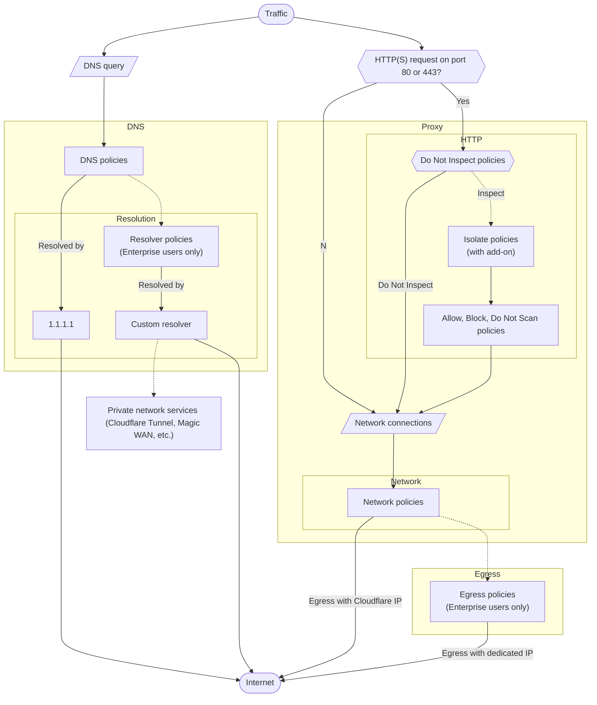

---
_build:
  publishResources: false
  render: never
  list: never
---

## Priority between policy builders

Gateway applies your policies in the following order:

1. DNS policies with selectors evaluated before resolution
2. DNS policies with selectors evaluated after resolution
3. HTTP policies
4. Network policies
5. Egress policies (if applicable)

DNS policies are standalone. For example, if you block a site with a DNS policy but do not create a corresponding HTTP policy, users can still access the site if they know its IP address.

Next, Gateway evaluates HTTP policies in [a specific order](#http-policies). For example, if you block a specific source IP in an HTTP policy but allow the IP range in a network policy, the IP address will be blocked.

Lastly, if traffic passes your HTTP policies, Gateway checks the traffic against your network policies. For example, even if you create a Do Not Inspect HTTP policy for a site, it can be blocked by a subsequent network policy.

### HTTP/3 traffic

For proxied [HTTP/3 traffic](/cloudflare-one/policies/gateway/http-policies/http3/), Gateway applies your policies in the following order:

1. DNS policies
2. Network policies
3. HTTP policies

## Priority within a policy builder

### DNS policies

Gateway evaluates DNS policies first in order of DNS resolution, then in [order of precedence](#order-of-precedence).

When DNS queries are received, Gateway evaluates policies with pre-resolution selectors, resolves the DNS query, then evaluates policies with post-resolution selectors. This means policies with selectors evaluated before DNS resolution take precedence. For example, the following set of policies will block `example.com`:

| Precedence | Selector                        | Operator | Value         | Action |
| ---------- | ------------------------------- | -------- | ------------- | ------ |
| 1          | Resolved Country IP Geolocation | is       | United States | Allow  |
| 2          | Domain                          | is       | `example.com` | Block  |

Despite an explicit Allow policy ordered first, policy 2 takes precedence because the _Domain_ selector is evaluated before DNS resolution.

If a policy contains both pre-resolution and post-resolution selectors, Gateway will evaluate the entire policy after DNS resolution. For information on when each selector is evaluated, refer to the [list of DNS selectors](/cloudflare-one/policies/gateway/dns-policies/#selectors).

### Network policies

Gateway evaluates network policies in [order of precedence](#order-of-precedence).

### HTTP policies

Gateway applies HTTP policies based on a combination of [action type](/cloudflare-one/policies/gateway/http-policies/#actions) and [order of precedence](#order-of-precedence):

1. All Do Not Inspect policies are evaluated first, in order of precedence.
2. If no policies match, all Isolate policies are evaluated in order of precedence.
3. All Allow, Block and Do Not Scan policies are evaluated in order of precedence.

This order of enforcement allows Gateway to first determine whether decryption should occur. If a site matches a Do Not Inspect policy, it is automatically allowed through Gateway and bypasses all other HTTP policies.


The only exception is if you are using [Clientless Web Isolation](/cloudflare-one/policies/browser-isolation/setup/clientless-browser-isolation/) — all sites within the clientless remote browser are implicitly isolated even if they match a Do Not Inspect policy.


Next, Gateway checks decrypted traffic against your Isolate policies. When a user makes a request which triggers an Isolate policy, the request will be rerouted to a [remote browser](/cloudflare-one/policies/browser-isolation/).

Lastly, Gateway evaluates all Allow, Block, and Do Not Scan policies. These policies apply to both isolated and non-isolated traffic. For example, if `example.com` is isolated and `example.com/subpage` is blocked, Gateway will block the subpage inside of the remote browser.

### Order of precedence




To avoid conflicts, Terraform applies a hash calculation to precedences. For example, a precedence of `1000` may become `1000901`. This can cause errors when reordering policies. To avoid this issue, manually set the precedence of your policies via the [Cloudflare API](/api/operations/zero-trust-gateway-rules-update-zero-trust-gateway-rule).


## Example

Suppose you have a list of policies arranged in the following order of precedence:

- DNS policies:
  
- HTTP policies:
  | Precedence | Selector | Operator | Value               | Action         |
  | ---------- | -------- | -------- | ------------------- | -------------- |
  | 1          | Host     | is       | `example.com`       | Block          |
  | 2          | Host     | is       | `test2.example.com` | Do Not Inspect |
- Network policies:
  | Precedence | Selector         | Operator | Value              | Action |
  | ---------- | ---------------- | -------- | ------------------ | ------ |
  | 1          | Destination Port | is       | `80`               | Block  |
  | 2          | Destination port | is       | `443`              | Allow  |
  | 3          | SNI Domain       | is       | `test.example.com` | Block  |

When a user goes to `https://test.example.com`, Gateway performs the following operations:

1. Evaluate DNS request against DNS policies:
   

2. Evaluate HTTPS request against HTTP policies:

   1. Policy #2 is evaluated first because Do Not Inspect [always takes precedence](#http-policies) over Allow and Block. Since there is no match, move on to check Policy #1.
   2. Policy #1 does not match `test.example.com`. Since there are no matching Block policies, the request passes the HTTP filter and moves on to network policy evaluation.

3. Evaluate HTTPS request against network policies:

   1. Policy #1 does not match because port 80 is used for standard HTTP, not HTTPS.
   2. Policy #2 matches, so the request is allowed and proxied to the upstream server.
   3. Policy #3 is not evaluated because there has already been an explicit match.

Therefore, the user is able to connect to `https://test.example.com`.
