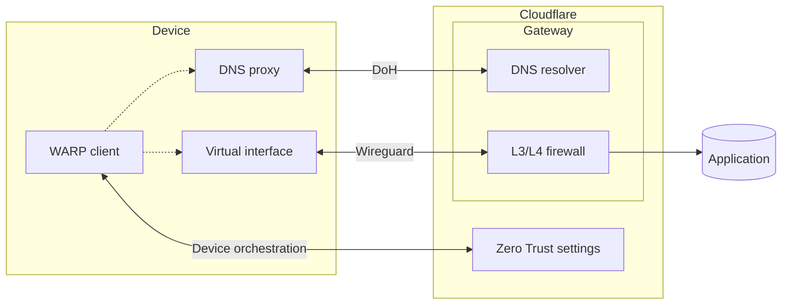
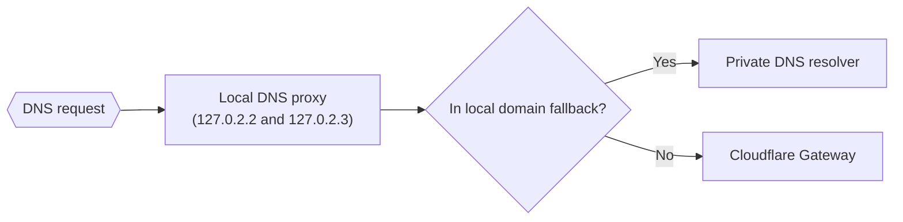
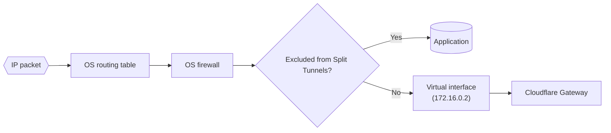

# WARP architecture

This guide explains how the Cloudflare WARP client interacts with a device’s operating system to route traffic and enforce Zero Trust policies.

## Overview

The WARP client allows IT administrators to have granular control over the applications an end user device can access. The software consists of two components: a service/daemon that handles all WARP functionality on your device, and a GUI wrapper that makes it easier for a user to interact with the daemon. The daemon forwards DNS and network traffic from the device to Cloudflare’s global network, where Zero Trust policies are applied in the cloud.

On all operating systems, the WARP daemon maintains three long-lived connections between the device and Cloudflare:
| Connection | Protocol | Purpose |
| -----------|----------|---------|
| Device orchestration | HTTPS | Perform user registration, check device posture, apply WARP profile settings. |
| DoH | HTTPS | Send DNS requests to Gateway for DNS policy enforcement. |
| Wireguard | UDP | Send IP packets to Gateway for network and HTTP policy enforcement. |



Your [Local Domain Fallback](/cloudflare-one/connections/connect-devices/warp/configure-warp/route-traffic/local-domains/) configuration determines which DNS requests are sent to the DoH endpoint. Your [Split Tunnel](/cloudflare-one/connections/connect-devices/warp/configure-warp/route-traffic/split-tunnels/) configuration determines what IP traffic is sent down the Wireguard tunnel. Note that Split Tunnel rules do not apply to device orchestration and DoH traffic since those connections operate outside of the Wireguard tunnel.

Next, you will learn how WARP configures your operating system to apply your Local Domain Fallback and Split Tunnel routing rules. Implementation details differ between desktop and mobile clients.

## Windows, macOS, and Linux

### DNS traffic

When you turn on WARP, WARP creates a local DNS proxy on the device and binds it to these IP addresses on port 53 (the port designated for DNS traffic):

- **IPv4**: `127.0.2.2` and `127.0.2.3`
- **IPv6**: `fd01:db8:1111::2` and `fd01:db8:1111::3`

WARP then configures the operating system to send all DNS requests to these IP addresses. All network interfaces on the device will now use this local DNS proxy for DNS resolution. In other words, all DNS traffic will now be handled by the WARP client.

Based on your Local Domain Fallback configuration, WARP will either forward the request to Gateway for DNS policy enforcement or forward the request to your private DNS resolver.



To verify that the operating system is using WARP's local DNS proxy, run `scutil --dns` on macOS/Linux or `ipconfig` on Windows. As shown in the example below, the nameservers should be set to `127.0.2.2` and `127.0.2.3`.

```sh
---
highlight: 5-6
---
$ scutil --dns
DNS configuration (for scoped queries)
resolver #1
  search domain[0] : fios-router.home
  nameserver[0] : 127.0.2.2
  nameserver[1] : 127.0.2.3
  if_index : 15 (en0)
  flags    : Scoped, Request A records
  reach    : 0x00030002 (Reachable,Local Address,Directly Reachable Address)
resolver #2
  nameserver[0] : 127.0.2.2
  nameserver[1] : 127.0.2.3
  nameserver[2] : fd01:db8:1111::2
  nameserver[3] : fd01:db8:1111::3
  if_index : 23 (utun3)
  flags    : Scoped, Request A records, Request AAAA records
  reach    : 0x00030002 (Reachable,Local Address,Directly Reachable Address)
```


WARP does not create a local DNS proxy in [Secure Web Gateway without DNS filtering](/cloudflare-one/connections/connect-devices/warp/configure-warp/warp-modes/#secure-web-gateway-without-dns-filtering) mode.


### IP traffic

When you turn on WARP, WARP makes three changes on the device to enable IP routing:

- Creates a virtual network interface.
- Modifies the operating system routing table according to your Split Tunnel rules.
- Modifies the operating system firewall according to your Split Tunnel rules.



#### Virtual interface

Virtual interfaces allow the operating system to logically subdivide a physical interface, such as a network interface controller (NIC), into separate interfaces for the purposes of routing IP traffic. WARP’s virtual interface is what maintains the Wireguard connection between the device and Cloudflare.

To view a list of all network interfaces, run `ifconfig` on macOS/Linux or `ipconfig` on Windows.  When WARP is turned on, you will see a `utun` interface on macOS/Linux or a [`wintun`](https://www.wintun.net/) interface on Windows. The IP address for the virtual interface is hardcoded as `172.16.0.2`. For example,

```sh
---
highlight: 4
---
$ ifconfig
<redacted>
utun3: flags=8051<UP,POINTOPOINT,RUNNING,MULTICAST> mtu 1280
	inet 172.16.0.2 --> 172.16.0.2 netmask 0xffffffff 
	inet6 fe80::f6d4:88ff:fe82:6d9e%utun3 prefixlen 64 scopeid 0x17 
	inet6 2606:4700:110:8c7d:7369:7526:a59b:5636 prefixlen 128 
	nd6 options=201<PERFORMNUD,DAD>
```

#### Routing table

WARP edits the system routing table to control what traffic goes down the Wireguard tunnel to Gateway. The routing table indicates which network interface should handle packets to a particular IP address.

To view the routing table:

```sh
$ netstat -r
```

On macOS/Linux, you can also lookup the routing table entry for a particular domain. In the following example, we see that traffic to `google.com` is sent through `utun3`, which is the WARP virtual interface on this device:

```sh
---
highlight: 5
---
$ route get google.com
   route to: lga25s81-in-f14.1e100.net
destination: 136.0.0.0
       mask: 248.0.0.0
  interface: utun3
      flags: <UP,DONE,PRCLONING>
 recvpipe  sendpipe  ssthresh  rtt,msec    rttvar  hopcount      mtu     expire
       0         0         0         0         0         0      1280         0 
```

IPs and domains on your Split Tunnel exclude list will use the default interface on your device. For example, this DHCP address is excluded from WARP and uses `en0`:

```sh
---
highlight: 5
---
$ route get 169.254.0.0   
   route to: 169.254.0.0
destination: 169.254.0.0
       mask: 255.255.0.0
  interface: en0
      flags: <UP,DONE,CLONING,STATIC>
 recvpipe  sendpipe  ssthresh  rtt,msec    rttvar  hopcount      mtu     expire
       0         0         0         0         0         0      1500   -210842 
```

#### System firewall

In Split Tunnel Exclude mode, WARP also modifies the operating system firewall to enforce your Split Tunnel rules. This adds a layer of protection in case a service bypasses the routing table and tries to send traffic directly through another interface. For example, if `www.example.com` is supposed to be inspected by Gateway, we create a firewall rule that only allows traffic to `www.example.com` to use our `utun` interface.

## iOS, Android, and ChromeOS

On iOS and Android/ChromeOS, the Cloudflare One Agent installs itself as a VPN client to capture and route all traffic. The app is built on the official VPN framework for iOS and Android. For more information, refer to Apple’s [NetworkExtension documentation](https://developer.apple.com/documentation/networkextension) and Google’s [Android developer documentation](https://developer.android.com/guide/topics/connectivity/vpn).

Note that ChromeOS runs the Android app in a virtual machine, rather than running a native Chrome app.
