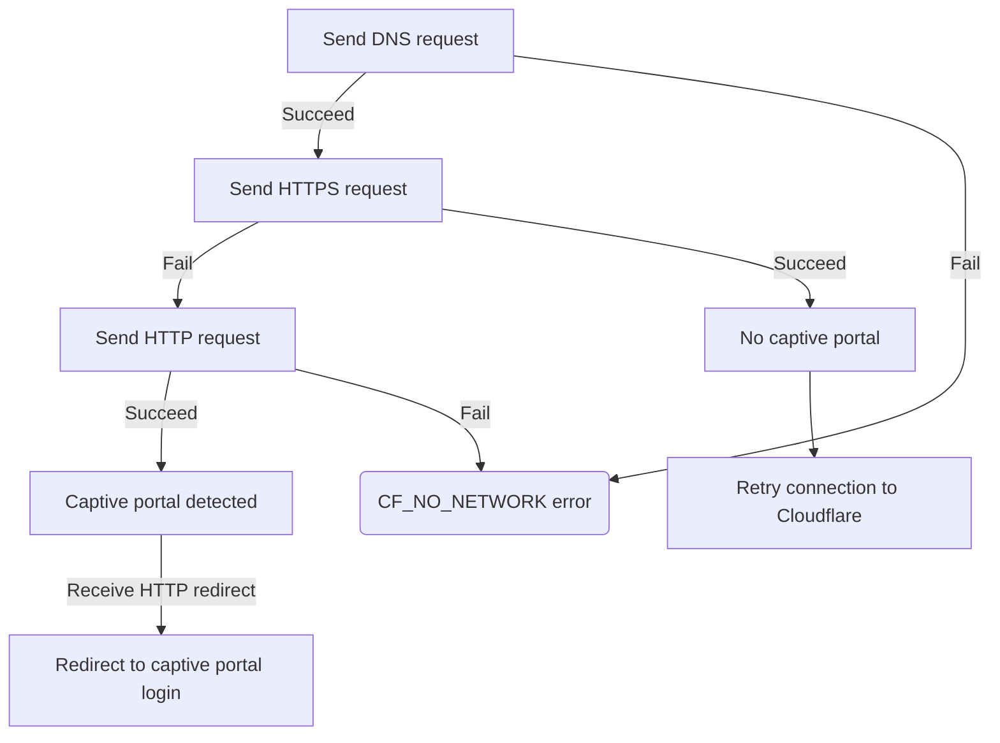

# Captive portal detection

Captive portals are used by public Wi-Fi networks (such as airports, coffee shops, and hotels) to make a user agree to their Terms of Service or provide payment before allowing access to the Internet. When a user connects to the Wi-Fi, the captive portal blocks all HTTPS traffic until the user completes a captive portal login flow in their browser. This prevents the WARP client from connecting to Cloudflare. At the same time, WARP creates [firewall rules](/cloudflare-one/connections/connect-devices/warp/configure-warp/route-traffic/warp-architecture/#ip-traffic) on the device to send all traffic to Cloudflare. The user is therefore unable to access the captive portal login screen unless they temporarily disable WARP.

## Allow users to connect to captive portals

To allow users to connect through a captive portal, administrators can configure the following WARP settings:

### No user interaction required

- Enable [Captive portal detection](/cloudflare-one/connections/connect-devices/warp/configure-warp/warp-settings/#captive-portal-detection). This allows WARP to temporarily turn off when it detects a captive portal on the network. For more details, refer to [how captive portal detection works](#how-captive-portal-detection-works) and its [limitations](#limitations).
- Set [Device tunnel protocol](/cloudflare-one/connections/connect-devices/warp/configure-warp/warp-settings/#device-tunnel-protocol) to **MASQUE**. When using MASQUE, WARP traffic will look like standard HTTPS traffic and is therefore less likely to be blocked by captive portals.

### User interaction required

- Enable [Lock WARP switch](/cloudflare-one/connections/connect-devices/warp/configure-warp/warp-settings/#lock-warp-switch) and enable [Admin override](/cloudflare-one/connections/connect-devices/warp/configure-warp/warp-settings/#admin-override). Users can contact the IT administrator for a one-time code that allows them to manually turn off WARP and connect to a portal.
- For employees who travel, disable [Lock WARP switch](/cloudflare-one/connections/connect-devices/warp/configure-warp/warp-settings/#lock-warp-switch) and set an [Auto connect](/cloudflare-one/connections/connect-devices/warp/configure-warp/warp-settings/#auto-connect) duration. This allows the user to manually turn off WARP without contacting IT.

## How captive portal detection works

If WARP cannot establish a connection to Cloudflare, it will:
1. Temporarily open the [system firewall](/cloudflare-one/connections/connect-devices/warp/configure-warp/route-traffic/warp-architecture/#ip-traffic) so that the device can send traffic outside of the WARP tunnel. The firewall only allows the following traffic:

    - HTTP/HTTPS on TCP ports `80`, `443`, `8080`, and `8443`
    - DNS on UDP port `53`

2. Send a series of requests to the [captive portal test URLs](/cloudflare-one/connections/connect-devices/warp/deployment/firewall/#captive-portal). If the HTTPS request is intercepted, WARP assumes the network is behind a captive portal.
3. Open a browser window with the captive portal login screen if the captive portal sends a redirect HTTP response code (`302`, `303`, `307`, or `308`).
4. Automatically re-enable the firewall after the configured timeout period.

## Limitations

- Due to [how captive portal detection works](#how-captive-portal-detection-works), it may be possible for an employee to spoof a captive portal in order to turn off WARP.
- Some captive portals, particularly those on airlines, may be slow to respond and exceed the captive portal detection timeout. Users will likely see a [CF_CAPTIVE_PORTAL_TIMED_OUT](/cloudflare-one/connections/connect-devices/warp/troubleshooting/client-errors/#cf_captive_portal_timed_out) error when they try to connect.
- WARP may not be able to detect multi-stage captive portals, which redirect the user to different networks during the login process. Users will need to manually turn off WARP to get through the captive portal.
- Some public Wi-Fi networks are incompatible with running WARP:

  - Captive portals that intercept all DNS traffic will block WARP's [DoH connection](/cloudflare-one/connections/connect-devices/warp/configure-warp/route-traffic/warp-architecture/#overview). Users will likely see a [CF_NO_NETWORK](/cloudflare-one/connections/connect-devices/warp/troubleshooting/client-errors/#cf_no_network) error after they login to the captive portal.
  - Captive portals that only allow HTTPS traffic will block WARP's [Wireguard UDP connection](/cloudflare-one/connections/connect-devices/warp/configure-warp/route-traffic/warp-architecture/#overview). Users will likely see a [CF_HAPPY_EYEBALLS_MITM_FAILURE](/cloudflare-one/connections/connect-devices/warp/troubleshooting/client-errors/#cf_happy_eyeballs_failure) error after they login to the captive portal.
