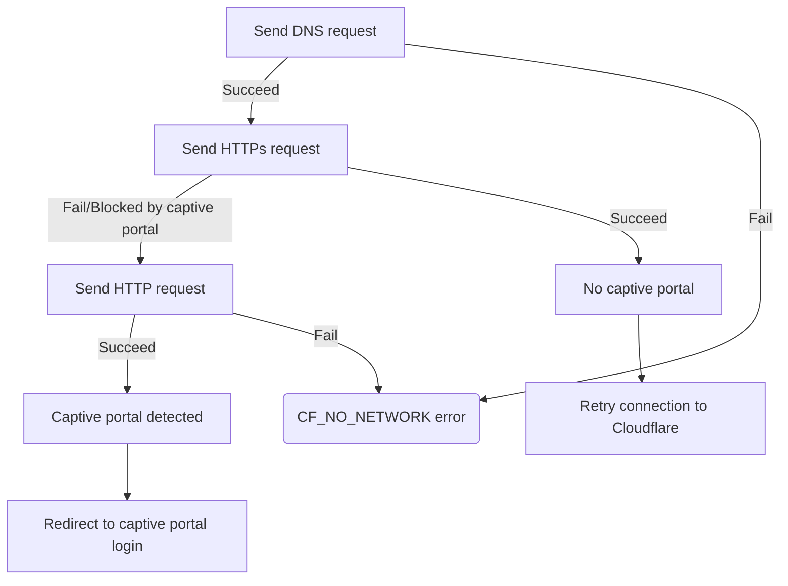

# Captive portal detection

Captive portals are used by public Wi-Fi networks (such as airports, coffee shops, and hotels) to make a user agree to their Terms of Service or provide payment before allowing access to the Internet. When a user connects to the Wi-Fi, the captive portal blocks all HTTPS traffic until the user completes a captive portal login flow in their browser. This prevents the WARP client from connecting to Cloudflare. At the same time, WARP creates [firewall rules](/cloudflare-one/connections/connect-devices/warp/configure-warp/route-traffic/warp-architecture/#ip-traffic) on the device to send all traffic to Cloudflare. The user is therefore unable to access the captive portal login screen unless they temporarily disable WARP.

## Allow users to connect to captive portals

To allow users to connect through a captive portal, administrators can configure the following WARP settings:

- Enable [Captive portal detection](/cloudflare-one/connections/connect-devices/warp/configure-warp/warp-settings/#captive-portal-detection).
- Set an [Auto connect](/cloudflare-one/connections/connect-devices/warp/configure-warp/warp-settings/#auto-connect) time period.
- If WARP fails to automatically detect a portal, provide an [admin override code](/cloudflare-one/connections/connect-devices/warp/configure-warp/warp-settings/#admin-override) to your end users. This will allow users to manually turn off WARP and connect to the portal. WARP will automatically turn back on after the auto connect period.
- Disable [Lock WARP switch](/cloudflare-one/connections/connect-devices/warp/configure-warp/warp-settings/#lock-warp-switch).

## How captive portal detection works

When [Captive portal detection](/cloudflare-one/connections/connect-devices/warp/configure-warp/warp-settings/#captive-portal-detection) is enabled, WARP temporarily opens the [system firewall](/cloudflare-one/connections/connect-devices/warp/configure-warp/route-traffic/warp-architecture/#ip-traffic) if it cannot connect to Cloudflare's global network. WARP then sends a series of requests to the [captive portal test URLs](/cloudflare-one/connections/connect-devices/warp/deployment/firewall/#captive-portal). If a captive portal is detected, a browser window opens with the captive portal login screen. WARP automatically re-enables the firewall after the configured timeout period.

## Limitations
