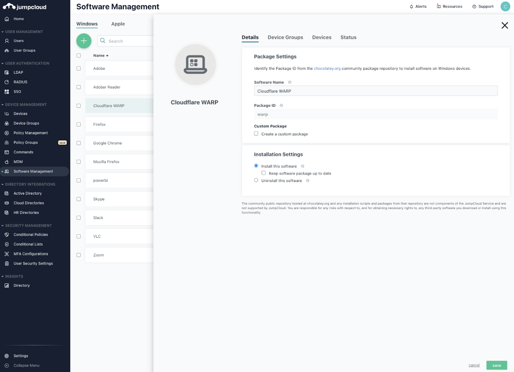

# JumpCloud

## Windows

1.  Log in to the [JumpCloud Admin Portal](https://console.jumpcloud.com).

2.  Navigate to **Device Management** > **Software Management**.

3.  Select the *Windows* tab, then click (+).

    

4.  Enter a unique display name in the *Software Name* field.

5.  Enter `warp` into the *Package ID* field.

6.  Select **Install this software**.

7.  (Optional) Select *Keep software package up to date* to automatically update this app as updates become available.

8.  (Optional) Select *Allow end users to delay updates for up to one week* to avoid updates during a busy time.

9.  Click **save**.

### Deploy the client to a single MDM-managed device

1.  Log in to the [JumpCloud Admin Portal](https://console.jumpcloud.com).
2.  Navigate to **Device Management** > **Software Management**.
3.  Select the *Windows* tab and select the app you want to deploy.
4.  Select the *Devices* tab.
5.  Select the devices where you want to deploy the app.
6.  Click **save**.
7.  Click **save** again.

### Deploy the client to an MDM-managed device group

1.  Log in to the [JumpCloud Admin Portal](https://console.jumpcloud.com).
2.  Navigate to **Device Management** > **Software Management**.
3.  Select the *Windows* tab and select the app you want to deploy.
4.  Select the *Device Groups* tab.
5.  Select the groups that you want to deploy the app to.
6.  Click **save**.
7.  Click **save** again.

## macOS

1.  Log in to the [JumpCloud Admin Portal](https://console.jumpcloud.com).

2.  Navigate to **Device Management** > **Software Management**.

3.  Select the *Apple* tab, then click (+).

    

4.  On the *Details* tab, enter a unique display name in **Software Description**.

5.  Add the app's URL location to **Software Package URL**.

### Deploy the client to a single MDM-managed device

1.  Select the *Devices* tab.
2.  Select the devices where this app will be deployed. To select all devices, select the checkbox next to **Type**.
3.  Click **save** to install the client.
    Verify that Cloudflare was installed by selecting the app and selecting the Status tab.

### Deploy the client to an MDM-managed device group

1.  Select the *Device Groups* tab.
2.  Select the groups where this app will be deployed. To select all device groups, select the checkbox next to **Type**.
3.  Click **save** to install the client.
