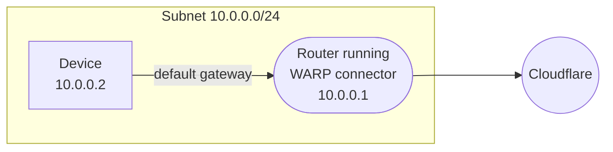
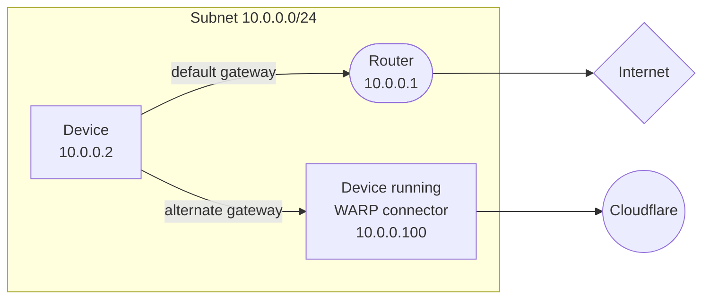
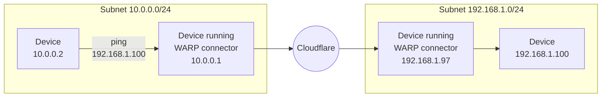

# Set up WARP connector

Cloudflare WARP connector is a piece of software that enables site-to-site, bidirectional, and mesh networking connectivity without requiring changes to underlying network routing infrastructure. WARP connector establishes a secure Layer 3 connection between a private network and Cloudflare, allowing you to:

- Connect two or more private networks to each other.
- Connect IoT devices that cannot run external software, such as printers and IP phones.
- Filter and log traffic server-initiated traffic, such as VoIP and SIP traffic.
- Apply Zero Trust security policies based on the source IP of the request.


As shown in the diagram, WARP connector acts as a router for a subnet within the private network to on-ramp and off-ramp traffic through Cloudflare. All devices on the subnet can access any services connected to Cloudflare, and all devices connected to Cloudflare can access any services on the subnet. Each subnet runs a WARP connector on a designated Linux machine (typically the default gateway router), but other devices on the network do not need to install software.

This guide will cover how to connect two independent subnets, for example `10.0.0.0/24` and `192.168.1.0/24`.

## 1. Create a service token

[Create a new service token](/cloudflare-one/identity/service-tokens/#create-a-service-token) and copy its **Client ID** and **Client Secret**. WARP connector will use this service token to authenticate with your Zero Trust organization.

## 2. Add a device enrollment rule

Next, create a device enrollment rule that allows the WARP connector to authenticate:

1. In [Zero Trust](https://one.dash.cloudflare.com), go to **Settings** > **WARP Client**.
2. In the **Device enrollment** card, select **Manage**.
3. Select **Add a rule**.
4. Name the rule and configure the following fields:

    | Rule Action  | Rule type | Selector      | Value          |
    | ------------ | --------- | ------------- | -------------- |
    | Service Auth | Include   | Service Token | `<SERVICE-TOKEN-NAME>` |

5. Select **Save**.

## 3. Turn on WARP-to-WARP

To allow a WARP connector to connect to services behind another WARP connector:

1. In [Zero Trust](https://one.dash.cloudflare.com), go to **Settings** > **Network**.
2. Enable **Warp-to-Warp**.

## 4. Install a WARP connector

Each subnet must run its own WARP connector on a Linux host.  Installing on your router is the simplest setup, but if you do not have access to the router, you may choose any other machine on the subnet. For system requirements, refer to the [WARP downloads page](/cloudflare-one/connections/connect-devices/warp/download-warp/#linux).

In this example, we will create a WARP connector for subnet `10.0.0.0/24` and install it on `10.0.0.1`. We will then create a second WARP connector for subnet `192.168.1.0/24` and install it on `192.168.1.97`.

1. In [Zero Trust](https://one.dash.cloudflare.com), go to **Network** > **Tunnels**.
2. Select **Create a tunnel**.
3. For the connector type, select **WARP**. Select **Next**.
4. A window will appear with a list of prerequisites. Select **Confirm** to continue.
5. Give the tunnel any name (for example, `Subnet-10.0.0.0/24`) and select **Save tunnel**.
6. Select the operating system of your host machine.
7. Copy-paste the command into a terminal window and run the command.
8. To authenticate the WARP connector to your Zero Trust organization:
    1. Create an `mdm.xml` file in `/var/lib/cloudflare-warp` using any text editor:

      ```sh
      $ cd /var/lib/cloudflare-warp
      $ sudo vim mdm.xml
      ```
    2. Add the following text to the file. Make sure to fill in your team name, the Client ID and Client Secret of your [service token](#1-create-a-service-token), and the WARP connector token value (shown in the dashboard). As soon as you save this file the WARP client will attempt to register with the provided credentials.

      ```txt
      ---
      filename: /var/lib/cloudflare-warp/mdm.xml
      ---
      <dict>
      <key>organization</key>
      <string><TEAM-NAME></string>
      <key>auth_client_id</key>
      <string><CLIENT-ID></string>
      <key>auth_client_secret</key>
      <string><CLIENT-SECRET></string>
      <key>warp_connector_token</key>
      <string><WARP-CONNECTOR-TOKEN></string>
      </dict>
      ```
    3. To verify the registration:
      ```sh
      $ warp-cli account
      ```

      If the registration did not go through, [restart the WARP service](#restart-warp).

If you are managing the deployment remotely over SSH, your connection may drop when you register the WARP connector. Because the connector immediately starts forwarding traffic to Cloudflare, the remote SSH server's traffic will be routed to Cloudflare instead of via the server's public IP and will timeout your existing connection. You can work around this issue by temporarily adding your home IP to your [Split Tunnel Exclude list](/cloudflare-one/connections/connect-devices/warp/configure-warp/route-traffic/split-tunnels/).


9. Select **Next**.
10. In **CIDR**, enter the private IPv4 address range that you wish to route through this WARP connector (for example, `10.0.0.0/24`). IPv6 is not supported at this time.


If you do not already have a private network range, you can choose one of these [pre-defined CIDRs](https://datatracker.ietf.org/doc/html/rfc1918#section-3).


11. Select **Save Tunnel**.

12. In your [Split Tunnel configuration](/cloudflare-one/connections/connect-devices/warp/configure-warp/route-traffic/split-tunnels/), ensure that your CIDR is routing through the WARP tunnel. For instructions on how to do this, refer to [Route private network IPs through WARP](/cloudflare-one/connections/connect-networks/private-net/cloudflared/#3-route-private-network-ips-through-warp).

13. Repeat these steps for subnet `192.168.1.0/24`.

## 5. Configure the host

Run the following commands on each machine where you installed WARP connector.

1. Ensure that IP forwarding is enabled:

  ```sh
  $ sudo sysctl -w net.ipv4.ip_forward=1
  ```

  To set this up more permanently (persist between reboots):

  ```sh
  $ echo 'net.ipv4.ip_forward = 1' | sudo tee -a /etc/sysctl.d/99-warp-svc.conf
  $ sudo sysctl -p /etc/sysctl.d/99-warp-svc.conf
  ```


If you are setting up WARP connector on a [virtual private cloud (VPC)](/learning/cloud/what-is-a-virtual-private-cloud/), you may need to enable IP forwarding on the VM instance. Here is an example of how to do this in [Google Cloud](https://cloud.google.com/vpc/docs/using-routes#canipforward).


2. WARP's [virtual interface](/cloudflare-one/connections/connect-devices/warp/configure-warp/route-traffic/warp-architecture/#virtual-interface) has a [maximum transmission unit (MTU)](/learning/network-layer/what-is-mtu/) of 1280 bytes, whereas the standard Ethernet MTU is 1500 bytes. To avoid dropping packets that exceed 1280 bytes, clamp the [maximum segment size (MSS)](/learning/network-layer/what-is-mss/) of the host machine so that incoming payloads are less than the MTU of WARP:

  ```sh
  $ sudo iptables -t mangle -A FORWARD -i CloudflareWARP -p tcp -m tcp --tcp-flags SYN,RST SYN -j TCPMSS --clamp-mss-to-pmtu
  $ sudo iptables -t mangle -A FORWARD -o CloudflareWARP -p tcp -m tcp --tcp-flags SYN,RST SYN -j TCPMSS --clamp-mss-to-pmtu

  ```

## 6. Configure other devices on the subnet

Depending on where you installed the WARP connector, you may need to configure other devices on the private network to route traffic through the WARP connector.

### Default gateway

If you installed WARP connector on your router, no additional configuration is necessary. All traffic on the device will use the router as the default gateway.



### Alternate gateway

If you installed WARP connector on another machine, you will need to manually configure each device on the subnet to egress through WARP connector's [virtual network interface](/cloudflare-one/connections/connect-devices/warp/configure-warp/route-traffic/warp-architecture/#ip-traffic) instead of the default gateway.



#### Route all traffic

You can configure all traffic on a device to egress through the WARP connector. All traffic will be filtered by your Gateway network policies.




```sh
$ sudo ip route add default via <WARP-CONNECTOR-IP> dev eth0 metric 101
```

Ensure that the `metric` value is lower than other default gateways. To verify that WARP connector is now the preferred default gateway, run `ip route get <DESTINATION-IP>`.




```sh
$ sudo route -n change default <WARP-CONNECTOR-IP> -interface en0
```








#### Route specific IPs

You can configure only certain routes to egress through WARP connector. For example, you may only want to filter traffic destined to internal applications and devices, but allow public Internet traffic to bypass Cloudflare.




```sh
$ sudo route -n add -net <DESTINATION-IP> <WARP-CONNECTOR-IP>
```




```sh
$ sudo route -n add -net <DESTINATION-IP> <WARP-CONNECTOR-IP>
```









`100.96.0.0/12` is the default CIDR for all user devices running [Cloudflare WARP](/cloudflare-one/connections/connect-devices/warp/). If you set `<DESTINATION-IP>` to `100.96.0.0/12`, this configures the server to connect to user devices through Cloudflare.


## 7. Test the WARP connector

You can now test the connection between the two subnets. For example, on the `10.0.0.2` device run `ping 192.168.1.100`.




If you are testing with curl using private hostnames, make sure to add the `--ipv4` to your curl commands.


## Troubleshooting

Use the following troubleshooting strategies if you have issues setting up WARP connector.

- Ensure that the WARP systemd service is running. To restart the service:
    ```sh
    $ sudo systemctl restart warp-svc.service
    ```
- Ensure that WARP is connected:
    ```sh 
    $ warp-cli status
    Success
    Status update: Connected
    ```
- [Check your routing table](/cloudflare-one/connections/connect-devices/warp/configure-warp/route-traffic/warp-architecture/#routing-table) and ensure that traffic is sent through the CloudflareWARP virtual interface.
- If your private network uses a firewall to restrict Internet traffic, ensure that it allows the [WARP ports and IPs](/cloudflare-one/connections/connect-devices/warp/deployment/firewall/).


WARP connector is an extension of the [WARP client](/cloudflare-one/connections/connect-devices/warp/).

