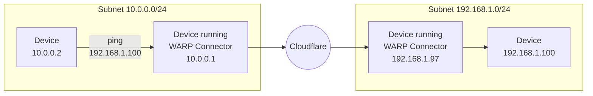

Set up WARP Connector



| [WARP modes](/cloudflare-one/connections/connect-devices/warp/configure-warp/warp-modes/) | [Zero Trust plans](https://www.cloudflare.com/teams-pricing/) |
| -- | -- |
| Gateway with WARP | All plans  |

| System   | Availability |
| ---------| -------------|
| Windows  | ❌           |
| macOS    | ❌           |
| Linux    | ✅           |
| iOS      | ❌           |
| Android  | ❌           |
| ChromeOS | ❌           |



Cloudflare WARP Connector is a piece of software that enables site-to-site, bidirectional, and mesh networking connectivity without requiring changes to underlying network routing infrastructure. WARP Connector establishes a secure Layer 3 connection between a private network and Cloudflare, allowing you to:

- Connect two or more private networks to each other.
- Connect IoT devices that cannot run external software, such as printers and IP phones.
- Filter and log server-initiated traffic, such as VoIP and SIP traffic.
- Apply Zero Trust security policies based on the source IP of the request.


As shown in the diagram, WARP Connector acts as a router for a subnet within the private network to on-ramp and off-ramp traffic through Cloudflare. All devices on the subnet can access any services connected to Cloudflare, and all devices connected to Cloudflare can access any services on the subnet. Each subnet runs a WARP Connector on a designated Linux machine (typically the default gateway router), but other devices on the network do not need to install software.

This guide will cover how to connect two independent subnets, for example `10.0.0.0/24` and `192.168.1.0/24`.

## Prerequisites

- A Linux host on each subnet
- Verify that your firewall allows inbound/outbound traffic over the [WARP IP addresses, ports, and domains](/cloudflare-one/connections/connect-devices/warp/deployment/firewall/).

## 1. Create a service token

[Create a new service token](/cloudflare-one/identity/service-tokens/#create-a-service-token) and copy its **Client ID** and **Client Secret**. WARP Connector will use this service token to authenticate with your Zero Trust organization.

## 2. Add a device enrollment rule

Next, create a device enrollment rule that allows the WARP Connector to authenticate:

1. In [Zero Trust](https://one.dash.cloudflare.com), go to **Settings** > **WARP Client**.
2. In the **Device enrollment** card, select **Manage**.
3. Select **Add a rule**.
4. Name the rule.
6. For **Rule action**, select _Service Auth_.
7. Configure the following fields:

    | Selector      | Value          |
    | ------------- | -------------- |
    | Service Token | `<SERVICE-TOKEN-NAME>` |

8. Select **Save**.

## 3. Enable CGNAT routing

All WARP Connector and WARP client devices in your Zero Trust organization have the same local IP address by default. To route traffic between various WARP devices, you must allow Cloudflare to assign a unique CGNAT IP to each device.

1. In [Zero Trust](https://one.dash.cloudflare.com), go to **Settings** > **Network**.
2. Enable **Proxy**.
3. Enable **Warp to Warp**. This allows Cloudflare to route traffic to the CGNAT IP space.
4. Next, go to **Settings** > **WARP Client**.
5. Enable [**Override local interface IP**](/cloudflare-one/connections/connect-devices/warp/configure-warp/warp-settings/#override-local-interface-ip).
6. [Check your Split Tunnel configuration](/cloudflare-one/connections/connect-networks/private-net/cloudflared/#3-route-private-network-ips-through-warp) and ensure that the CGNAT IP space (`100.96.0.0/12`) routes through WARP.

    For example, if you are using **Exclude** mode, delete `100.64.0.0/10` from the list and re-add `100.64.0.0/11` and `100.112.0.0/12`.

## 4. Install a WARP Connector

Each subnet must run its own WARP Connector on a Linux host.  Installing on your router is the simplest setup, but if you do not have access to the router, you may choose any other machine on the subnet.

In this example, we will create a WARP Connector for subnet `10.0.0.0/24` and install it on `10.0.0.1`. We will then create a second WARP Connector for subnet `192.168.1.0/24` and install it on `192.168.1.97`.

1. In [Zero Trust](https://one.dash.cloudflare.com), go to **Network** > **Tunnels**.
2. Select **Create a tunnel**.
3. For the connector type, select **WARP**. Select **Next**.
4. A window will appear with a list of prerequisites. Select **Confirm** to continue.
5. Give the tunnel any name (for example, `Subnet-10.0.0.0/24`) and select **Save tunnel**.
6. Select the operating system of your host machine.
7. Copy-paste the command into a terminal window and run the command. WARP Connector software is now installed, but not yet connected to Cloudflare.
8. To authenticate the WARP Connector to your Zero Trust organization:
    1. Create an `mdm.xml` file in `/var/lib/cloudflare-warp` using any text editor:

      ```sh
      $ cd /var/lib/cloudflare-warp
      $ sudo vim mdm.xml
      ```
    2. Add the following text to the file. Make sure to fill in your team name, the Client ID and Client Secret of your [service token](#1-create-a-service-token), and the WARP Connector token value (shown in the dashboard). As soon as you save this file, WARP will automatically register with the provided credentials.

      ```txt
      ---
      filename: /var/lib/cloudflare-warp/mdm.xml
      ---
      <dict>
      <key>organization</key>
      <string>myteam</string>
      <key>auth_client_id</key>
      <string>b33d5a65a6e801cd875scefff5908457f29.access</string>
      <key>auth_client_secret</key>
      <string>cdb5fa2721018c39cfaf8ec7fca9b5f62860ff5c584a89121241c6d0c83878124591cce23</string>
      <key>warp_connector_token</key>
      <string>fVTLilTWgMiF3TMxTIMM3nMU2NsixOYTTDHW1IamOMyORL0Y0jUcMWAoZDZhVhLVdn2pTDhy0VFRWZdE22rQCFNN6jQUoOx0eIV0ehcj5RyTZl5PYRwU25wMMi0kDGUS2XZn5W0eJS3mZXS9DkUTJatMNiMZDtNb1TmtmMptENJ20WY0NmdYmIBLoVhtToFichIjtiMnTZIMMOYOGZmpATzzEm2MjhnC6tWMHwNwFGhoIN==</string>
      </dict>
      ```
    3. Verify the registration:
      ```sh
      $ warp-cli account
      Account type: Team
      Device ID: f174e90a-fafe-4643-bbbc-4a0ed4fc8415
      Public key: 4w5uugfh0q03nrmcn95ltfzeghfzuhl75o7pruyd0h7z9ar9x6doxwq50aszar5kd
      Account ID: 699d98642c564d2e855e9661899b7252
      Organization: myteam
      ```

      <details>
      <summary>Troubleshoot missing registration</summary>
      <div>
      If the registration did not go through, try the following troubleshooting strategies:

      - Ensure that `mdm.xml` is formatted correctly and stored in `/var/lib/cloudflare-warp`.
      - Ensure that you have a [device enrollment rule](/cloudflare-one/connections/connect-networks/private-net/warp-connector/#2-add-a-device-enrollment-rule) with the _Service Auth_ action (not _Allow_).
      - Restart the WARP systemd service:
        ```sh
        $ sudo systemctl restart warp-svc.service
        ```
      - Clear an old registration and trigger WARP to re-register:
        ```sh
        $ sudo warp-cli delete
        ```
      - Review your [WARP daemon logs](/cloudflare-one/connections/connect-devices/warp/troubleshooting/warp-logs/) for information about why the registration is failing.
      </div>
      </details>

    4. Verify that WARP is connected to Cloudflare:
      ```sh
      $ warp-cli status
      Status update: Connected
      Success
      ```

      <details>
      <summary>Troubleshoot connection</summary>
      <div>

      If WARP is disconnected, try the following troubleshooting strategies:

      - Run `warp-cli connect`.

      - If your private network uses a firewall to restrict Internet traffic, ensure that it allows the [WARP ports and IPs](/cloudflare-one/connections/connect-devices/warp/deployment/firewall/).

      - Review your [WARP daemon logs](/cloudflare-one/connections/connect-devices/warp/troubleshooting/warp-logs/) for information about why the connection is failing.

      </div>
      </details>


If you are managing the deployment remotely over SSH, your connection may drop when you register the WARP Connector. Because the connector immediately starts forwarding traffic to Cloudflare, the remote SSH server's traffic will be routed to Cloudflare instead of via the server's public IP and will timeout your existing connection. You can work around this issue by temporarily adding the public IP of your local machine to your [Split Tunnel Exclude list](/cloudflare-one/connections/connect-devices/warp/configure-warp/route-traffic/split-tunnels/).


9. Select **Next**.
10. In **CIDR**, enter the private IPv4 address range that you wish to route through this WARP Connector (for example, `10.0.0.0/24`). WARP Connector does not currently support IPv6 routes.


If you do not already have a private network range, you can choose a subnet from one of these [pre-defined CIDRs](https://datatracker.ietf.org/doc/html/rfc1918#section-3).


11. Select **Save Tunnel**.

12. In your [Split Tunnel configuration](/cloudflare-one/connections/connect-devices/warp/configure-warp/route-traffic/split-tunnels/), ensure that your CIDR is routing through the WARP tunnel. For instructions on how to do this, refer to [Route private network IPs through WARP](/cloudflare-one/connections/connect-networks/private-net/cloudflared/#3-route-private-network-ips-through-warp).

    The `10.0.0.0/24` WARP Connector is now connected to Cloudflare.
    ```mermaid
        flowchart LR
          subgraph subnet1[Subnet 10.0.0.0/24]
          router1["Device running
            WARP Connector
            10.0.0.1"]
          end
          router1<-->C((Cloudflare))
    ```

13. Repeat these steps to install an additional WARP Connector on subnet `192.168.1.0/24`. You can reuse the service token, but you will need to create a new tunnel and MDM file.

    ```mermaid
        flowchart LR
          subgraph subnet1[Subnet 10.0.0.0/24]
          router1["Device running
            WARP Connector #1
            10.0.0.1"]
          end
          subgraph subnet2[Subnet 192.168.1.0/24]
            router2["Device running
            WARP Connector #2
            192.168.1.97"]
          end
          router1<-->C((Cloudflare))<-->router2
    ```

## 5. Configure the host

Run the following commands on the machine where you installed WARP Connector. You will need to configure the host machine on each subnet.

1. Enable IP forwarding:

    ```sh
    $ sudo sysctl -w net.ipv4.ip_forward=1
    ```

    <details>
    <summary>Save configuration to persist after reboot</summary>
    <div>

    ```sh
    $ echo 'net.ipv4.ip_forward = 1' | sudo tee -a /etc/sysctl.d/99-warp-svc.conf
    $ sudo sysctl -p /etc/sysctl.d/99-warp-svc.conf
    ```
    </div>
    </details>


If you are setting up WARP Connector on a [virtual private cloud (VPC)](https://www.cloudflare.com/learning/cloud/what-is-a-virtual-private-cloud/), you may need to enable IP forwarding on the VM instance.


2. WARP's [virtual interface](/cloudflare-one/connections/connect-devices/warp/configure-warp/route-traffic/warp-architecture/#virtual-interface) has a [maximum transmission unit (MTU)](https://www.cloudflare.com/learning/network-layer/what-is-mtu/) of 1280 bytes, whereas the standard Ethernet MTU is 1500 bytes. To avoid dropping packets that exceed 1280 bytes, clamp the [maximum segment size (MSS)](https://www.cloudflare.com/learning/network-layer/what-is-mss/) of the host machine so that incoming payloads are less than the MTU of WARP:

    ```sh
    $ sudo iptables -t mangle -A FORWARD -i CloudflareWARP -p tcp -m tcp --tcp-flags SYN,RST SYN -j TCPMSS --clamp-mss-to-pmtu
    $ sudo iptables -t mangle -A FORWARD -o CloudflareWARP -p tcp -m tcp --tcp-flags SYN,RST SYN -j TCPMSS --clamp-mss-to-pmtu
    ```

    <details>
    <summary>Save configuration to persist after reboot</summary>
    <div>

    1. Create a bash script that writes the `iptable` rules to a file:

      ```bash
      echo '#!/bin/bash
      # Define your rules
      RULES=(
        "-A FORWARD -i CloudflareWARP -p tcp -m tcp --tcp-flags SYN,RST SYN -j TCPMSS --clamp-mss-to-pmtu"
        "-A FORWARD -o CloudflareWARP -p tcp -m tcp --tcp-flags SYN,RST SYN -j TCPMSS --clamp-mss-to-pmtu"
      )

      # Apply the rules
      for rule in "${RULES[@]}"; do
        iptables -t mangle $rule
      done

      # Save the rules
      iptables-save > /etc/iptables/rules.v4
      ' | sudo tee /usr/local/bin/apply_iptables_rules.sh
      ```

    2. Run the script:

    ```sh
    $ sudo chmod +x /usr/local/bin/apply_iptables_rules.sh
    $ sudo /usr/local/bin/apply_iptables_rules.sh
    ```

    3. Create a systemd service to restore the rules at startup:

    ```bash
    echo '[Unit]
    Description=Load iptables rules at startup

    [Service]
    Type=oneshot
    ExecStart=/sbin/iptables-restore < /etc/iptables/rules.v4

    [Install]
    WantedBy=multi-user.target
    ' | sudo tee /etc/systemd/system/iptables-persistent.service
    ```

    </div>
    </details>

## 6. Route traffic through WARP Connector

Depending on where you installed the WARP Connector, you may need to configure other devices on the subnet to route traffic through WARP Connector.

### Option 1: Default gateway

If you installed WARP Connector on your router, no additional configuration is necessary. All traffic will use the router as the default gateway.


### Option 2: Alternate gateway

If you have access to the router but installed WARP Connector on another machine, you can configure the router to forward traffic to the WARP Connector. This typically involves adding a static route for the destination IPs that you want to connect to through Cloudflare. Refer to your router's documentation for specific instructions on how to add an IP route.

For example, if you are on subnet `10.0.0.0/24` and want to reach applications behind subnet `192.168.1.0/24`, add a rule that routes `192.168.1.0/24` to the WARP Connector IP (`10.0.0.100` in the diagram below). When a device sends a request to `192.168.1.0/24`, the router will first redirect the traffic to the WARP Connector machine. WARP Connector encrypts the traffic, changes its destination IP to the [WARP ingress IP](/cloudflare-one/connections/connect-devices/warp/deployment/firewall/#warp-ingress-ip), and sends it back to the router. The router will now forward this encrypted traffic to Cloudflare.



Ensure that your routing rules do not forward the [WARP ingress IP](/cloudflare-one/connections/connect-devices/warp/deployment/firewall/#warp-ingress-ip) back to the WARP Connector.


### Option 3: Intermediate gateway

If you do not have access to the router, you will need to configure each device on the subnet to egress through the WARP Connector machine instead of the default gateway.


#### Route all traffic

You can configure all traffic on a device to egress through WARP Connector with its local source IP. All traffic will be filtered by your Gateway network policies.




```sh
$ sudo ip route add default via <WARP-CONNECTOR-IP> dev eth0 metric 101
```

Ensure that the `metric` value is lower than other default gateways. To verify that WARP Connector is now the preferred default gateway, run `ip route get <DESTINATION-IP>`.




```sh
$ sudo route -n change default <WARP-CONNECTOR-IP> -interface en0
```





```bash
route /p add 0.0.0.0 mask 0.0.0.0 <WARP-CONNECTOR-IP> metric 101
```



#### Route specific IPs

You can configure only certain routes to egress through WARP Connector. For example, you may only want to filter traffic destined to internal applications and devices, but allow public Internet traffic to bypass Cloudflare.




```sh
$ sudo ip route add <DESTINATION-IP> via <WARP-CONNECTOR-IP> dev eth0
```




```sh
$ sudo route -n add -net <DESTINATION-IP> <WARP-CONNECTOR-IP>
```





```bash
route /p add <DESTINATION-IP> mask 255.255.255.255 <WARP-CONNECTOR-IP>
```





`100.96.0.0/12` is the default CIDR for all user devices running [Cloudflare WARP](/cloudflare-one/connections/connect-devices/warp/). Setting `<DESTINATION-IP>` to `100.96.0.0/12` configures the local machine to connect to user devices through Cloudflare.


#### Verify routes

To validate subnet routing, [check your routing table](/cloudflare-one/connections/connect-devices/warp/configure-warp/route-traffic/warp-architecture/#routing-table) and ensure that traffic is routing through the `CloudflareWARP` [virtual interface](/cloudflare-one/connections/connect-devices/warp/configure-warp/route-traffic/warp-architecture/#virtual-interface).

## 7. Test the WARP Connector

You can now test the connection between the two subnets. For example, on the `10.0.0.2` device run `ping 192.168.1.100`.




If you are testing with curl using private hostnames, make sure to add the `--ipv4` flag to your curl commands.



WARP Connector is an extension of the [WARP client](/cloudflare-one/connections/connect-devices/warp/).


- [System requirements](/cloudflare-one/connections/connect-devices/warp/download-warp/#linux)
- Package dependencies:
  - `curl`
  - `gpg`
  - `iptables`
  - `iptables-persistent`
  - `lsb-core`
  - `sudo`



