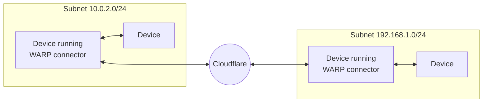

# Set up WARP connector

Cloudflare WARP connector is a piece of software that enables site-to-site, bidirectional, and mesh networking connectivity without requiring changes to underlying network routing infrastructure. WARP connector establishes a secure Layer 3 connection between a private network and Cloudflare, allowing you to:

- Connect two or more private networks to each other.
- Connect IoT devices that cannot run external software, such as printers and IP phones.
- Filter and log traffic server-initiated traffic, such as VoIP and SIP traffic.
- Apply Zero Trust security policies based on the source IP within a private network.

As shown in the diagram, WARP connector acts as a router for a subnet within the private network to on-ramp and off-ramp traffic through Cloudflare. All devices on the subnet can access any services connected to Cloudflare, and all devices connected to Cloudflare can access any services on the subnet. Each subnet runs a WARP connector on a designated Linux machine (typically the default gateway router), but other devices on the network do not need to install software.

## Prerequisites

- 

## 1. Create an Access service token

## 2. Create a device enrollment policy

## 3. Enable WARP-to-WARP

## 4. Create a WARP connector

## 5. Configure other devices on the network

## 6. Test the WARP connector

## Troubleshooting