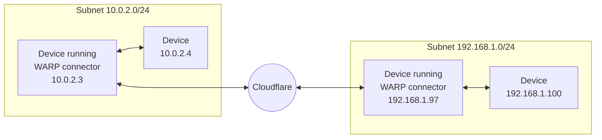

# Set up WARP connector

Cloudflare WARP connector is a piece of software that enables site-to-site, bidirectional, and mesh networking connectivity without requiring changes to underlying network routing infrastructure. WARP connector establishes a secure Layer 3 connection between a private network and Cloudflare, allowing you to:

- Connect two or more private networks to each other.
- Connect IoT devices that cannot run external software, such as printers and IP phones.
- Filter and log traffic server-initiated traffic, such as VoIP and SIP traffic.
- Apply Zero Trust security policies based on the source IP of the request.



As shown in the diagram, WARP connector acts as a router for a subnet within the private network to on-ramp and off-ramp traffic through Cloudflare. All devices on the subnet can access any services connected to Cloudflare, and all devices connected to Cloudflare can access any services on the subnet. Each subnet runs a WARP connector on a designated Linux machine (typically the default gateway router), but other devices on the network do not need to install software.

## 1. Create a service token

[Create a new service token](/cloudflare-one/identity/service-tokens/#create-a-service-token) and copy its **Client ID** and **Client Secret**. WARP connector will use this service token to authenticate with your Zero Trust organization.

## 2. Add a device enrollment rule

Next, create a device enrollment rule that allows the WARP connector to authenticate:

1. In [Zero Trust](https://one.dash.cloudflare.com), go to **Settings** > **WARP Client**.
2. In the **Device enrollment** card, select **Manage**.
3. Select **Add a rule**.
4. Name the rule and configure the following fields:

    | Rule Action  | Rule type | Selector      | Value          |
    | ------------ | --------- | ------------- | -------------- |
    | Service Auth | Include   | Service Token | `<SERVICE-TOKEN-NAME>` |

5. Select **Save**.

## 3. Turn on WARP-to-WARP

To allow a WARP connector to connect to services behind another WARP connector:

1. In [Zero Trust](https://one.dash.cloudflare.com), go to **Settings** > **Network**.
2. Enable **Warp-to-Warp**.

## 4. Create a WARP connector

Each subnet requires its own WARP connector. To create a new WARP connector:

1. In [Zero Trust](https://one.dash.cloudflare.com), go to **Network** > **Tunnels**.
2. Select **Create a tunnel**.
3. For the connector type, select **WARP**. Select **Next**.
4. A window will appear with a list of prerequisites. Select **Confirm** to continue.
5. Give the tunnel any name and select **Save tunnel**.

## 5. Install the WARP connector

WARP connector is only supported on Linux.  Installing on your router is the simplest setup, but if you do not have access to the router, you may choose any other machine on your network. For system requirements, refer to the [WARP downloads page](/cloudflare-one/connections/connect-devices/warp/download-warp/#linux).

To install the WARP connector:

1. On the **Install and run connectors** screen, select the operating system of your host machine.
2. Copy-paste the command into a terminal window and run the command.
3. To authenticate the WARP connector to your Zero Trust organization:
    1. In `/var/lib/cloudflare-warp`, create an `mdm.xml` file using any text editor:

      ```sh
      $ cd /var/lib/cloudflare-warp
      $ sudo vim mdm.xml
      ```
    2. Add the following text to the file. Make sure to fill in your team name, the Client ID and Client Secret of your [service token](#1-create-a-service-token), and the WARP connector token value (shown in the dashboard).

      ```txt
      ---
      filename: /var/lib/cloudflare-warp/mdm.xml
      ---
      <dict>
      <key>organization</key>
      <string><TEAM-NAME></string>
      <key>auth_client_id</key>
      <string><CLIENT__ID></string>
      <key>auth_client-secret</key>
      <string><CLIENT-SECRET></string>
      <key>warp_connector_token</key>
      <string><WARP-CONNECTOR-TOKEN></string>
      </dict>
      ```
    3. To verify the registration, run the following command:
      ```sh
      $ warp-cli account
      ```

      If the registration did not go through, [restart the WARP service](#restart-warp).

If you are managing the deployment remotely over SSH, your connection may drop when you register the WARP connector. Because the connector immediately starts forwarding traffic to Cloudflare, your SSH client will see a Cloudflare IP instead of the server's public IP and terminate the connection. You can work around this issue by temporarily adding your home IP to your [Split Tunnel Exclude list](/cloudflare-one/connections/connect-devices/warp/configure-warp/route-traffic/split-tunnels/).


4. Select **Next**.

## 6. Add IP routes

1. In **CIDR**, enter the private IPv4 address range that you wish to route through this WARP connector. IPv6 is not supported at this time.


If you do not already have a private network range, you can choose one of these [pre-defined CIDRs](https://datatracker.ietf.org/doc/html/rfc1918#section-3).


2. Select **Save Tunnel**.

3. In your [Split Tunnel configuration](/cloudflare-one/connections/connect-devices/warp/configure-warp/route-traffic/split-tunnels/), ensure that your CIDR is routing through the WARP tunnel. For instructions on how to do this, refer to [Route private network IPs through WARP](/cloudflare-one/connections/connect-networks/private-net/cloudflared/#3-route-private-network-ips-through-warp).

## 7. Configure the host machine

Run the following commands on the machine that is running the WARP connector:

1. Enable IP forwarding:

  ```sh
  $ sudo sysctl -w net.ipv4.ip_forward=1
  ```

  To set this up more permanently (persist between reboots):

  ```sh
  $ echo 'net.ipv4.ip_forward = 1' | sudo tee -a /etc/sysctl.d/99-warp-svc.conf
  $ sudo sysctl -p /etc/sysctl.d/99-warp-svc.conf
  ```


If you are setting up WARP connector on a [virtual private cloud (VPC)](/learning/cloud/what-is-a-virtual-private-cloud/), you may need to enable IP forwarding on the VM instance. Here is an example of how to do this in [Google Cloud](https://cloud.google.com/vpc/docs/using-routes#canipforward).


2. WARP's [virtual interface](/cloudflare-one/connections/connect-devices/warp/configure-warp/route-traffic/warp-architecture/#virtual-interface) has a [maximum transmission unit (MTU)](/learning/network-layer/what-is-mtu/) of 1280 bytes, whereas the standard Ethernet MTU is 1500 bytes. To avoid dropping packets that exceed 1280 bytes, clamp the [maximum segment size (MSS)](/learning/network-layer/what-is-mss/) of the host machine so that incoming payloads are less than the MTU of WARP:

  ```sh
  $ sudo iptables -t mangle -A FORWARD -i CloudflareWARP -p tcp -m tcp --tcp-flags SYN,RST SYN -j TCPMSS --clamp-mss-to-pmtu
  $ sudo iptables -t mangle -A FORWARD -o CloudflareWARP -p tcp -m tcp --tcp-flags SYN,RST SYN -j TCPMSS --clamp-mss-to-pmtu

  ```

## 8. Configure other devices on the network

### Default gateway

### Alternate gateway

## 9. Test the WARP connector

## Troubleshooting

### Restart WARP

### Check WARP connection status

### Check the routing table

### Check your firewall

If your private network uses a firewall to restrict Internet traffic, you may need to allow the [WARP ports and IPs](/cloudflare-one/connections/connect-devices/warp/deployment/firewall/).
