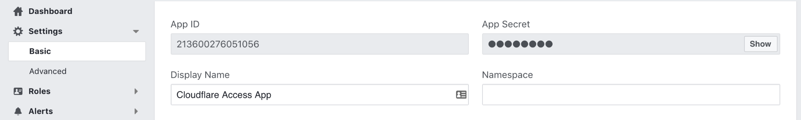

# Facebook

Use these steps to set up Facebook as your identity provider.

1.  Go to go to [developers.facebook.com](https://developers.facebook.com/).

2.  Click **Create App** at the top-right.

    

    The **Create a New App ID** card displays.

3.  Enter the **Display Name** and **Contact Email**.

4.  Click **Create App ID**. The **Create a New App ID** window displays.

5.  Enter the CAPTCHA code to proceed.

6.  Click **Submit**.

7.  On the **Facebook Login** card, click **Set Up**.

    

    A Quickstart card displays offering platform choices.

8.  Click **Web**. The **Web** tab displays.

9.  Enter your **Site URL**.

10. Click **Save**.

11. Click **Continue**. Ignore any JavaScript page that suggests that you install it on your site.

12. Click **Settings > Basic** on the left-hand menu.

    

13. On the Zero Trust dashboard, navigate to **Settings > Authentication**.

14. Under **Login methods**, click **Add new**.

15. Copy the App ID and App Secret into the **OAuth ID** and **OAuth Secret** fields.

16. Click **Save**.

17. On [developers.facebook.com](https://developers.facebook.com/), set the **Use Strict Mode for Redirect URIs** slider to **Yes**.

18. In the **Valid OAuth redirect URIs** field, enter your [team domain](/glossary#team-domain), followed by this callback at the end of the path: `/cdn-cgi/access/callback`. For example:

    ```txt
    https://<your-team-name>.cloudflareaccess.com/cdn-cgi/access/callback
    ```

19. Click **Save Changes**.

20. On the Zero Trust dashboard, click **Save**.

To test that your connection is working, navigate to **Authentication > Login methods** and click **Test** next to Facebook.

## Example API Configuration

```json
{
    "config": {
        "client_id": "<your client id>",
        "client_secret": "<your client secret>"
    },
    "type": "facebook",
    "name": "my example idp"
}
```
