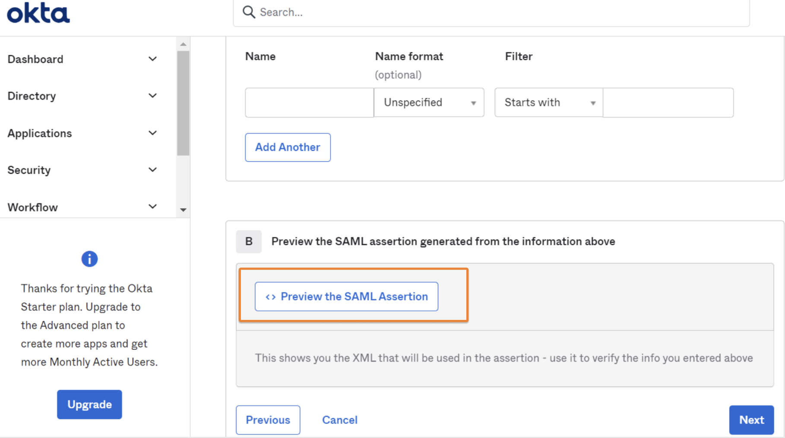
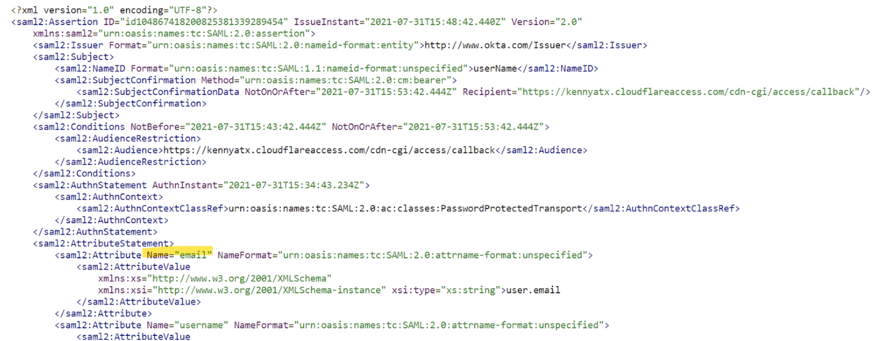
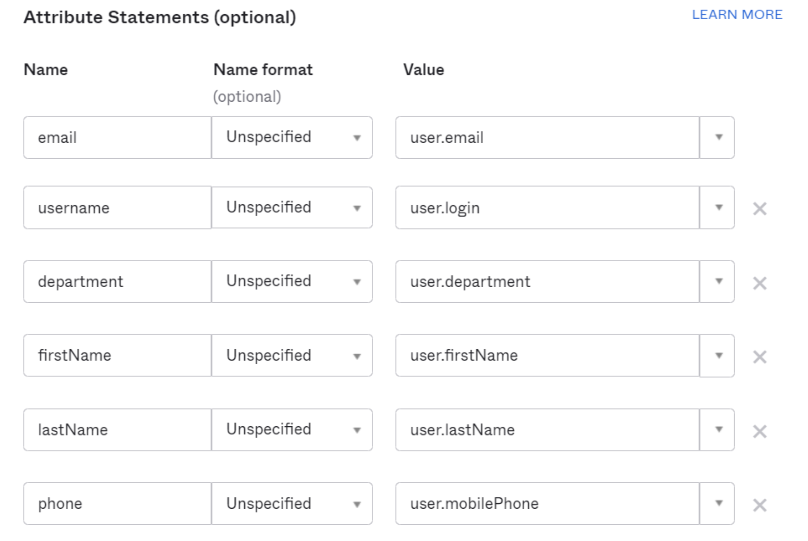

# Generic SAML 2.0

Cloudflare Zero Trust integrates with any identity provider that supports SAML 2.0. If your identity provider is not listed in the integration list of login methods on the Zero Trust Dashboard, it can be configured using SAML 2.0 (or OpenID if OIDC based). Generic SAML can also be used if you would like to pass additional SAML headers or claims for an IdP in the integration list.

Most identity providers allow users to create an **application**. In this context, an application is a set of parameters that the identity provider will then pass on to Cloudflare to establish an integration.

Minimum requirements for identity providers:

*   The IdP must conform to SAML 2.0
*   The IdP must provide: A Single Sign on URL, an Entity ID, and a signing certificate

Depending on the identity provider you would like to integrate, the following steps may happen in a different order.

## Create an application in your identity provider

The typical setup requirements are:

1.  Create a new integration in the identity provider with the type set as **SAML**.
2.  Set the Entity/Issuer ID to: `https://<your-team-name>.cloudflareaccess.com/cdn-cgi/access/callback`, where `<your-team-name>` should be your Cloudflare Zero Trust [team name](/glossary#team-name).
3.  Set the Single Sign On URL (or similarly named) to: `https://<your-team-name>.cloudflareaccess.com/cdn-cgi/access/callback`, where `<your-team-name>` should be your Cloudflare Zero Trust [team name](/glossary#team-name).
4.  Set the Name ID/Email format to `emailAddress`.
5.  \[Optional] Set the signature policy to *Always Sign*.
6.  \[Optional] If your identity provider supports metadata file configuration, use the endpoint:  `https://<your-team-name>.cloudflareaccess.com/cdn-cgi/access/saml-metadata` to download and generate an XML file. Upload this XML file to the identity provider.

## Add a SAML identity provider to the Zero Trust Dashboard

1.  On the Zero Trust Dashboard, navigate to **Settings** > **Authentication**.
2.  In the Login methods card, click **Add new** and select *SAML*.
3.  Choose a descriptive name for your identity provider.
4.  Enter the Single Sign on URL, IdP Entity ID or Issuer URL, and Signing certificate.
5.  If you do not wish to enter any of the [additional SAML configurations](#additional-saml-configurations), click **Save**.

## Additional SAML configurations

SAML integrations allow users to include additional headers or claims that can be passed to applications.

### Sign SAML authentication request

This optional configuration signs the Access JWT with the Cloudflare Access public key to ensure that the JWT is coming from a legitimate source. The Cloudflare public key can be obtained at `https://<your-team-name>.cloudflareaccess.com/cdn-cgi/access/certs`.

### Email attribute name

Many [Zero Trust policies](/policies/zero-trust) depend on a user’s email address. Some identity providers have a different naming for the email address attribute (for example, `Email`, `e-mail`, `emailAddress`). This can typically be checked in the identity provider's SAML test option.

Example in Okta:

### SAML attributes

SAML attributes can be added to the Access JWT. These can then be consumed by self-hosted or SaaS applications connected to Access. Any SAML attribute configured in the SAML integration must also be sent from the IdP.

Example in Okta:

How to receive these Attributes in Cloudflare:

### SAML header attributes

If an application only requires specific SAML attributes on sign-in, then the attributes can be passed as headers. The **Attribute Name** should be the values coming from the IdP. The **Header Name** is what will appear in the initial authorization header from Access.

## Testing the connection

Save the initial SAML configuration and click **Test**. This will prompt an error or success message. The error message will provide instructions on how to update the configuration to successfully integrate your identity provider with Cloudflare.
