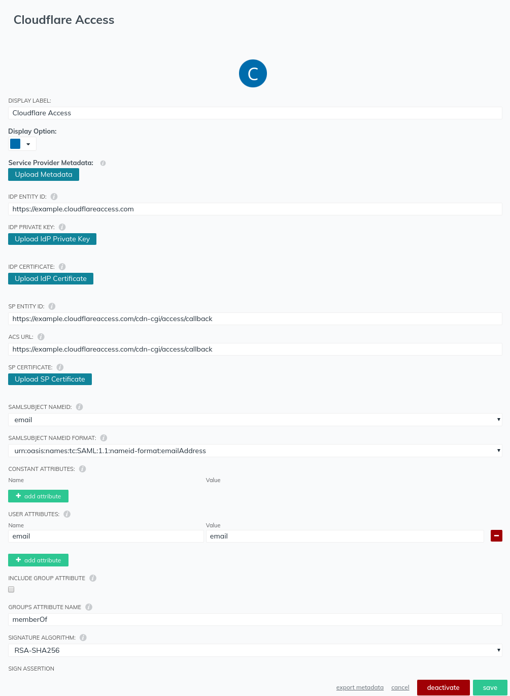

# SAML | Jumpcloud

JumpCloud provides [Directory-as-a-Service®](https://jumpcloud.com/daas-product/) to securely connect user identities to systems, apps, files, and networks. Cloudflare Access integrates with JumpCloud using the SAML protocol. [This documentation from JumpCloud](https://support.jumpcloud.com/s/article/getting-started-applications-saml-sso2) can help you configure applications within your JumpCloud deployment.

These steps focus on requirements specific to Cloudflare Zero Trust.

## Set up Jumpcloud SAML

To set up JumpCloud SAML as your identity provider:

1.  Generate a SAML certificate.

    **Tip:** JumpCloud requires that you provide your own certificates for signing SAML assertions. Self-signed certificates are acceptable.

    If you do not have a certificate, this command generates one using OpenSSL:

    ```bash
    $ openssl genrsa -out samlidp.key 2048 ; openssl req -new -x509 -sha256 -key samlidp.key -out samlidp.crt -days 1095
    Generating RSA private key, 2048 bit long modulus
    .................................................................................+++++
    ......................+++++
    e is 65537 (0x010001)
    ```

    When asked to enter a Distinguished Name or a DN to incorporate into your certificate request, you can leave some of these fields blank. Some fields have a default value. Enter a dot (`.`) in the field to leave it blank. For example:

    ```bash
    -----
    Country Name (2 letter code) [AU]:.
    State or Province Name (full name) [Some-State]:.
    Locality Name (eg, city) []:.
    Organization Name (eg, company) [Internet Widgits Pty Ltd]:.
    Organizational Unit Name (eg, section) []:.
    Common Name (e.g. server FQDN or YOUR name) []:JumpCloud SAML IdP
    Email Address []:
    ```

2.  In JumpCloud, select **Applications** in the left-side menu.

    

3.  Click the + icon at the top-left of the screen to add an application.

4.  Choose the **SAML** option in **Application Types**.

5.  Enter an application name in **Display Label**.

6.  Enter an IdP entity in the **IDP IDENTITY ID** field.The IdP entity can be anything, but must be unique. We suggest you reference something easily identified, such as your Cloudflare team domain, for example `https://<your-team-name>.cloudflareaccess.com/`.

7.  At the prompt, enter the IdP private key and IdP certificate you previously generated.

8.  Set both the **SP entity ID** and **ACS URL** to the following callback URL, where `<your-team-name>` is your Cloudflare [team name](/glossary#team-name):

    ```text
    https://<your-team-name>.cloudflareaccess.com/cdn-cgi/access/callback
    ```

9.  Under **SAML SUBJECT NAMEID**, choose **email**.

10. Set the **SAML SUBJECT NAMEID FORMAT** to:

    ```text
    urn:oasis:names:tc:SAML:1.1:nameid-format:emailAddress
    ```

11. Under USER ATTRIBUTES enter `email` for the name and `email` for the value.

12. Leave other settings at default.

13. Click **save**.

    Remember to assign this application to users or groups.

    

14. On the Zero Trust dashboard, navigate to **Settings > Authentication**.

15. Under **Login methods**, click **Add new**.

16. Select **SAML**.

17. Input a **Name**, a **Single Sign on URL**, **IdP Entity ID or Issuer URL**, and **Signing Certificate**.

18. Click **Save**.

To test that your connection is working, navigate to **Authentication > Login methods** and click **Test** next to the login method you want to test.

## Example API configuration

```json
{
 "config": {
  "issuer_url": "jumpcloud",
  "sso_target_url": "https://sso.myexample.jumpcloud.com/saml2/cloudflareaccess",
  "attributes": [
   "email",
   "name",
   "username"
  ],
  "email_attribute_name": "",
        "sign_request": false,
  "idp_public_cert": "MIIDpDCCAoygAwIBAgIGAV2ka+55MA0GCSqGSIb3DQEBCwUAMIGSMQswCQYDVQQGEwJVUzETMBEG\nA1UEC.....GF/Q2/MHadws97cZg\nuTnQyuOqPuHbnN83d/2l1NSYKCbHt24o"
 },
 "type": "saml",
 "name": "jumpcloud saml example"
}
```
