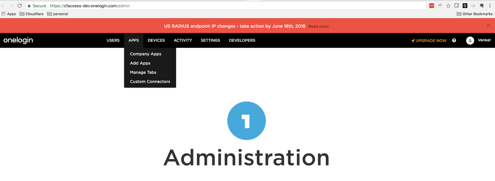
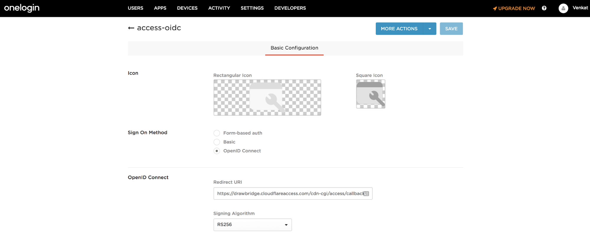
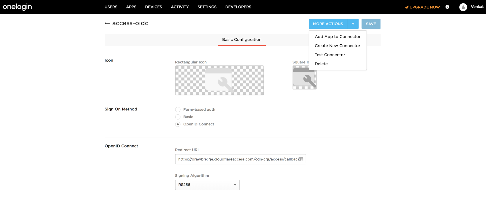
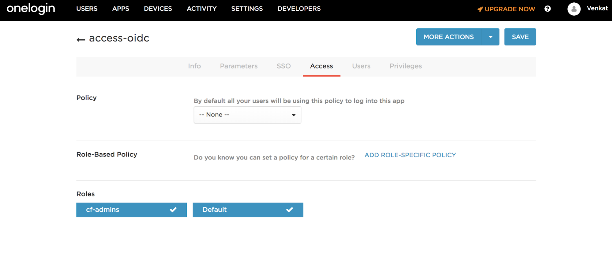
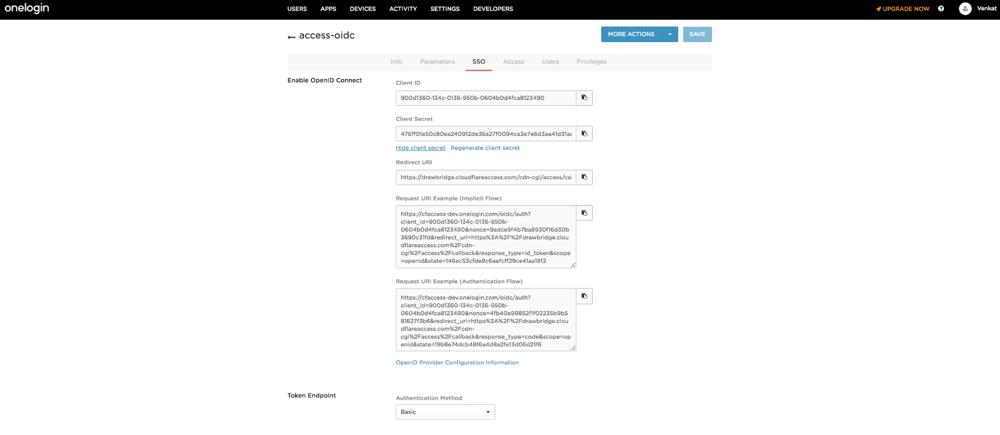

# OneLogin OIDC

OneLogin provides SSO identity management. Cloudflare Access supports OneLogin as an OIDC identity provider.

## Set up OneLogin OIDC

To set up OneLogin as your identity provider:

1.  Log in to your OneLogin admin portal.

2.  Select **Apps > Custom Connectors**.

    

    The *Custom Connectors* card displays.

3.  Click **New Connector**.

4.  Name the connector. The *connector name* card displays. Our example uses `access-oidc` for the connector name.

    

5.  In **Sign-On Method**, select the **OpenID Connect** option.

6.  In the **Redirect URI** field, enter your [team domain](/glossary#team-domain) followed by this callback at the end of the path: `/cdn-cgi/access/callback`. For example:

    ```txt
    https://<your-team-name>.cloudflareaccess.com/cdn-cgi/access/callback
    ```

7.  Click **Save**.

8.  Select **More Actions > Add App to Connector**.

    

9.  In the **Portal** section, enter a name for your application in the **Display Name** field.

10. Click **Save**.

11. Select the **Access** tab.

    

12. Add the **Roles** that can access this application.

13. Select the **SSO** tab.

    

14. Click **Show client secret**.

15. Copy both the **Client ID** and **Client Secret**.

16. On the Zero Trust dashboard, navigate to **Settings > Authentication**.

17. Under **Login methods**, click **Add new**.

18. Select Centrify as your IdP.

19. Paste in your copied **Client ID** and **Client secret**.

20. Click **Save**.

To test that your connection is working, navigate to **Authentication > Login methods** and click **Test** next to OneLogin.

## Example API Config

```json
{
    "config": {
        "client_id": "<your client id>",
        "client_secret": "<your client secret>",
        "onelogin_account": "https://mycompany.onelogin.com",
    },
    "type": "onelogin",
    "name": "my example idp"
}
```
