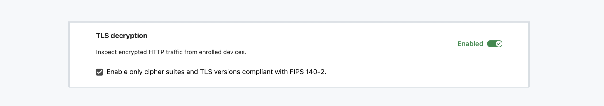

# TLS decryption


This setting requires the Proxy switch to be enabled.

1. Navigate to **Settings** > **Network**.
1. Scroll down to **L7 Firewall**.
1. Set the **Proxy** switch to *Enabled*.

TLS decryption can use both TLS version 1.2 and 1.3. 

## Cipher suites
The following is a list of cipher suites used when the switch is enabled.

```txt
CHACHA20-POLY1305-SHA256
ECDHE-ECDSA-AES128-GCM-SHA256
ECDHE-ECDSA-AES256-GCM-SHA384
ECDHE-RSA-AES128-GCM-SHA256
ECDHE-RSA-AES256-GCM-SHA384
ECDHE-RSA-AES128-SHA
ECDHE-RSA-AES256-SHA384
AES128-GCM-SHA256
AES256-GCM-SHA384
AES128-SHA
AES256-SHA
```

## FIPS compliance

In order to be FedRAMP compliant, we need to be able to say that our products support FIPS compliant cipher suites

When enabling TLS decryption, you have the option to only enable cipher suites and TLS versions compliant with FIPS 140-2. FIPS compliance mode requires TLS version 1.2.

If the origin doesn't support FIPS compliant ciphers, the request will fail.

The default server TLS versions and cipher suites used by Gateway will be overridden with those that are FIPS 140-2 compliant

 

The following is a list of cipher suites used for TLS decryption when the **FIPS compliance** setting is enabled.

```txt
CHACHA20-POLY1305-SHA256
ECDHE-ECDSA-AES128-GCM-SHA256
ECDHE-ECDSA-AES256-GCM-SHA384
ECDHE-RSA-AES128-GCM-SHA256
ECDHE-RSA-AES256-GCM-SHA384
ECDHE-RSA-AES256-SHA384
AES128-GCM-SHA256
AES256-GCM-SHA384
```

This account-level setting applies to both client and server hellos.
1. Gateway acting as the server where it will accept (via ServerHello) one of the TLS versions and cipher suites the eyeball says it supports in the connection's ClientHello.
2. Gateway acting as the client when it connects to the origins and advertises (via its own ClientHellow) the TLS versions/cipher suites it supports to the origin.