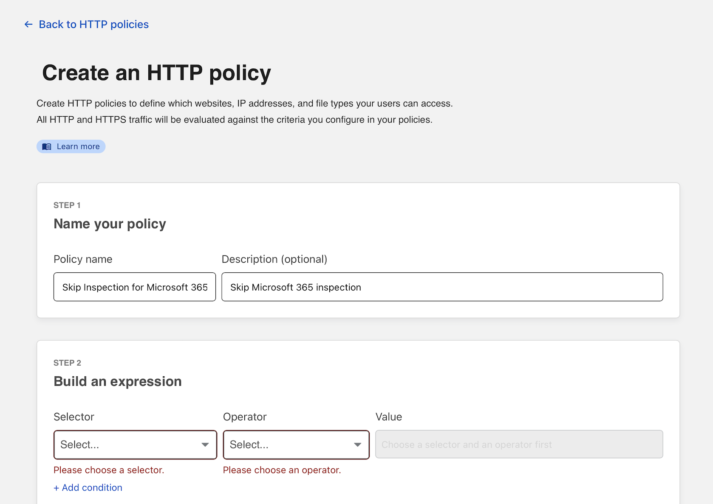
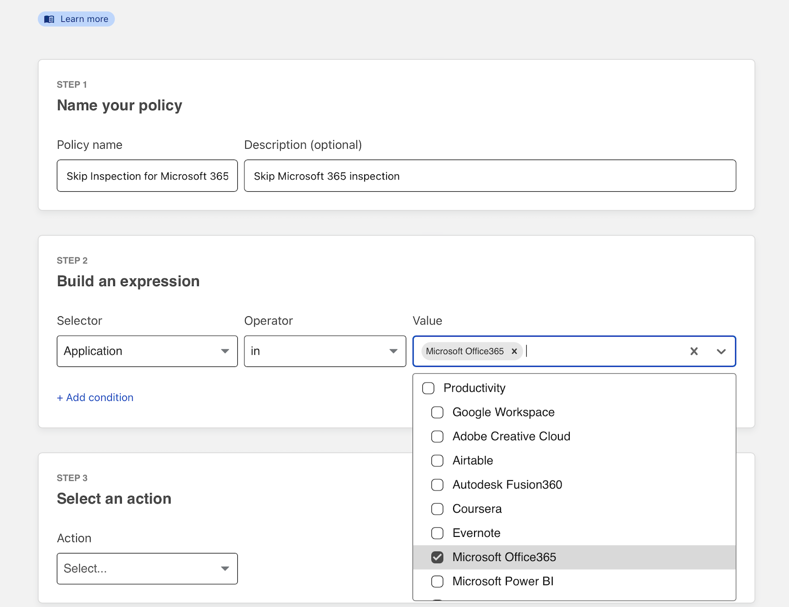
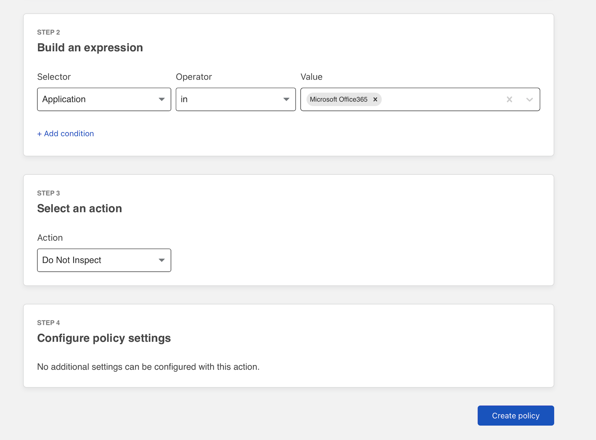
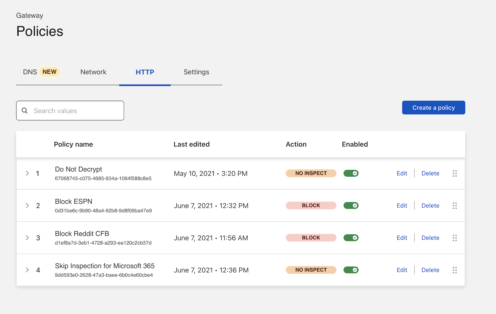
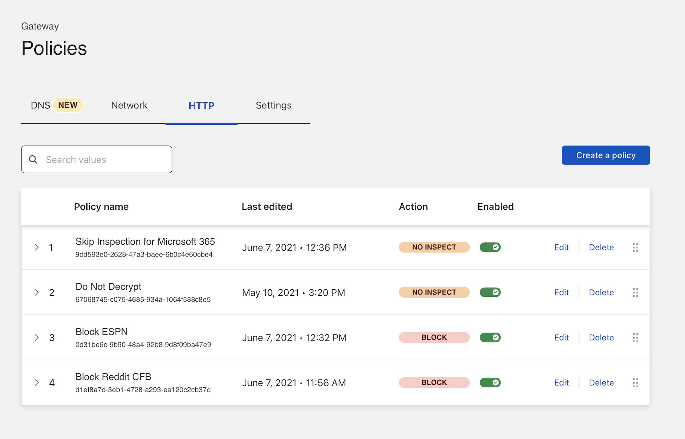

# Skip inspection for groups of applications

You can configure Cloudflare Zero Trust to skip inspection for certain groups of applications.

By default, Cloudflare Gateway creates a rule that includes the hostnames used by certain client applications, like Zoom or Apple's services, that rely on certificate pinning. The TLS inspection performed by a service like Cloudflare Gateway will cause errors when users visit those applications.

This tutorial skips inspection for additional applications beyond those in the list curated by Cloudflare.

**🗺️ This walkthrough covers how to:**

*   Build a `Do not inspect` policy using Cloudflare's list of certificate pinned resources
*   Configure that policies precedence in your Gateway configuration

**⏲️ Time to complete:**

5 minutes

## Before you start

1.  [Connect devices](/connections/connect-devices/warp) to Cloudflare's edge with the WARP client and [install the root certificate](/connections/connect-devices/warp/install-cloudflare-cert)
2.  [Enable web inspection](/connections/connect-devices/warp/warp-settings#enable-proxy)

## Build the policy

1.  Navigate to the **HTTP** tab of the `Policies` page in Cloudflare Gateway. Click **Add a rule**.

2.  Name the policy and, optionally, provide a description.

    

3.  Under **Selector** choose **Application**. Select **in** in the **Operator field**. This example uses Microsoft 365, categorized as Productivity.

    

4.  Scroll to the bottom of the page and select **Do Not Inspect** and click **Create rule**.

    

## Change rule precedence

New rules are saved at the bottom of the rule list in Gateway. Gateway evaluates rules from top-to-bottom, except for do-not-inspect rules. Those are always evaluated first.

We do recommend dragging the **Do Not Inspect** rule to the top of the list to reduce confusion.

