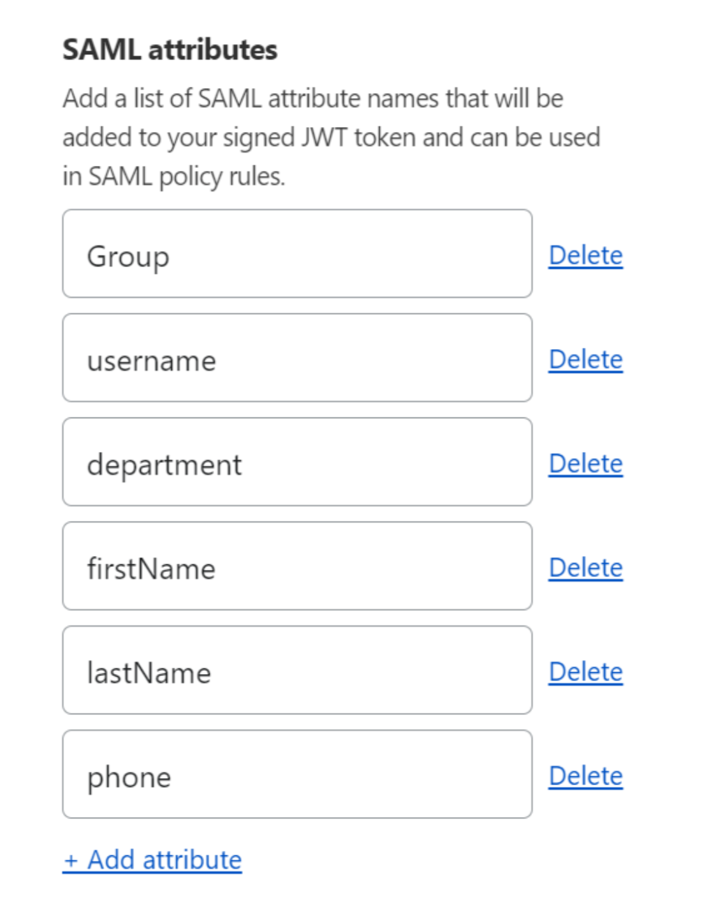
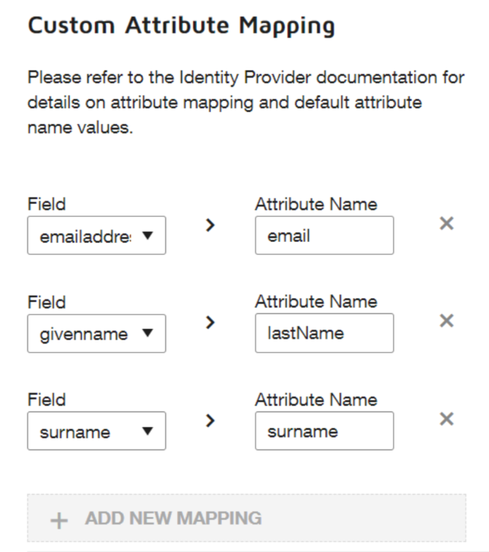

# Protecting DocuSign with Access for SaaS

This guide covers how to protect your DocuSign account with Access for SaaS.

## Pre-Requisites:

*   Access for SaaS requires that you have Single Sign-On available in your DocuSign plan.
*   A domain you own.
*   See DocuSign’s [checklist](https://support.docusign.com/en/guides/org-admin-guide-single-sign-on-overview) for additional requirements.
*   A [SAML IdP](/identity/idp-integration/generic-saml) configured with SAML Attributes configured.

**⏲️ Time to complete:** 10 minutes

## Create the Access for SaaS application

1.  On the Zero Trust Dashboard, go to **Access** > **Applications**.

2.  Select **Add an Application**.

3.  Select **SaaS**.

4.  Use the following configuration:
    *   Set the **Application** to *DocuSign*.
    *   Put placeholder values in **EntityID** and **Assertion Consumer Service URL** (e.g. `https://example.com`). We’ll come back and update these.
    *   Set **Name ID Format** to: *Unique ID*.

5.  DocuSign requires SAML attributes to do Just In Time user provisioning.

    *   Ensure you are collecting SAML attributes from your IdP:

    

6.  These IdP SAML values can then be mapped to the following DocuSign SAML attributes:
    *   Email
    *   Surname
    *   Givenname

7.  Set an Access policy (for example, create a policy based on *Emails ending in @example.com*).

8.  Copy and save SSO Endpoint, Entity ID and Public Key.

     <Aside type='note'>

    The Public key must be transformed into a fingerprint. To do that:

    1.  Copy the Public Key Value.
    2.  Paste the Public Key into VIM or another code editor.
    3.  Wrap the value in `-----BEGIN CERTIFICATE-----` and `-----END CERTIFICATE-----`.
    4.  Set the file extension to `.crt` and save.

     </Aside>

\## Configure your DocuSign SSO instance

1.  Ensure you have a domain claimed in Zendesk.

2.  From the DocuSign Admin dashboard, click **Identity Providers**.

3.  On the Identity Providers page, click **ADD IDENTITY PROVIDER**. Use the following mappings from the saved Access Application values:
    *   **Name**: Pick your desired name.
    *   **Identity Provider Issuer**: Entity ID.
    *   **Identity Provider Login URL**: Assertion Consumer Service URL.

4.  Save the Identity Provider.

5.  Upload your certificate to the *DocuSign Identity Provider* menu.

6.  Configure your SAML Attribute mappings. The Attribute Names should match the values in **IdP Value** in your Access application.

    

7.  Go back to the Identity Provider's screen and select **Actions** > **Endpoints**. Copy and save the following:
    *   Service Provider Issuer URL.
    *   Service Provider Assertion Consumer Service URL.

## Finalize your Cloudflare configuration

1.  Go back to your DocuSign application under **Access** > **Applications**.
2.  Click **Edit**.
3.  Use the following mappings:
    *   EntityID->Service Provider Issuer URL.
    *   Assertion Consumer Service URL -> Service Provider Assertion Consumer Service URL.
4.  Save the application.

When ready, enable the SSO for your DocuSign account and you will be able to login to DocuSign via Cloudflare SSO and your Identity Provider.
