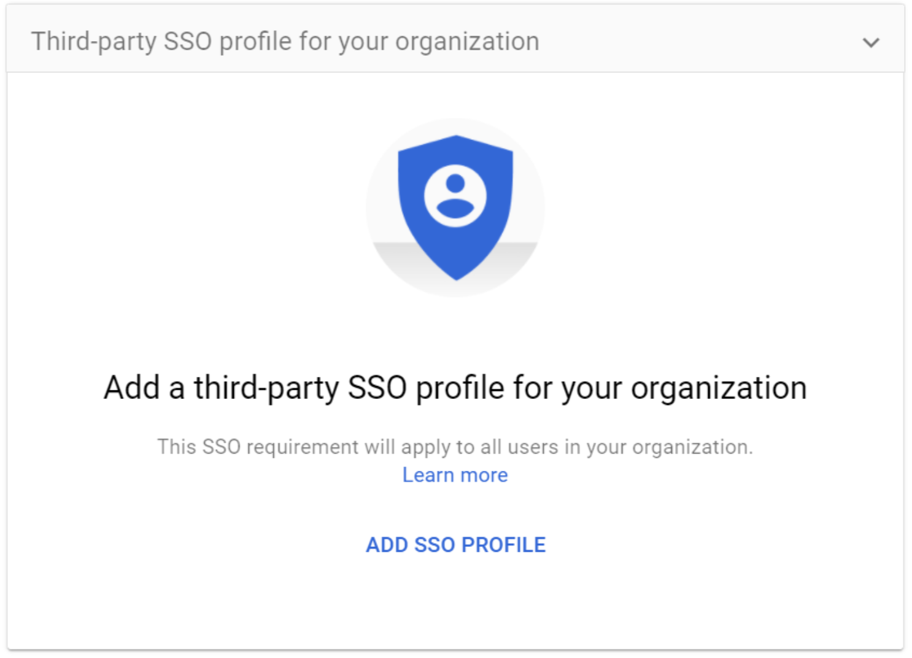
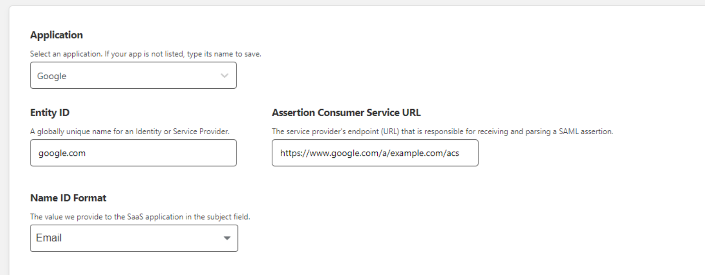

# Configure a Google Workspace account for Access for SaaS

This tutorial covers how to use Cloudflare as a single sign on provider by setting up Access for SaaS.

**⏲️ Time to complete:** 15 minutes

## Create an SSO provider in Google Workspace

1.  In your Google Workspace account, create an SSO third-party identity provider.

    

2.  Select **Setup SSO with a third party identity provider**.

## Create an application on the Zero Trust Dashboard

1.  On the Zero Trust Dashboard, navigate to **Access** > **Applications** and create a SaaS application.

2.  Follow [this guide](https://support.google.com/a/answer/6349809?hl=en\&ref_topic=7556907) to collect the Entity ID and Assertion Consumer Service URL to add to your application:

    *   Entity ID: `google.com`
    *   Assertion Consumer Service URL: `https://google.com/a/your_domain.com/acs`
    *   Name ID: `Email`

    

3.  Click **Next** to create an Access policy and use the following mapping to set up your Workspace sign-in:

    | Google Workspace value | Cloudflare value |
    | ----- | ---- |
    | Sign-in page URL | SSO Endpoint |
    | Sign-out page URL | SSO Endpoint |
    | Verification Certificate | Public Key |

4.  Next, you can select **Use a domain specific issuer**. If you select this option, Google will send an issuer specific to your domain (where `your_domain.com` is replaced with your actual primary Google Workspace domain name).

## Create and upload a certificate file

1.  Paste the **Public Key** in VIM or another code editor.
2.  Wrap the certificate in `-----BEGIN CERTIFICATE-----` and `-----END CERTIFICATE-----`.
3.  Set the file extension as `.crt` and save.

Once the certificate file has been created, upload it to your Google Workspace account.

## Test the integration

You can now test the integration by going to `https://google.com/a/<yourdomain>`.

## Troubleshooting

`Error: “G Suite - This account cannot be accessed because the login credentials could not be verified.”`

If you see this error, it is likely that the Public Key and Private Key do not match. Confirm your certificate file matches your Public Key.
