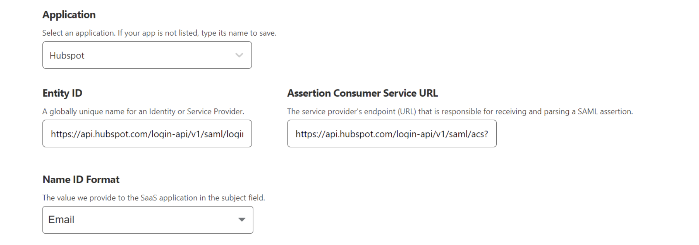
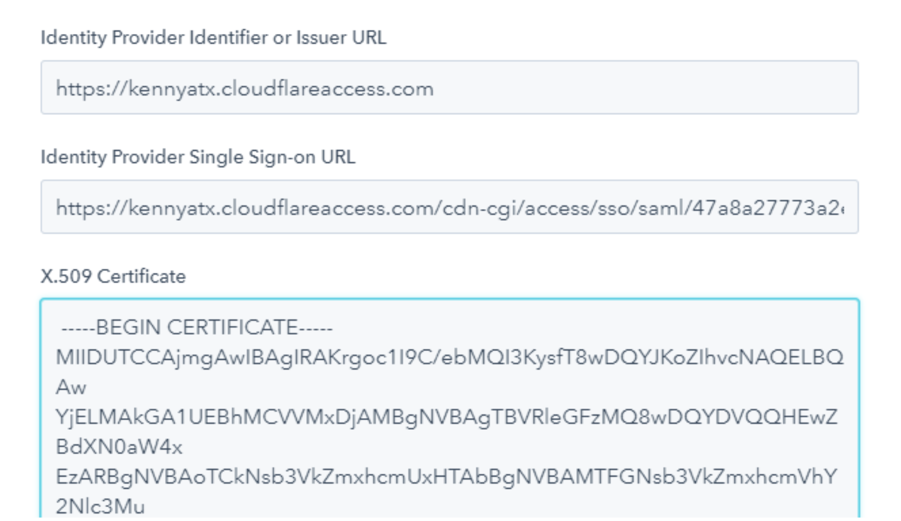

# Configure a Hubspot account for Access for SaaS

This tutorial covers how to set up Cloudflare as the SSO provider for Hubspot. Before you start, please note that Hubspot SSO typically requires an Enterprise license.

**⏲️ Time to complete:** 15 minutes

## Configure Hubspot

1.  Go to **Settings** > **Account**, and from there, navigate to **Defaults** > **Security**.
2.  Select *Single Sign-on*.
3.  Copy the values for *Audience URI* and *Sign on URL*.

## Configure Cloudflare Access

1.  On the Zero Trust Dashboard, navigate to **Access** > **Applications** and create a SaaS application.

2.  Set the **Application type** to *Hubspot*.

    

3.  Use the following Hubspot field mappings:

    | Hubspot values | Cloudflare values |
    | ---- | ---- |
    | Audience URI | EntityID |
    | Sign On URL | Assertion Consumer Service URL |

4.  Next, set **NameID** to *Email*.

5.  Add any desired [Zero Trust policies](/policies/zero-trust) to your application.

6.  Copy SSO endpoint and Access Entity ID.

## Create the certificate

1.  Wrap the certificate in `-----BEGIN CERTIFICATE-----` and `-----END CERTIFICATE-----`.
2.  Paste the certificate contents into the Certificate field.

## Finalize Hubspot configuration

1.  Use the following field mappings:

    | Cloudflare value | Hubspot value |
    | --- | --- |
    | SSO endpoint | Identity Provider Single Sign-on URL |
    | Entity ID | Identity Provider Identifier |
    | Public key | Certificate |

    

2.  Select **Verify** to validate the integration.

Your configuration is now complete. Hubspot SSO can be switched on for specific users or the entire account.
