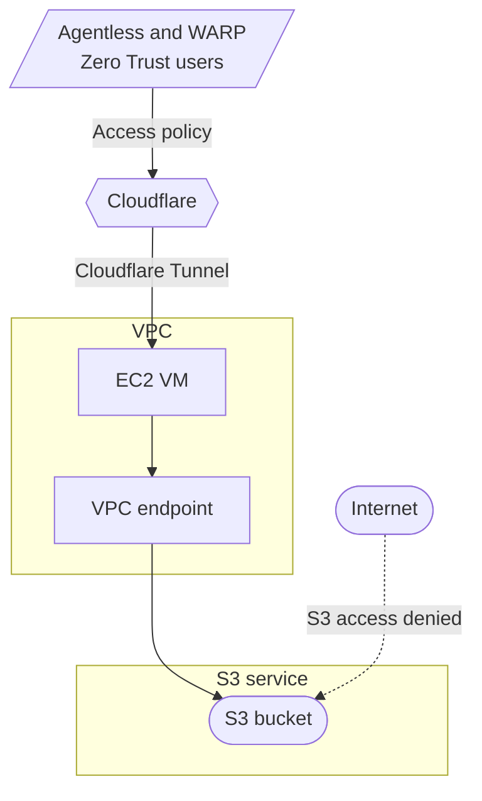
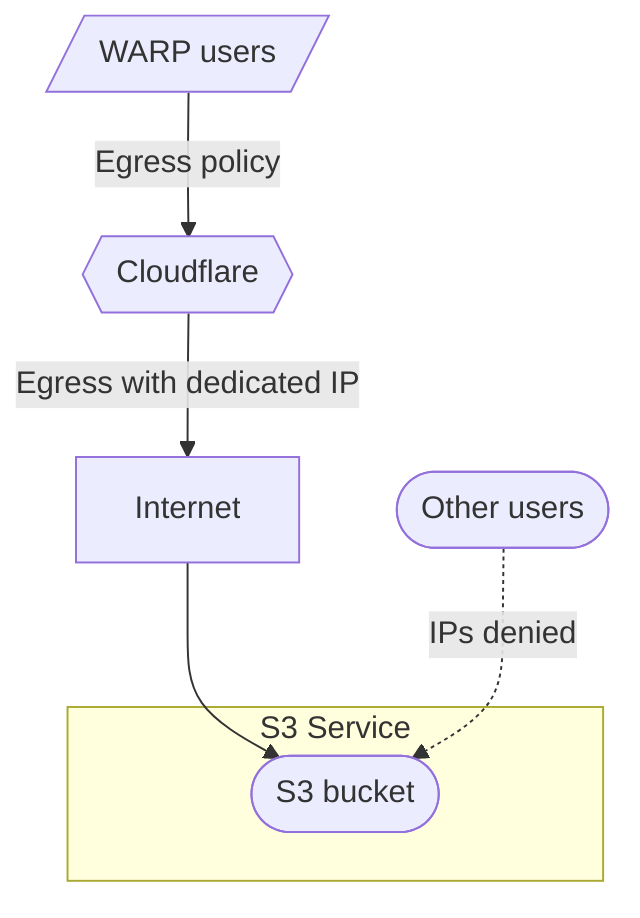

# Protect access to Amazon S3 buckets with Cloudflare Zero Trust

This tutorial demonstrates how to secure access to AWS S3 buckets via Cloudflare Zero Trust, so that data in these buckets is not publicly exposed on the Internet. With Zero Trust, we can do this with either Cloudflare Access and VPC endpoints, or with Cloudflare Gateway egress policies.

## Method 1: Via Cloudflare Access and VPC endpoints



### Prerequisites

- AWS VPC with one EC2 virtual machine (VM) hosting the [Cloudflare Tunnel daemon](/cloudflare-one/connections/connect-networks/)
- S3 bucket to be protected by Cloudflare Zero Trust
- S3 bucket and AWS VPC configured in the same AWS region

### 1. Create VPC endpoint on AWS

1. From the AWS dashboard, go to the **VPC dashboard** > **Virtual private cloud** > **Endpoints** > **Create endpoint**.
2. Name the endpoint, for example `vpc-endpoint`.
3. Select **AWS services** as the Service category.
4. Under **Services** search and select the S3 service in the same region of the VPC. For example, for **Europe (London) - eu-west-2**, the S3 service is **com.amazonaws.eu-west-2.s3**. This is a service of type **Gateway**.
5. Under **VPC**, select the VPC that contains the EC2 VM hosting the Cloudflare tunnel daemon.
6. Under **Route tables**, select the route table associated with the VPC.
7. Under **Policy**, select **Full access**.
8. Select **Create endpoint**.

After the VPC endpoint is created, there will be a new entry in the VPC route table with the target being the VPC endpoint, in the format `vpce-xxxxxxxxxxxxxxxxx`.

### 2. Set up a bucket policy on the S3 bucket so that the VPC can access the bucket

1. From the AWS dashboard, go to the **S3 dashboard** > **Buckets** > **`your-S3-bucket01`** > **Permissions**
2. Uncheck **Block all public access**.
3. Edit the **Bucket policy** and add this policy.

```json
{
    "Version": "2012-10-17",
    "Id": "VPCe",
    "Statement": [
        {
            "Sid": "VPCe",
            "Effect": "Allow",
            "Principal": "*",
            "Action": "s3:*",
            "Resource": [
                "arn:aws:s3:::<your-S3-bucket01>",
                "arn:aws:s3:::<your-S3-bucket01>/*"
            ],
            "Condition": {
                "StringEquals": {
                    "aws:SourceVpce": "<your-vpc-endpoint>"
                }
            }
        }
    ]
}
```

### 3. Enable Static website hosting on the S3 bucket

From the AWS dashboard, go to the **S3 dashboard** > **Buckets** > `your-S3-bucket01` > **Properties**

1. Under **Static website hosting** Select **Edit**.
2. Choose **Enable** for **Static website hosting**.
3. Specify the **Index** and **Error** documents for the S3 bucket.
4. Select **Save changes**.

A bucket website endpoint will be available at `http://<your-S3-bucket01>.s3-website.<aws-region>.amazonaws.com` . Due to the bucket policy, this website endpoint will only accessible from the VPC with the VPC endpoint configured.

### 4. Add a new public hostname to the Cloudflare tunnel terminating in the AWS VPC

From the Cloudflare Zero Trust dashboard, go to **Access** > **Tunnels** > `your-cloudflare-tunnel` > **Configure**

1. Go to **Public hostnames** > **Add a public hostname**.
2. Under **Subdomain**, choose a subdomain name that will be used by your organization to access the S3 bucket, for example, `s3-bucket.your-domain.com`.
3. Under **Service**, choose `Type = HTTP` and `URL = <your-S3-bucket01>.s3-website.<aws-region>.amazonaws.com`.
4. Expand the **Additional application settings** > **HTTP Settings** and configure the **HTTP Host Header** as `<your-S3-bucket01>.s3-website.<aws-region>.amazonaws.com`.
5. Select **Save hostname**.

### 5. Add a new Access Policy to restrict access to the S3 bucket

From the Cloudflare Zero Trust dashboard, go to **Access** > **Applications** > **Add an application**

1. Select **Self-hosted** as the application type.
2. Provide a name to the **Application**, for example, `s3-bucket`.
3. Define the **Application Domain** as the **Public hostname** added to the Cloudflare tunnel, for example, `s3-bucket.your-domain.com`.
4. Configure the rest of the Application settings as per your organization requirements. For more details, refer to the [Access Policies](/cloudflare-one/policies/access/) documentation. For automated systems, to access the bucket, [Service Tokens](/cloudflare-one/identity/service-tokens/) can be used.

The S3 bucket is now available at `https://s3-bucket.your-domain.com` but only for users/applications that successfully authenticate via Cloudflare Access.

## Method 2: Via Cloudflare Gateway egress policies


This method is only available on Enterprise plans.




### Prerequisites

- S3 bucket to be protected by Cloudflare Zero Trust
- Cloudflare Zero Trust account with [dedicated egress IPs](/cloudflare-one/policies/gateway/egress-policies/dedicated-egress-ips/)

### 1. Set up a bucket policy on the S3 bucket to restrict access to a specific IP address

From the AWS dashboard, go to the **S3 dashboard** > **Buckets** > `your-S3-bucket02` > **Permissions**

1. Uncheck **Block all public access**.
2. Edit the **Bucket policy** and add this policy:

```json
{
    "Version": "2012-10-17",
    "Id": "SourceIP",
    "Statement": [
        {
            "Sid": "SourceIP",
            "Effect": "Allow",
            "Principal": "*",
            "Action": "s3:*",
            "Resource": [
                "arn:aws:s3:::<your-S3-bucket02>",
                "arn:aws:s3:::<your-S3-bucket02>/*"
            ],
            "Condition": {
                "IpAddress": {
                    "aws:SourceIp": "<your-dedicated-ip>/32"
                }
            }
        }
    ]
}
```

### 2. Enable Static website hosting on the S3 bucket

From the AWS dashboard, go to the **S3 dashboard** > **Buckets** > `your-S3-bucket02` > **Properties**

1. Under **Static website hosting** Select **Edit**.
2. Choose **Enable** for **Static website hosting**.
3. Specify the **Index** and **Error** documents for the S3 bucket.
4. Select **Save changes**.

A bucket website endpoint will be available at `http://<your-S3-bucket02>.s3-website.<aws-region>.amazonaws.com` . Due to the bucket policy, this website endpoint will only accessible to traffic being sourced from the Dedicated Egress IP specified.

### 3. Setup a dedicated egress IP policy

1. In [Zero Trust](https://one.dash.cloudflare.com/), go to **Gateway** > **Egress Policies** > **Add a policy**.
2. Define a policy that specifies what traffic proxied by Cloudflare Gateway should get a dedicated egress IP assigned to it. For more details, refer to the [Dedicated egress IP documentation](/cloudflare-one/policies/gateway/egress-policies/dedicated-egress-ips/).
3. Under **Step 3**, choose **Use dedicated Cloudflare egress IPs** and select `your-dedicated-ip` (the same as defined in the S3 bucket policy).

The S3 bucket is now available at `http://<your-S3-bucket02>.s3-website.<aws-region>.amazonaws.com` but only for traffic being proxied by Cloudflare Gateway and assigned the dedicated egress IP.
