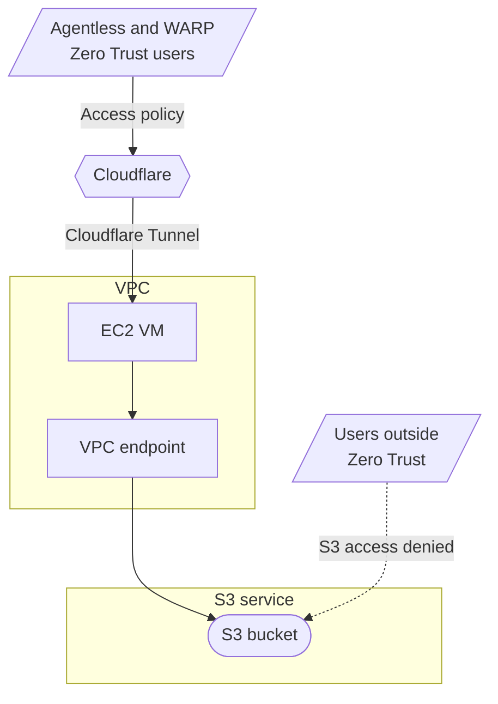
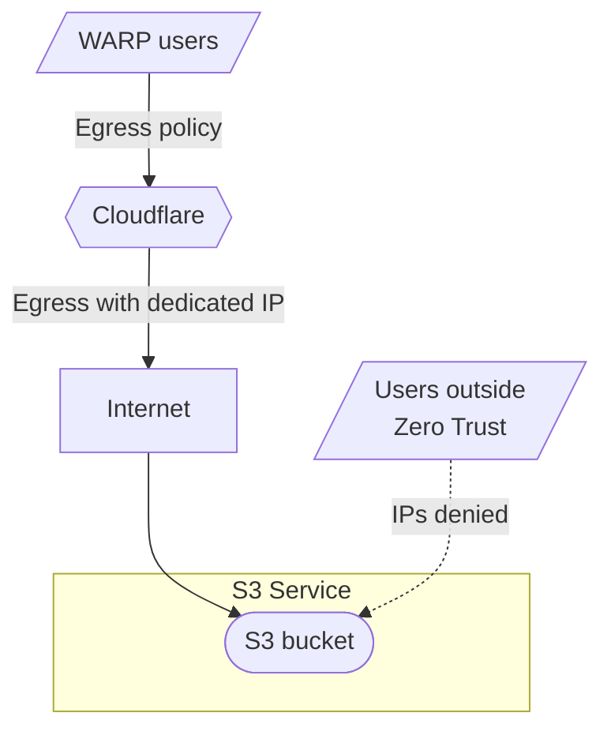

# Protect access to Amazon S3 buckets with Cloudflare Zero Trust

This tutorial demonstrates how to secure access to Amazon S3 buckets with Cloudflare Zero Trust so that data in these buckets is not publicly exposed on the Internet. With Zero Trust, you can use Cloudflare Access and AWS VPC endpoints. Enterprise may also use Cloudflare Gateway egress policies with dedicated egress IPs.

## Method 1: Via Cloudflare Access and VPC endpoints



### Prerequisites

- AWS VPC with one EC2 virtual machine (VM) hosting the [Cloudflare Tunnel daemon](/cloudflare-one/connections/connect-networks/)
- S3 bucket to be protected by Cloudflare Zero Trust
- S3 bucket and AWS VPC configured in the same [AWS region](https://docs.aws.amazon.com/AmazonRDS/latest/UserGuide/Concepts.RegionsAndAvailabilityZones.html)

### 1. Create a VPC endpoint in AWS

1. In the [AWS dashboard](https://aws.amazon.com/console/), go to **Services** > **Networking & Content Delivery** > **VPC**.
2. Under **Virtual private cloud**, go to **Endpoints**.
3. Select **Create endpoint** and name the endpoint.
4. Choose _AWS services_ as the service category.
5. In **Services**, search and select the S3 service in the same region of the VPC. For example, for the AWS region **Europe (London) - eu-west-2**, the corresponding S3 service is named `com.amazonaws.eu-west-2.s3` with a type of Gateway.
6. In **VPC**, select your VPC that contains the EC2 VM hosting the Cloudflare tunnel daemon.
7. In **Route tables**, select the route table associated with the VPC.
8. In **Policy**, choose _Full access_.
9. Select **Create endpoint**.

After you create the VPC endpoint, a new entry in the VPC route table with the target being your VPC endpoint. The entry will have the format `vpce-xxxxxxxxxxxxxxxxx`.

### 2. Set up a bucket policy for VPC access

1. Go to **Services** > **Storage** > **S3**.
2. In Amazon S3, go to **Buckets** > **`<your-S3-bucket>`** > **Permissions**.
3. Disable **Block all public access**.
4. In **Bucket policy**, add the following policy:

```json
{
    "Version": "2012-10-17",
    "Id": "VPCe",
    "Statement": [
        {
            "Sid": "VPCe",
            "Effect": "Allow",
            "Principal": "*",
            "Action": "s3:*",
            "Resource": [
                "arn:aws:s3:::<your-S3-bucket01>",
                "arn:aws:s3:::<your-S3-bucket01>/*"
            ],
            "Condition": {
                "StringEquals": {
                    "aws:SourceVpce": "<your-vpc-endpoint>"
                }
            }
        }
    ]
}
```

Your bucket policy will allow your VPC to access your S3 bucket.

### 3. Enable static website hosting for the S3 bucket

1. Return to the S3 dashboard, then go to **Buckets** > **`your-S3-bucket01`** > **Properties**.
2. In **Static website hosting**, select **Edit**.
3. Enable **Static website hosting**.
4. Specify the Index and Error documents for the S3 bucket.
5. Select **Save changes**.

A bucket website endpoint will be available at `http://<your-S3-bucket01>.s3-website.<aws-region>.amazonaws.com` . Because of the bucket policy, this website endpoint will only be accessible from the VPC with the VPC endpoint configured.

### 4. Add a new public hostname to the Cloudflare Tunnel

1. In [Zero Trust](https://one.dash.cloudflare.com/), go to **Access** > **Tunnels**
2. Select your Tunnel, then select **Configure**.
3. Go to **Public Hostname**, then select **Add a public hostname**.
4. Enter a subdomain your organization will use to access the S3 bucket. For example, `s3-bucket.<your-domain>.com`.
5. Under **Service**, choose _HTTP_ for **Type**. In **URL**, enter `<your-S3-bucket01>.s3-website.<aws-region>.amazonaws.com`.
6. In **Additional application settings** > **HTTP Settings**, input the **HTTP Host Header** as `<your-S3-bucket01>.s3-website.<aws-region>.amazonaws.com`.
7. Select **Save hostname**.

Your Cloudflare Tunnel will terminate at the AWS VPC using your public hostname.

### 5. Restrict S3 access with an Access policy

1. Go to **Access** > **Applications**. Select **Add an application**.
2. Select **Self-hosted**.
3. Enter a name for the application.
4. In **Application Domain**, enter the public hostname used by your Tunnel. For example, `s3-bucket.<your-domain>.com`.
5. Configure the settings per your organization's requirements. For more information, refer to the [Access policies](/cloudflare-one/policies/access/). For automated systems, to access the bucket, [Service Tokens](/cloudflare-one/identity/service-tokens/) can be used.

Users and applications that successfully authenticate via Cloudflare Access can access your S3 bucket at `https://s3-bucket.<your-domain>.com`.

## Method 2: Via Cloudflare Gateway egress policies


This method is only available on Enterprise plans.




### Prerequisites

- S3 bucket to be protected by Cloudflare Zero Trust
- Cloudflare Zero Trust account with [dedicated egress IPs](/cloudflare-one/policies/gateway/egress-policies/dedicated-egress-ips/)

### 1. Set up a bucket policy on the S3 bucket to restrict access to a specific IP address

From the AWS dashboard, go to the **S3 dashboard** > **Buckets** > `your-S3-bucket02` > **Permissions**

1. Uncheck **Block all public access**.
2. Edit the **Bucket policy** and add this policy:

```json
{
    "Version": "2012-10-17",
    "Id": "SourceIP",
    "Statement": [
        {
            "Sid": "SourceIP",
            "Effect": "Allow",
            "Principal": "*",
            "Action": "s3:*",
            "Resource": [
                "arn:aws:s3:::<your-S3-bucket02>",
                "arn:aws:s3:::<your-S3-bucket02>/*"
            ],
            "Condition": {
                "IpAddress": {
                    "aws:SourceIp": "<your-dedicated-ip>/32"
                }
            }
        }
    ]
}
```

### 2. Enable Static website hosting on the S3 bucket

From the AWS dashboard, go to the **S3 dashboard** > **Buckets** > `your-S3-bucket02` > **Properties**

1. Under **Static website hosting** Select **Edit**.
2. Choose **Enable** for **Static website hosting**.
3. Specify the **Index** and **Error** documents for the S3 bucket.
4. Select **Save changes**.

A bucket website endpoint will be available at `http://<your-S3-bucket02>.s3-website.<aws-region>.amazonaws.com` . Due to the bucket policy, this website endpoint will only accessible to traffic being sourced from the Dedicated Egress IP specified.

### 3. Setup a dedicated egress IP policy

1. In [Zero Trust](https://one.dash.cloudflare.com/), go to **Gateway** > **Egress Policies** > **Add a policy**.
2. Define a policy that specifies what traffic proxied by Cloudflare Gateway should get a dedicated egress IP assigned to it. For more details, refer to the [Dedicated egress IP documentation](/cloudflare-one/policies/gateway/egress-policies/dedicated-egress-ips/).
3. Under **Step 3**, choose **Use dedicated Cloudflare egress IPs** and select `your-dedicated-ip` (the same as defined in the S3 bucket policy).

The S3 bucket is now available at `http://<your-S3-bucket02>.s3-website.<aws-region>.amazonaws.com` but only for traffic being proxied by Cloudflare Gateway and assigned the dedicated egress IP.
