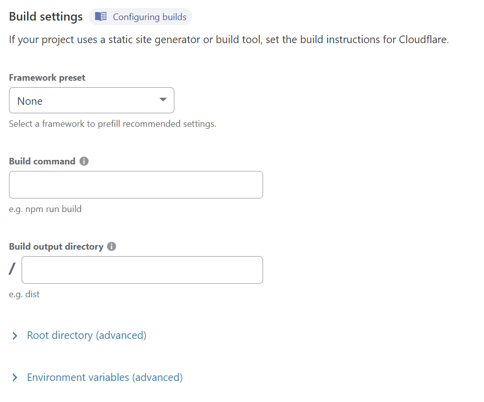
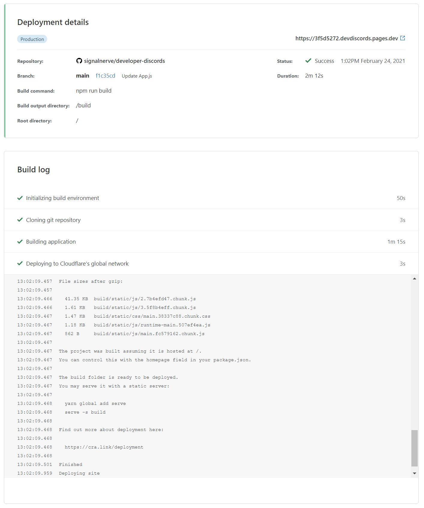
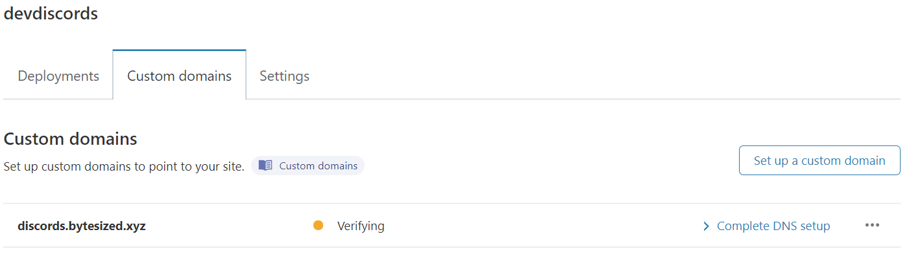
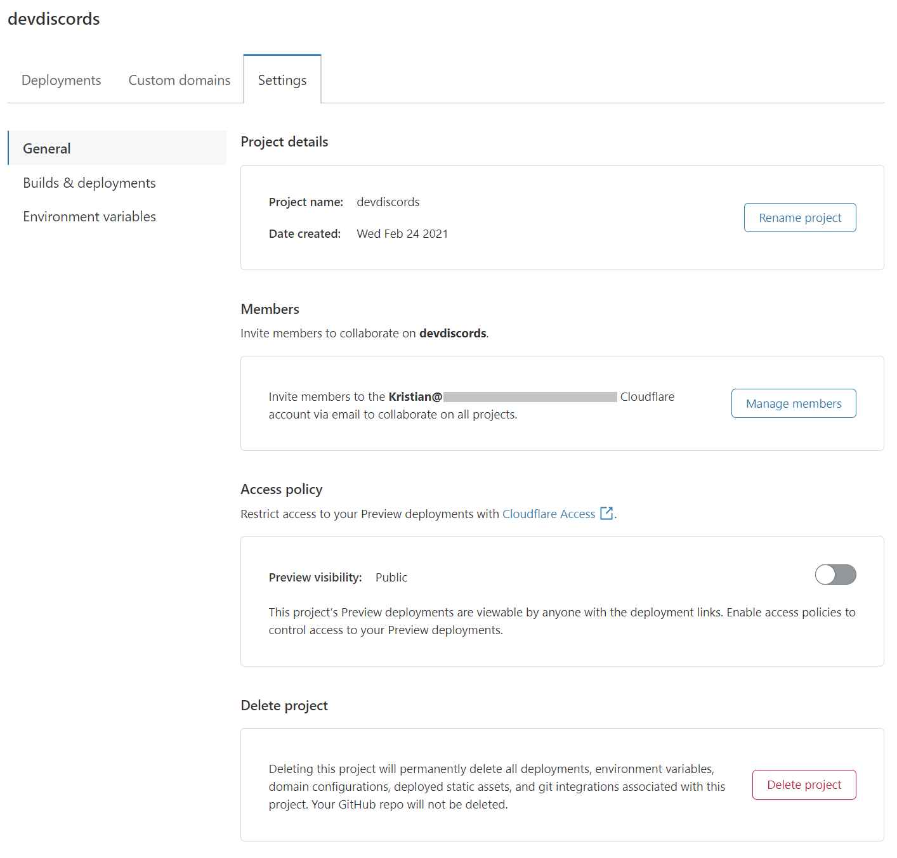

# Get started

In this guide, you will get started with Cloudflare Pages, and deploy your first website to the Pages platform.

<Aside>

You will be signing up for a Cloudflare account. You may also want to create a custom domain, but this is not required.

</Aside>

## Connecting your git provider to Pages

### Sign in to Cloudflare Pages

To begin, go to the [Cloudflare Pages site](https://pages.dev) and sign in with your Cloudflare account. If you do not have an account yet, you can sign up as you get started deploying your new Pages site.

### Connect to your git provider

Right now, Pages offers support for both [GitHub](https://github.com/) and [GitLab](https://gitlab.com/). Signing in with your preferred git provider allows [Cloudflare Pages](https://pages.dev) to deploy your projects, update your PRs with [preview deployments](/platform/preview-deployments), and more. After you sign in, select **Create a project** in the Pages dashboard.

## Configuration and deployment

### Selecting a your GitHub repository

You can select a GitHub project from your personal account or an organization you have given Pages access to. This allows you to choose a GitHub repository to deploy using Pages. Both private and public repositories are supported.

### Selecting a your GitLab repository

If using GitLab, select a project from your account. This allows you to choose a GitHub repository to deploy using Pages. Both private and public repositories are supported. Note: signing in with GitLab will grant Pages access to all repositories on your account. Additionally, if you are a part of a multi-user Cloudflare account, and you sign in with GitLab, other members will also have the ability to see the names of your repositories and deploy them to Pages.

<Aside>

If you do not have a project repo to choose from yet, [refer to our extensive How to section](/how-to) to learn how to create and deploy common frameworks and tools to Cloudflare Pages.

</Aside>

### Configuring your deployment

Once you have selected a repository, select **Install & Authorize** and **Begin setup**. You can then customize your deployment in the **Set up builds and deployments** page.

Your **project name** will be used to generate your project's hostname. By default, this matches your GitHub project name.

**Production branch** indicates the branch that Cloudflare Pages should use to deploy the production version of your site. For most projects, this is the `main` or `master` branch. All other branches that are not your production branch will be used for [preview deployments](/platform/preview-deployments).

#### Build settings

Depending on the framework, tool, or project you are deploying to Cloudflare Pages, you will need to specify the site's **build command** and **build output directory** to tell Cloudflare Pages how to deploy your site. The contents of this directory are uploaded to Cloudflare Pages as your website's contents.

Our deployment dashboard provides a number of framework-specific presets, which provide the default values for the selected framework. If you are unsure what the correct values are for this section, refer to our documentation on [build configuration](/platform/build-configuration). If you do not need a build step, you may input  `exit 0` into the **Build command** field.

Cloudflare Pages begins by working from your repository's root directory. The entire build pipeline, including the installation steps, will begin from this location. If you would like to change this, specify a new root directory location through the **Root directory (advanced)** > **Path** field.

#### Environment variables

Environment variables are a common way of providing configuration to your build workflow. While setting up your project, you can specify a number of key-value pairs as environment variables. These can be further customized once your project has finished building for the first time.

After you have chosen your _Framework preset_, configured **Root directory (advanced)**, and customized your **Environment variables (optional)**, you are ready to deploy.

## Your first deploy

Once you have finished setting your build configuration, select **Save and Deploy**. Your project build logs will output as Cloudflare Pages installs your project dependencies, builds the project, and deploys it to Cloudflare's global network.

When your project has finished deploying, you will receive a unique URL to view your deployed site.

## Managing your site

After your first deploy, select **Continue to project** to see see your project's configuration in the Cloudflare Pages dashboard. On this page, you can see your project's current deployment status, the production URL and associated commit, and all past deployments.

### Adding a custom domain

While every Cloudflare Pages site receives a custom subdomain during deployment, you may also wish to point custom domains (or subdomains) to your site. To do this, select the **Custom domains** section in your site dashboard.

 Select **Set up a domain**, provide the domain that you would like to serve your Cloudflare Pages site on and select **Continue**. Depending on the domain, you will need to configure nameservers or add a custom CNAME record to point the domain to your Cloudflare Pages site.

#### Configure nameservers

Configure your nameservers to point to Cloudflare's name servers. If your nameservers are successfully pointed to Cloudflare, Cloudflare will proceed by creating a CNAME record for you.

#### Add a custom CNAME record

If you do not want to point your nameservers to Cloudflare, you can still use a custom CNAME record to use a single domain with Cloudflare Pages. You can configure your DNS settings in the **DNS** section of the Cloudflare dashboard.

| Type         | Name               | Content            |
| ------------ | ------------------ | ------------------ |
| `CNAME`      | `domain.com`       | `custom.pages.dev` |

<Aside type="note">

To ensure a custom domain is added successfully, you must go through the [Adding a custom domain](/getting-started#adding-a-custom-domain) process described above. Manually adding a custom CNAME record pointing to your Cloudflare Pages site - without first associating the domain (or subdomains) in the Cloudflare Pages dashboard - will result in your domain failing to resolve at the CNAME record address, and display a [522 error](https://support.cloudflare.com/hc/en-us/articles/115003011431-Troubleshooting-Cloudflare-5XX-errors#522error).

</Aside>

## Advanced project settings

In the **Settings** section, you can configure advanced settings, such as changing your project name, updating your GitHub configuration, or updating your build command or build directory.

### Access policies

You can use [Cloudflare Access](https://www.cloudflare.com/teams-access/) to manage access to your deployment previews. By default, these deployment URLs are public. Enabling the access policy will restrict viewing project deployments to your Cloudflare account.

Once enabled, you can [set up a multi-user account](https://support.cloudflare.com/hc/en-us/articles/205065067-Setting-up-Multi-User-accounts-on-Cloudflare) to allow other members of your team to view preview deployments.
