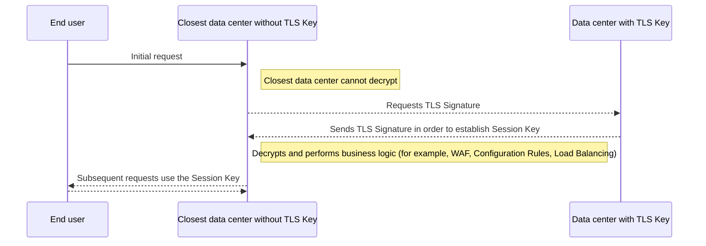

# Geo Key Manager

Geo Key Manager offers enhanced control over the storage location of private SSL/TLS keys, ensuring compliance with regional data regulations and security requirements.

## Customize key storage

By default, private keys will be encrypted and securely distributed to each data center, where they can be utilized for local SSL/TLS termination. Geo Key Manager allows you to choose where you want to store your private keys.

Geo Key Manager was restricted to the US, EU, and high-security data centers, but with the new version of Geo Key Manager, available in [Closed Beta](https://blog.cloudflare.com/configurable-and-scalable-geo-key-manager-closed-beta/), you can now create `allowlists` and `blocklists` of countries in which your private keys will be stored. That means that you will be able define specific geographic locations where to store keys, for instance you can store your private keys exclusively in Australia or limit private keys storage to the EU and the UK. 

## Cloudflare data center flow example

The following diagram is a high-level example of the flow of the Cloudflare data centers without private TLS key. In this process, data centers have to request and create temporary Session Keys to perform TLS termination by reaching out to Cloudflare data centers which hold the private TLS keys:

 

 

For detailed information on setup and supported options, refer to [Geo Key Manager documentation](/ssl/edge-certificates/geokey-manager/).
