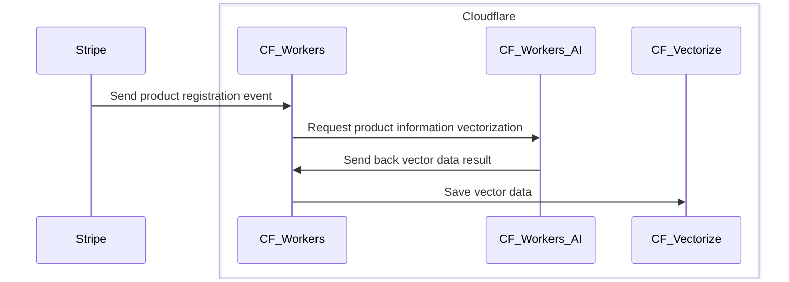

# Recommend products on e-commerce sites using Workers AI and Stripe





E-commerce and media sites often work on increasing the average transaction value to boost profitability. One of the strategies to increase the average transaction value is "cross-selling," which involves recommending related products. Cloudflare offers a range of products designed to build mechanisms for retrieving data related to the products users are viewing or requesting. In this tutorial, you will experience developing functionalities necessary for cross-selling by creating APIs for related product searches and product recommendations.

## Goals
In this workshop, you will develop three REST APIs.

1. An API to search for information highly related to a specific product.
2. An API to suggest products in response to user inquiries.
3. A Webhook API to synchronize product information with external e-commerce applications.

By developing these APIs, you will learn about the resources needed to build cross-selling and recommendation features for e-commerce sites.

You will also learn how to use the following Cloudflare products:

- [**Cloudflare Workers**](/workers/): Execution environment for API applications
- [**Cloudflare Vectorize**](/vectorize/): Vector DB used for related product searches
- [**Cloudflare Workers AI**](/workers-ai/): Used for vectorizing data and generating recommendation texts






### Prerequisites

This tutorial involves the use of several Cloudflare products. Some of these products have free tiers, while others may incur minimal charges. Please review the following billing information carefully.





You will also need access to [Vectorize](/vectorize/platform/pricing/).



## 1. Create a new Worker project

First, let's create a Cloudflare Workers project.



To efficiently create and manage multiple APIs, let's use [`Hono`](https://hono.dev). Hono is an open-source application framework released by a Cloudflare Developer Advocate. It is lightweight and allows for the creation of multiple API paths, as well as efficient request and response handling.
Open your command line interface (CLI) and run the following command:




```sh
$ npm create cloudflare@latest cross-sell-api -- --framework hono
```




```sh
$ yarn create cloudflare@latest cross-sell-api -- --framework hono
```




```sh
$ pnpm create cloudflare@latest cross-sell-api -- --framework hono
```




If this is your first time running the `C3` command, you will be asked whether you want to install it. Confirm that the package name for installation is `create-cloudflare` and answer `y`.

```sh
Need to install the following packages:
create-cloudflare@latest
Ok to proceed? (y)
```

During the setup, you will be asked if you want to manage your project source code with `Git`. It is recommended to answer `Yes` as it helps in recording your work and rolling back changes. You can also choose `No`, which will not affect the tutorial progress.

```sh
╰ Do you want to use git for version control?
  Yes / No
```

Finally, you will be asked if you want to deploy the application to your Cloudflare account. For now, select `No` and start development locally.

```sh
╭ Deploy with Cloudflare Step 3 of 3
│
╰ Do you want to deploy your application?
  Yes / No
```

If you see a message like the one below, the project setup is complete. You can open the `cross-sell-api` directory in your preferred IDE to start development.

```sh
├  APPLICATION CREATED  Deploy your application with npm run deploy
│
│ Navigate to the new directory cd cross-sell-api
│ Run the development server npm run dev
│ Deploy your application npm run deploy
│ Read the documentation https://developers.cloudflare.com/workers
│ Stuck? Join us at https://discord.cloudflare.com
│
╰ See you again soon!
```

Cloudflare Workers applications can be developed and tested in a local environment. On your CLI, change directory into your newly created Workers and run `npx wrangler dev` to start the application. Using `Wrangler`, the application will start, and you'll see a URL beginning with `localhost`.

```sh
 ⛅️ wrangler 3.60.1
-------------------

⎔ Starting local server...
[wrangler:inf] Ready on http://localhost:8787
╭───────────────────────────────────────────────────────────────────────────────────────────────────────────╮
│ [b] open a browser, [d] open Devtools, [l] turn off local mode, [c] clear console, [x] to exit            │
╰───────────────────────────────────────────────────────────────────────────────────────────────────────────╯

```

You can send a request to the API using the `curl` command. If you see the text `Hello Hono!`, the API is running correctly.

```sh
$ curl http://localhost:8787
Hello Hono!
```

So far, we've covered how to create a Cloudflare Worker project and introduced tools and open-source projects like the `C3` command and the `Hono` framework that streamline development with Cloudflare. Leveraging these features will help you develop applications on Cloudflare Workers more smoothly.

## 2. Create an API to import product information

Now, we will start developing the three APIs that will be used in our cross-sell system. First, let's create an API to synchronize product information with an existing e-commerce application. In this example, we will set up a system where product registrations in [Stripe](https://stripe.com) are synchronized with the cross-sell system.

This API will receive product information sent from an external service like Stripe as a Webhook event. It will then extract the necessary information for search purposes and store it in a database for related product searches. Since vector search will be used, we also need to implement a process that converts strings to vector data using an Embedding model provided by Cloudflare Workers AI.

The process flow is illustrated as follows:



Let's start implementing step-by-step.

### Bind Workers AI and Vectorize to your Worker

This API requires the use of Workers AI and Vectorize. To use these resources from a Worker, you will need to first create the resources then [bind](/workers/runtime-apis/bindings/#what-is-a-binding) them to a Worker. First, let's create a Vectorize index with Wrangler using the command `wrangler vectorize create {index_name} --dimensions={number_of_dimensions} --metric={similarity_metric}`. The values for `dimensions` and `metric` depend on the type of [Text Embedding Model](/workers-ai/models/#text-embeddings) you are using for data vectorization (Embedding). For example, if you are using the `bge-large-en-v1.5` model, the command is:

```sh
$ npx wrangler vectorize create stripe-products --dimensions=1024 --metric=cosine
```

When this command executes successfully, you will see a message like the following. It provides the items you need to add to `wrangler.toml` to bind the Vectorize index with your Worker application. Copy the three lines starting with `[[vectorize]]`.

```sh
✅ Successfully created a new Vectorize index: 'stripe-products'
📋 To start querying from a Worker, add the following binding configuration into 'wrangler.toml':

[[vectorize]]
binding = "VECTORIZE_INDEX"
index_name = "stripe-products"
```

To use the created Vectorize index from your Worker, let's add the binding. Open `wrangler.toml` and add the copied lines.

```toml
---
filename: wrangler.toml
highlight: [5,6,7]
---
name = "cross-sell-api"
main = "src/index.ts"
compatibility_date = "2024-06-05"

[[vectorize]]
binding = "VECTORIZE_INDEX"
index_name = "stripe-products"
```

Additionally, let's add the configuration to use Workers AI in `wrangler.toml`.

```toml
---
filename: wrangler.toml
highlight: [9,10]
---
name = "cross-sell-api"
main = "src/index.ts"
compatibility_date = "2024-06-05"

[[vectorize]]
binding = "VECTORIZE_INDEX"
index_name = "stripe-products"

[ai]
binding = "AI" # available in your Worker on env.AI
```

When handling bound resources from your application, you can generate TypeScript type definitions to develop more safely. Run the `npm run cf-typegen` command. This command updates the `worker-configuration.d.ts` file, allowing you to use both Vectorize and Workers AI in a type-safe manner.

```sh
$ npm run cf-typegen

> cf-typegen
> wrangler types --env-interface CloudflareBindings

 ⛅️ wrangler 3.60.1
-------------------

interface CloudflareBindings {
        VECTORIZE_INDEX: VectorizeIndex;
        AI: Ai;
}
```

Once you save these changes, the respective resources and APIs will be available for use in the Workers application. You can access these properties from `env`. In this example, you can use them as follows:

```ts
---
filename: src/index.ts
---
app.get('/', (c) => {
  c.env.AI // Workers AI SDK
  c.env.VECTORIZE_INDEX // Vectorize SDK
  return c.text('Hello Hono!')
})
```

Finally, rerun the `npx wrangler dev` command with the `--remote` option. This is necessary because Vectorize indexes are not supported in local mode. If you see the message, `Vectorize bindings are not currently supported in local mode. Please use --remote if you are working with them.`, rerun the command with the `--remote` option added.

```sh
$ npx wrangler dev --remote
```

### Create a webhook API to handle product registration events

You can receive notifications about product registration and information via POST requests using webhooks. Let's create an API that accepts POST requests. Open your `src/index.ts` file and add the following code:

```ts
---
filename: src/index.ts
---
app.post('/webhook', async (c) => {
  const body = await c.req.json()
  if (body.type === 'product.created') {
    const product = body.data.object
    console.log(JSON.stringify(product, null, 2))
  }
  return c.text('ok', 200)
})
```

This code implements an API that processes POST requests to the `/webhook` endpoint. The data sent by Stripe's Webhook events is included in the request body in JSON format. Therefore, we use `c.req.json()` to extract the data. There are multiple types of Webhook events that Stripe can send, so we added a conditional to only process events when a product is newly added, as indicated by the `type`.

### Add Stripe's API Key to the project

When developing a webhook API, you need to ensure that requests from unauthorized sources are rejected. To prevent unauthorized API requests from causing unintended behavior or operational confusion, you need a mechanism to verify the source of API requests. When integrating with Stripe, you can protect the API by generating a signing secret used for webhook verification.

1. Refer to the [Stripe documentation](https://docs.stripe.com/keys) to get a [secret API key for the test environment](https://docs.stripe.com/keys#reveal-an-api-secret-key-for-test-mode).
2. Save the obtained API key in a `.dev.vars` file.
```
STRIPE_SECRET_API_KEY=sk_test_XXXX
```
3. Follow the [guide](https://docs.stripe.com/stripe-cli) to install Stripe CLI.
4. Use the following Stripe CLI command to forward Webhook events from Stripe to your local application.
```sh
$ stripe listen --forward-to http://localhost:8787/webhook --events product.created
```
5. Copy the signing secret that starts with `whsec_` from the Stripe CLI command output.
```
> Ready! You are using Stripe API Version [2024-06-10]. Your webhook signing secret is
whsec_xxxxxx (^C to quit)
```
6. Save the obtained signing secret in the `.dev.vars` file.
```
STRIPE_WEBHOOK_SECRET=whsec_xxxxxx
```
7. Run `npm run cf-typegen` to update the type definitions in `worker-configuration.d.ts`.
8. Run `npm install stripe` to add the Stripe SDK to your application.
9. Restart the `npm run dev -- --remote` command to import the API key into your application.

Finally, modify the source code of `src/index.ts` as follows to ensure that the webhook API cannot be used from sources other than your Stripe account.

```ts
---
filename: src/index.ts
---
import { Hono } from 'hono'
import { env } from 'hono/adapter'
import Stripe from 'stripe'

type Bindings = {
  [key in keyof CloudflareBindings]: CloudflareBindings[key]
}

const app = new Hono<{
  Bindings: Bindings;
  Variables: {
    stripe: Stripe;
  }
}>()

/**
 * Initialize Stripe SDK client
 * We can use this SDK without initializing on each API route,
 * just get it by the following example:
 * ```
 * const stripe = c.get('stripe')
 * ```
 */
app.use('*', async (c, next) => {
  const { STRIPE_SECRET_API_KEY } = env(c)
  const stripe = new Stripe(STRIPE_SECRET_API_KEY)
  c.set('stripe', stripe)
  await next()
})

app.post('/webhook', async (c) => {
  const { STRIPE_WEBHOOK_SECRET } = env(c)
  const stripe = c.get('stripe')
  const signature = c.req.header('stripe-signature')
  if (!signature || !STRIPE_WEBHOOK_SECRET || !stripe) {
      return c.text("", 400)
  }
  try {
    const body = await c.req.text()
    const event = await stripe.webhooks.constructEventAsync(
        body,
        signature,
        STRIPE_WEBHOOK_SECRET,
    )
    if (event.type === 'product.created') {
      const product = event.data.object
      console.log(JSON.stringify(product, null, 2))
    }
    return c.text("", 200)
  } catch (err) {
    const errorMessage = `⚠️  Webhook signature verification failed. ${err instanceof Error ? err.message : "Internal server error"}`
    console.log(errorMessage)
    return c.text(errorMessage, 400)
  }
})

export default app
```

This ensures that an HTTP 400 error is returned if the Webhook API is called directly by unauthorized sources.

```sh
$ curl -XPOST http://localhost:8787/webhook -I
HTTP/1.1 400 Bad Request
Content-Length: 0
Content-Type: text/plain; charset=UTF-8
```

Use the Stripe CLI command to test sending events from Stripe.

```sh
$ stripe trigger product.created
Setting up fixture for: product
Running fixture for: product
Trigger succeeded! Check dashboard for event details.
```

The product information added on the Stripe side is recorded as a log on the terminal screen where `npm run dev` is executed.

```
{
  id: 'prod_QGw9VdIqVCNABH',
  object: 'product',
  active: true,
  attributes: [],
  created: 1718087602,
  default_price: null,
  description: '(created by Stripe CLI)',
  features: [],
  images: [],
  livemode: false,
  marketing_features: [],
  metadata: {},
  name: 'myproduct',
  package_dimensions: null,
  shippable: null,
  statement_descriptor: null,
  tax_code: null,
  type: 'service',
  unit_label: null,
  updated: 1718087603,
  url: null
}
[wrangler:inf] POST /webhook 201 Created (14ms)
```

## 3. Convert text into vector data using Workers AI

We've prepared to ingest product information, so let's start implementing the preprocessing needed to create an index for search. In vector search using Cloudflare Vectorize, text data must be converted to numerical data before indexing. By storing data as numerical sequences, we can search based on the similarity of these vectors, allowing us to retrieve highly similar data.

In this step, we'll first implement the process of converting externally sent data into text data. This is necessary because the information to be converted into vector data is in text form. If you want to include product names, descriptions, and metadata as search targets, add the following processing.

```ts
---
filename: src/index.ts
highlight: [3,4,5,6,7,8,9]
---
if (event.type === 'product.created') {
  const product = event.data.object
  const productData = [
    `## ${product.name}`,
    product.description,
    '### metadata',
    Object.entries(product.metadata).map(([key, value]) => `- ${key}: ${value}`).join('\n')
  ].join('\n')
  console.log(JSON.stringify(productData, null, 2))
}
```

By adding this processing, you convert product information in JSON format into a simple Markdown format product introduction text.

```sh
## product name
product description.
### metadata
- key: value
```

Now that we've converted the data to text, let's convert it to vector data. By using the Text Embedding model of Workers AI, we can convert text into vector data of any desired dimension.

```ts
---
filename: src/index.ts
highlight: [7,8,9,10,11,12,13]
---
const productData = [
  `## ${product.name}`,
  product.description,
  '### metadata',
  Object.entries(product.metadata).map(([key, value]) => `- ${key}: ${value}`).join('\n')
].join('\n')
const embeddings = await c.env.AI.run(
  '@cf/baai/bge-large-en-v1.5',
  {
    text: productData,
  }
)
console.log(JSON.stringify(embeddings, null, 2))
```

When using Workers AI, execute the `c.env.AI.run()` function. Specify the model you want to use as the first argument. In the second argument, input text data about the text you want to convert using the Text Embedding model or the instructions for the generated images or text. If you want to save the converted vector data using Vectorize, make sure to select a model that matches the number of `dimensions` specified in the `npx wrangler vectorize create` command. If the numbers do not match, there is a possibility that the converted vector data cannot be saved.

### Save vector data to Vectorize

Finally, let's save the created data to Vectorize. Edit `src/index.ts` to implement the indexing process using the `VECTORIZE_INDEX` binding. Since the data to be saved will be vector data, save the pre-conversion text data as metadata.

```ts
---
filename: src/index.ts
highlight: [16,17,18,19,20,21,22,23,24]
---
if (event.type === 'product.created') {
  const product = event.data.object
  const productData = [
    `## ${product.name}`,
    product.description,
    '### metadata',
    Object.entries(product.metadata).map(([key, value]) => `- ${key}: ${value}`).join('\n')
  ].join('\n')
  console.log(JSON.stringify(productData, null, 2))
  const embeddings = await c.env.AI.run(
    '@cf/baai/bge-large-en-v1.5',
    {
      text: productData,
    }
  )
  await c.env.VECTORIZE_INDEX.insert([{
    id: product.id,
    values: embeddings.data[0],
    metadata: {
      name: product.name,
      description: product.description || '',
      product_metadata: product.metadata,
    }
  }])
}

```

With this, we have established a mechanism to synchronize the product data with the database for recommendations. Use Stripe CLI commands to save some product data.

```bash
$ stripe products create --name="Smartphone X" \
  --description="Latest model with cutting-edge features" \
  -d "default_price_data[currency]=usd" \
  -d "default_price_data[unit_amount]=79900" \
  -d "metadata[category]=electronics"
```

```bash
$ stripe products create --name="Ultra Notebook" \
  --description="Lightweight and powerful notebook computer" \
  -d "default_price_data[currency]=usd" \
  -d "default_price_data[unit_amount]=129900" \
  -d "metadata[category]=computers"
```

```bash
$ stripe products create --name="Wireless Earbuds Pro" \
  --description="High quality sound with noise cancellation" \
  -d "default_price_data[currency]=usd" \
  -d "default_price_data[unit_amount]=19900" \
  -d "metadata[category]=audio"
```

```bash
$ stripe products create --name="Smartwatch 2" \
  --description="Stay connected with the latest smartwatch" \
  -d "default_price_data[currency]=usd" \
  -d "default_price_data[unit_amount]=29900" \
  -d "metadata[category]=wearables"
```

```bash
$ stripe products create --name="Tablet Pro" \
  --description="Versatile tablet for work and play" \
  -d "default_price_data[currency]=usd" \
  -d "default_price_data[unit_amount]=49900" \
  -d "metadata[category]=computers"
```

If the save is successful, you will see logs like `[200] POST` in the screen where you are running the `stripe listen` command.

```sh
2024-06-11 16:41:42   --> product.created [evt_1PQPKsL8xlxrZ26gst0o1DK3]
2024-06-11 16:41:45  <--  [200] POST http://localhost:8787/webhook [evt_1PQPKsL8xlxrZ26gst0o1DK3]
2024-06-11 16:41:47   --> product.created [evt_1PQPKxL8xlxrZ26gGk90TkcK]
2024-06-11 16:41:49  <--  [200] POST http://localhost:8787/webhook [evt_1PQPKxL8xlxrZ26gGk90TkcK]
```

If you confirm one log entry for each piece of registered data, the save process is complete. Next, we will implement the API for related product searches.

## 4. Create a related products search API using Vectorize

Now that we have prepared the index for searching, the next step is to implement an API to search for related products. By utilizing a vector index, we can perform searches based on how similar the data is. Let's implement an API that searches for product data similar to the specified product ID using this method.

In this API, the product ID is received as a part of the API path. Using the received ID, vector data is retrieved from Vectorize using `c.env.VECTORIZE_INDEX.getByIds()`. The return value of this process includes vector data, which is then passed to `c.env.VECTORIZE_INDEX.query()` to conduct a similarity search. To quickly check which products are recommended, we set `returnMetadata` to `true` to obtain the stored metadata information as well. The `topK` parameter specifies the number of data items to retrieve. Change this value if you want to obtain less than 2 or more than 4 data items.

```ts
---
filename: src/index.ts
---
app.get('/products/:product_id', async (c) => {
  // Get the product ID from API path parameters
  const productId = c.req.param('product_id')

  // Retrieve the indexed data by the product ID
  const [product] = await c.env.VECTORIZE_INDEX.getByIds([productId])

  // Search similar products by using the embedding data
  const similarProducts = await c.env.VECTORIZE_INDEX.query(product.values, {
    topK: 3,
    returnMetadata: true,
  })

  return c.json({
    product: {
      ...product.metadata
    },
    similarProducts,
  })
})
```

Let's run this API. Use a product ID that starts with `prod_`, which can be obtained from the result of running the `stripe products crate` command or the `stripe products list` command.

```sh
$ curl http://localhost:8787/products/prod_xxxx
```

If you send a request using a product ID that exists in the Vectorize index, the data for that product and two related products will be returned as follows.

```json
{
  "product": {
    "name": "Tablet Pro",
    "description": "Versatile tablet for work and play",
    "product_metadata": {
      "category": "computers"
    }
  },
  "similarProducts": {
    "count": 3,
    "matches": [
      {
        "id": "prod_QGxFoHEpIyxHHF",
        "metadata": {
          "name": "Tablet Pro",
          "description": "Versatile tablet for work and play",
          "product_metadata": {
            "category": "computers"
          }
        },
        "score": 1
      },
      {
        "id": "prod_QGxFEgfmOmy5Ve",
        "metadata": {
          "name": "Ultra Notebook",
          "description": "Lightweight and powerful notebook computer",
          "product_metadata": {
            "category": "computers"
          }
        },
        "score": 0.724717327
      },
      {
        "id": "prod_QGwkGYUcKU2UwH",
        "metadata": {
          "name": "demo product",
          "description": "aaaa",
          "product_metadata": {
            "test": "hello"
          }
        },
        "score": 0.635707003
      }
    ]
  }
}
```

Looking at the `score` in `similarProducts`, you can see that there is data with a `score` of `1`. This means it is exactly the same as the query used to search. By looking at the metadata, it is evident that the data is the same as the product ID sent in the request. Since we want to search for related products, let's add a `filter` to prevent the same product from being included in the search results. Here, a filter is added to exclude data with the same product name using the `metadata` name.

```ts
---
filename: src/index.ts
highlight: [7,8,9,10,11]
---
app.get('/products/:product_id', async (c) => {
  const productId = c.req.param('product_id')
  const [product] = await c.env.VECTORIZE_INDEX.getByIds([productId])
  const similarProducts = await c.env.VECTORIZE_INDEX.query(product.values, {
    topK: 3,
    returnMetadata: true,
    filter: {
      name: {
        "$ne": product.metadata?.name.toString(),
      }
    }
  })

  return c.json({
    product: {
      ...product.metadata
    },
    similarProducts,
  })
})
```

After adding this process, if you run the API, you will see that there is no data with a `score` of `1`.

```json
{
  "product": {
    "name": "Tablet Pro",
    "description": "Versatile tablet for work and play",
    "product_metadata": {
      "category": "computers"
    }
  },
  "similarProducts": {
    "count": 3,
    "matches": [
      {
        "id": "prod_QGxFEgfmOmy5Ve",
        "metadata": {
          "name": "Ultra Notebook",
          "description": "Lightweight and powerful notebook computer",
          "product_metadata": {
            "category": "computers"
          }
        },
        "score": 0.724717327
      },
      {
        "id": "prod_QGwkGYUcKU2UwH",
        "metadata": {
          "name": "demo product",
          "description": "aaaa",
          "product_metadata": {
            "test": "hello"
          }
        },
        "score": 0.635707003
      },
      {
        "id": "prod_QGxFEafrNDG88p",
        "metadata": {
          "name": "Smartphone X",
          "description": "Latest model with cutting-edge features",
          "product_metadata": {
            "category": "electronics"
          }
        },
        "score": 0.632409942
      }
    ]
  }
}
```

In this way, you can implement a system to search for related product information using Vectorize.

## 5. Create a recommendation API that answers user questions.

Recommendations can be more than just displaying related products; they can also address user questions and concerns. The final API will implement a process to answer user questions using Vectorize and Workers AI.

This API will implement the following processes:

1. Vectorize the user's question using the Text Embedding Model from Workers AI.
2. Use Vectorize to search and retrieve highly relevant products.
3. Convert the search results into a string in Markdown format.
4. Utilize the Text Generation Model from Workers AI to generate a response based on the search results.

This method realizes a text generation mechanism called Retrieval Augmented Generation (RAG) using Cloudflare. The bindings and other preparations are already completed, so let's add the API.

```ts
---
filename: src/index.ts
---
app.post('/ask', async (c) => {
  const { question } = await c.req.json()
  if (!question) {
    return c.json({
      message: 'Please tell me your question.'
    })
  }
  /**
   * Convert the question to the vector data
   */
  const embeddedQuestion = await c.env.AI.run(
    '@cf/baai/bge-large-en-v1.5',
    {
      text: question,
    }
  )

  /**
   * Query similarity data from Vectorize index
   */
  const similarProducts = await c.env.VECTORIZE_INDEX.query(embeddedQuestion.data[0], {
    topK: 3,
    returnMetadata: true,
  })

  /**
   * Convert the JSON data to the Markdown text
   **/
  const contextData = similarProducts.matches.reduce((prev, current) => {
    if (!current.metadata) return prev
    const productTexts = Object.entries(current.metadata).map(([key, value]) => {
      switch (key) {
        case 'name':
          return `## ${value}`
        case 'product_metadata':
          return `- ${key}: ${JSON.stringify(value)}`
        default:
          return `- ${key}: ${value}`
      }
    })
    const productTextData = productTexts.join('\n')
    return `${prev}\n${productTextData}`
  }, "")

  /**
   * Generate the answer
   */
  const response = await c.env.AI.run(
    "@cf/meta/llama-3-8b-instruct",
    {
      messages: [{
        role: 'system',
        content: `You are an assistant for question-answering tasks. Use the following pieces of retrieved context to answer the question. If you don't know the answer, just say that you don't know.\n#Context: \n${contextData} `
      }, {
        role: 'user',
        content: question
      }]
    }
  )

  return c.json(response)
})

```
Let's use the created API to consult on a product. You can send your question in the body of a POST request. For example, if you want to ask about getting a new PC, you can execute the following command:

```sh
$ curl -X POST "http://localhost:8787/ask" -H "Content-Type: application/json" -d '{"question": "I want to get a new PC"}'
```

When the question is sent, a recommendation text will be generated as introduced earlier. In this example, the `Ultra Notebook` product was recommended. This is because it has a `notebook compucoter` description, which means it received a relatively high score in the Vectorize search.

```json
{
  "response": "Exciting! You're looking to get a new PC! Based on the context I retrieved, I'd recommend considering the \"Ultra Notebook\" since it's described as a lightweight and powerful notebook computer, which fits the category of \"computers\". Would you like to know more about its specifications or features?"
}
```

The text generation model generates new text each time based on the input prompt (questions or product search results). Therefore, even if you send the same request to this API, the response text may differ slightly. When developing for production, use features like logging or caching in the [AI Gateway](/ai-gateway/) to set up proper control and debugging.

## 6. Deploy the application

Before deploying the application, we need to make sure your Worker project has access to the Stripe API keys we created earlier. Since the API keys of external services are defined in `.dev.vars`, this information also needs to be set in your Worker project. To save API keys and secrets, run the `npx wrangler secret put <KEY>` command. In this tutorial, you'll execute the command twice, referring to the values set in `.dev.vars`.

```sh
npx wrangler secret put STRIPE_SECRET_API_KEY
npx wrangler secret put STRIPE_WEBHOOK_SECRET
```

Then, run `npx wrangler deploy`. This will deploy the application on Cloudflare, making it publicly accessible.

## Conclusion

As you can see, using Cloudflare Workers, Workers AI, and Vectorize allows you to easily implement related product or product recommendation APIs. Even if product data is managed on external services like Stripe, you can incorporate them by adding a webhook API. Additionally, though not introduced in this tutorial, you can save information such as user preferences and interested categories in Workers KV or D1. By using this stored information as text generation prompts, you can provide more accurate recommendation functions.

Use the experience from this tutorial to enhance your e-commerce site with new ideas.
