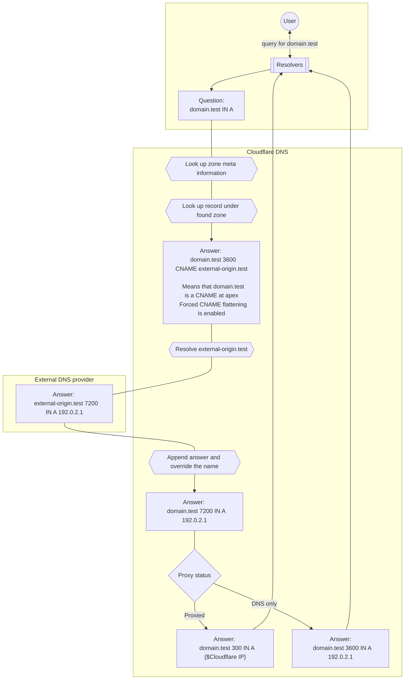

# How CNAME flattening works

For the purpose of this diagram:
- `domain.test` is a zone in Cloudflare and has the following CNAME record.


| Type | Name | Content | TTL |
| --- | --- | --- | --- |
| CNAME | `domain.test` | `external-origin.test` | 3600 |


- `external-origin.test` is a zone in a different DNS provider and has the following A record.


| Type | Name | Content | TTL |
| --- | --- | --- | ---|
| A | `external-origin.test` | `192.0.2.1` | 7200 |


In order to respond to queries for `domain.test` directly with the IP address, Cloudflare processes as following: 

