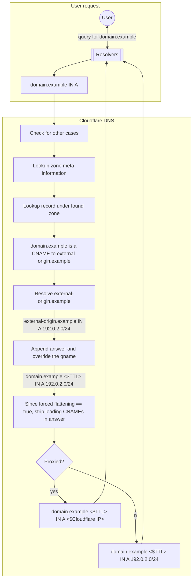

# How CNAME flattening works

See an example use case and the main steps involved when Cloudflare does CNAME flattening.

For the purpose of this diagram, consider:
- `domain.example` is a zone in Cloudflare and has a CNAME record like the following:


| Type | Name | Content |
| --- | --- | --- |
| CNAME | `domain.example` | `external-origin.example`


- `external-origin.example` is a zone in a different DNS provider and has the following A record:


| Type | Name | Content |
| --- | --- | --- |
| A | `external-origin.example` | `192.0.2.0/24`


