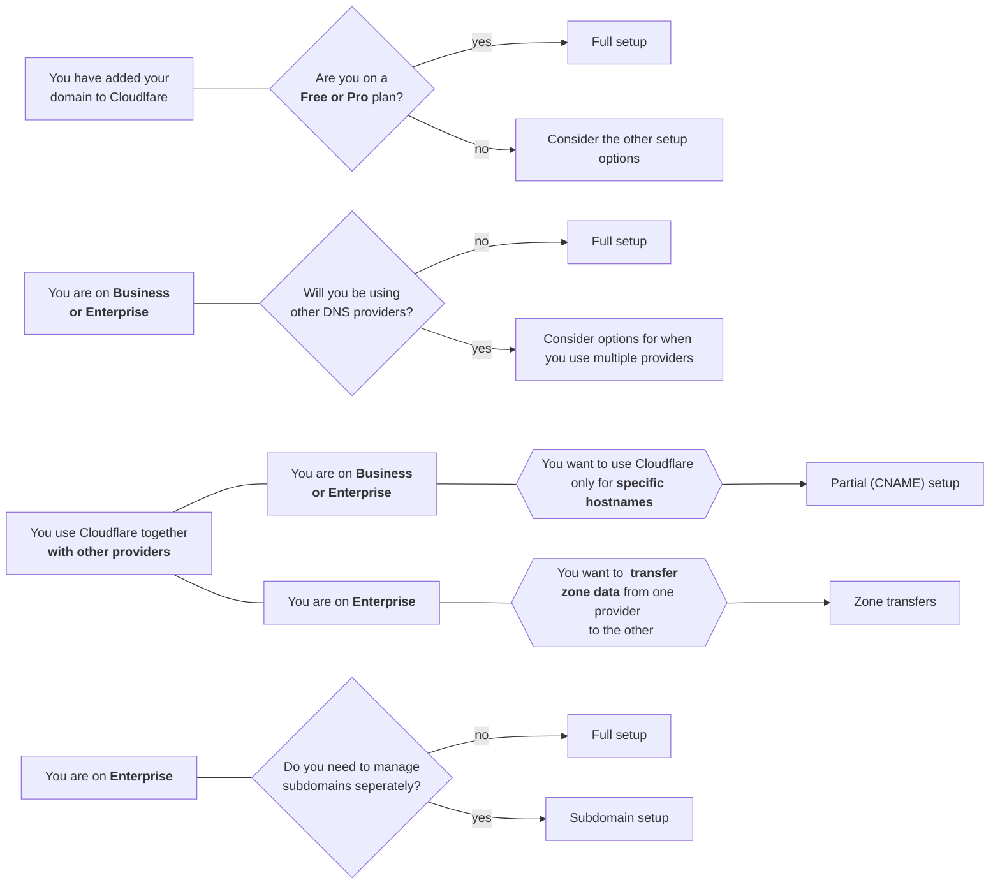

# Zone setups

When using Cloudflare DNS, you have a few options for your DNS zone setup:

* [Full setup](/dns/zone-setups/full-setup/) (most common): Use Cloudflare as your primary DNS provider and manage your DNS records on Cloudflare.
* [Partial (CNAME) setup](/dns/zone-setups/partial-setup/): Keep your primary DNS provider and only use Cloudflare's reverse proxy for individual subdomains.
* [Subdomain setup](/dns/zone-setups/subdomain-setup/): With your root domain (`example.com`) on a partial or full setup, independently manage the settings for a specific subdomain (`blog.example.com`) within a separate zone and, potentially, a separate account.
* [Zone transfers](/dns/zone-setups/zone-transfers/): Use Cloudflare and another DNS provider together across your entire zone to increase availability and fault tolerance. DNS records will be transferred between providers using [AXFR](https://datatracker.ietf.org/doc/html/rfc5936) or [IXFR](https://datatracker.ietf.org/doc/html/rfc1995).



If you run your own authoritative nameservers but still want to benefit from Cloudflare's global Anycast network, check out [DNS Firewall](/dns/dns-firewall/).



## Common use cases and availability

If you are unsure of which setup to use, consider the questions below for an overview of common use cases and their correspondence to each setup and [different pricing plans](https://www.cloudflare.com/plans/#overview).

Are you on a Free or Pro plan?

 
Full setup is the recommended and most common option. If you are on a Free or Pro plan use this setup.

Will you be using Cloudflare with other DNS providers?

If you are on a Business or Enterprise plan, use Partial (CNAME) setups to keep your primary DNS provider and only proxy individual subdomains through Cloudflare.
 
 
If you are on an Enterprise plan, you also have the option to use zone transfers to setup Cloudflare as either a primary or a secondary DNS provider and transfer zone files between Cloudflare and your other DNS providers.

Do you need to manage subdomains separately?

 
If you are on an Enterprise plan, you can use a subdomain setup to manage the Cloudflare settings for one or more subdomains separately from the settings associated with your domain apex.

 

Previous chart - erase afterwards

 

