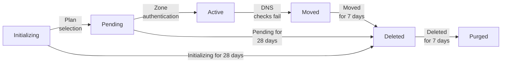

# Zone status

Review information on the different statuses that your [zone](/dns/concepts/#zone) can have after you [add your website or application](/fundamentals/setup/account-setup/add-site/) to Cloudflare.

If your zone status changes, you will receive an email at the address associated with your account.

The following diagram gives you an overview of the different statuses applicable and how your zone may transition from one status to the other.


If you use the API to add your website or application to Cloudflare, your zone will be created directly in a **Pending** status. **Initializing** only applies to domains added via the dashboard.


## Initializing (Setup)

You have initiated the setup via dashboard, but did not select a plan for your zone. Your zone status is presented as **Setup** on the Cloudflare dashboard.

In this state, Cloudflare does not respond to any DNS queries for your domain.

If your zone is in **Setup** for over 28 days, it will be automatically [deleted](#deleted).

## Pending

Cloudflare responds to DNS queries for pending zones on the assigned Cloudflare nameserver IPs, but your zone is still not active and is subject to the limitations listed below.

Your zone status is presented as **Pending Nameserver Update** on the Cloudflare dashboard.

### Causes

- [Full setup](/dns/zone-setups/full-setup/): You have either not changed your authoritative nameservers at your registrar or your change has not yet been authenticated.
- [Partial (CNAME) setup](/dns/zone-setups/partial-setup/): You have either not added the verification TXT record to your authoritative DNS provider or the record has not yet been authenticated.

### Limitations

- Pending zones cannot be used to [proxy traffic to Cloudflare](/dns/manage-dns-records/reference/proxied-dns-records/#pending-domains).
- If your domain is on the Free plan, it will be deleted automatically if not activated within 28 days. Any pending zone with a paid plan (Pro, Business, Enterprise) will remain pending until the plan is removed or the domain is activated or [removed from Cloudflare](/fundamentals/setup/manage-domains/remove-domain/).

## Active

Cloudflare has authenticated your [nameserver changes](/dns/zone-setups/full-setup/setup/#update-your-nameservers) or [verification TXT record](/dns/zone-setups/partial-setup/setup/#verify-ownership-for-your-domain) and you can proxy domain traffic through Cloudflare.

## Moved

Your domain has failed multiple DNS checks, where either the Cloudflare nameservers are no longer present on your domain's `NS` records ([Full setup](/dns/zone-setups/full-setup/)) or no `SOA` record is returned for the zone ([Partial (CNAME) setup](/dns/zone-setups/partial-setup/)).

The zone will be deleted automatically after 7 days, unless there is an active plan subscription.

## Deleted

Your zone has been archived. Cloudflare still responds to DNS queries for deleted zones on the assigned Cloudflare nameserver IPs (for non-deleted DNS records) and you can re-add the domain to Cloudflare by following the [regular onboarding flow](/fundamentals/setup/account-setup/add-site/).

After being deleted for seven days, the zone is automatically [purged](#purged).

## Purged

After a zone is deleted for seven days, it will be purged. Cloudflare does not respond to DNS queries for purged zones and, unlike [deleted zones](#deleted), this status cannot be reverted. In this case, even if you re-add the domain to the same Cloudflare account, none of the zone settings are expected to be restored.