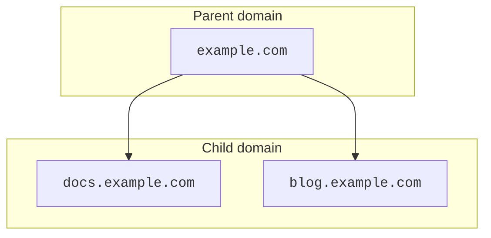

# Set up a child domain

When using a [subdomain setup](/dns/zone-setups/subdomain-setup/), the steps to create a child domain depend on the parent domain's setup and whether the child domain already exists.

Subdomain setup is only available for Enterprise accounts.

---

## Available setups

| Parent zone | Child zone | Available |
| --- | --- | --- |
| [Full](/dns/zone-setups/full-setup/) or [Secondary](/dns/zone-setups/zone-transfers/cloudflare-as-secondary/) | [Full](/dns/zone-setups/full-setup/) | Yes |
| [Full](/dns/zone-setups/full-setup/) or [Secondary](/dns/zone-setups/zone-transfers/cloudflare-as-secondary/) | [Secondary](/dns/zone-setups/zone-transfers/cloudflare-as-secondary/) | Yes |
| [Full](/dns/zone-setups/full-setup/) or [Secondary](/dns/zone-setups/zone-transfers/cloudflare-as-secondary/) | [Partial](/dns/zone-setups/partial-setup/) | No |
| [Partial](/dns/zone-setups/partial-setup/) | [Full](/dns/zone-setups/full-setup/) | Yes |
| [Partial](/dns/zone-setups/partial-setup/) | [Secondary](/dns/zone-setups/zone-transfers/cloudflare-as-secondary/) | Yes |
| [Partial](/dns/zone-setups/partial-setup/) | [Partial](/dns/zone-setups/partial-setup/) | Yes |


This table assumes zones are in an active [status](/dns/zone-setups/reference/domain-status/). If you need to add the parent zone to Cloudflare when its child zone already exists in a Partial setup, for example, you can [convert the parent zone to Partial](/dns/zone-setups/partial-setup/setup/#add-your-domain-to-cloudflare) while it is still in pending status.


---

## Parent domain on full setup

If the parent domain is using a [full setup](/dns/zone-setups/full-setup/)[^1], your child domain setup depends on whether the child domain already exists.



The following steps are similar if your Cloudflare parent zone is in a secondary setup, with the only difference that you will use your external primary DNS provider to make any necessary adjustments to DNS records.



### Subdomain does not exist in the parent domain

If you have not yet created a DNS record covering your child domain in the parent zone:

1. [Add the child domain](/fundamentals/setup/manage-domains/add-site/) to the parent domain's Cloudflare account or another account.
2. [Get the nameserver names](/dns/zone-setups/full-setup/setup/#get-nameserver-names) for the child domain. These will not be the same nameservers as the parent domain.
3. Within the **DNS** > **Records** of the parent zone, [add](/dns/manage-dns-records/how-to/create-dns-records/) two `NS` records for the subdomain you want to delegate.

    For example, if you delegated `www.example.com`, you might add the following records to `example.com`:

    | **Type** | **Name** | **Content** |
    | --- | --- | --- |
    | `NS` | www | john.ns.cloudflare.com |
    | `NS` | www | melinda.ns.cloudflare.com |

4. After a few minutes, the child domain will be active.
5. Create the various [DNS records](/dns/manage-dns-records/how-to/create-dns-records/) needed for your child domain.
6. (Optional) [Enable DNSSEC](/dns/zone-setups/subdomain-setup/dnssec/) on the child domain.

### Subdomain already exists in the parent domain

If you have already created a DNS record covering your child domain in the parent zone:

1. [Add the child domain](/fundamentals/setup/manage-domains/add-site/) to the parent domain's Cloudflare account or another account.
2. In your child domain, [re-create all DNS records](/dns/manage-dns-records/how-to/create-dns-records/) that relate to your child domain. This includes all DNS records deeper than the delegated subdomain, meaning that if you are delegating `www.example.com`, you should also move over records for `api.www.example.com`.

    Cloudflare recommends [exporting](/dns/manage-dns-records/how-to/import-and-export/#export-records) records from the parent domain, deleting all unnecessary records, and then [importing](/dns/manage-dns-records/how-to/import-and-export/#import-records) the records into your new zone.
    

3. If the parent zone is in Cloudflare, make sure that you migrate over any settings ([WAF custom rules](/waf/custom-rules/), [Rules](/rules/), [Workers](/workers/), and more) that might be needed for the child domain.
4. In the child domain zone, [order an advanced SSL certificate](/ssl/edge-certificates/advanced-certificate-manager/) that covers the child subdomain and any deeper subdomains (if present).
5. [Get the nameserver names](/dns/zone-setups/full-setup/setup/#get-nameserver-names) for the child domain. These will not be the same nameservers as the parent domain.
6. Within the **DNS** > **Records** of the parent zone, [delete](/dns/manage-dns-records/how-to/create-dns-records/#delete-dns-records) all non-address records (meaning everything except for `A`, `AAAA`, and `CNAME` records) referencing the child domain or any of its deeper subdomains.
7. Within the **DNS** > **Records** of the parent zone, leave one address record referencing the child domain and [delete](/dns/manage-dns-records/how-to/create-dns-records/#delete-dns-records) the rest.
8. Change the type of the last address record to `NS` and its content to one of the child domain's nameserver names. If the parent domain is in Cloudflare, use [a `PATCH` request](/api/operations/dns-records-for-a-zone-patch-dns-record) to achieve this.
7. Within the **DNS** > **Records** of the parent zone, [create](/dns/manage-dns-records/how-to/create-dns-records/) the second `NS` record in the parent zone for the subdomain you want to delegate.

    For example, if you delegated `www.example.com`, you might add the following records to `example.com`:

    | **Type** | **Name** | **Content** |
    | --- | --- | --- |
    | `NS` | www | john.ns.cloudflare.com |

8. Flush the address records of your child domain in public resolvers ([1.1.1.1](https://1.1.1.1/purge-cache/) and [8.8.8.8](https://developers.google.com/speed/public-dns/cache)).
9. Within a short period of time, the child domain should be active.
10. (Optional) [Enable DNSSEC](/dns/zone-setups/subdomain-setup/dnssec/) on the child domain.

---

## Parent domain on partial setup

If the parent domain is using a [partial setup](/dns/zone-setups/partial-setup/)[^2], your child domain setup depends on whether the child domain already exists.

### Subdomain does not exist in the parent domain

If you have not yet created a DNS record covering your child domain in the parent zone:




1. [Add the child domain](/fundamentals/setup/manage-domains/add-site/) to the parent domain’s Cloudflare account or another account.
2. Complete the configuration accordingly for [Full](/dns/zone-setups/full-setup/setup/) or [Secondary](/dns/zone-setups/zone-transfers/cloudflare-as-secondary/setup/) setup.
3. After creating the DNS records on the child zone, add the Cloudflare nameservers as `NS` records at your external DNS provider.
4. Within a short period of time, the child domain should be active.




1. [Add the child domain](/fundamentals/setup/manage-domains/add-site/) to the parent domain’s Cloudflare account or another account.
2. Convert the child zone to [a partial setup](/dns/zone-setups/partial-setup/setup/#add-your-domain-to-cloudflare).
3. Create the various [DNS records](/dns/manage-dns-records/how-to/create-dns-records/) needed for your child domain.
4. [Add the TXT verification record](/dns/zone-setups/partial-setup/setup/#verify-ownership-for-your-domain) at your authoritative DNS provider.
5. Within a short period of time, the child domain should be active.
6. Add a [`CNAME` record](/dns/zone-setups/partial-setup/setup/#add-dns-records) at your authoritative DNS provider.




### Subdomain already exists in the parent domain

If you have already created a DNS record covering your child domain in the parent domain:




1. [Add the child domain](/fundamentals/setup/manage-domains/add-site/) to the parent domain’s Cloudflare account or another account.
2. In your child domain, [re-create all DNS records](/dns/manage-dns-records/how-to/create-dns-records/) that relate to your child domain. This includes all DNS records deeper than the delegated subdomain, meaning that if you are delegating `www.example.com`, you should also move over records for `api.www.example.com`.

    Cloudflare recommends [exporting](/dns/manage-dns-records/how-to/import-and-export/#export-records) records from the parent domain, deleting all unnecessary records, and then [importing](/dns/manage-dns-records/how-to/import-and-export/#import-records) the records into your new zone.
    

3. In the parent domain, make sure that you migrate over any settings ([WAF custom rules](/waf/custom-rules/), [Rules](/rules/), [Workers](/workers/), and more) that might be needed for the child domain.
4. In the child domain, [order an advanced SSL certificate](/ssl/edge-certificates/advanced-certificate-manager/) that covers the child subdomain and any deeper subdomains.
5. Get the Cloudflare nameservers for the child domain and add them as `NS` records at your external DNS provider.
6. Within a short period of time, the child domain should be active.
7. Within the **DNS** > **Records** of the parent zone, [delete](/dns/manage-dns-records/how-to/create-dns-records/#delete-dns-records) any `A`, `AAAA`, or `CNAME` records referencing the child domain or any of its deeper subdomains.




1. [Add the child domain](/fundamentals/setup/manage-domains/add-site/) to the parent domain’s Cloudflare account or another account.
2. Convert the child zone to [a partial setup](/dns/zone-setups/partial-setup/setup/#add-your-domain-to-cloudflare).
3. In your child domain, [re-create all DNS records](/dns/manage-dns-records/how-to/create-dns-records/) that relate to your child domain. This includes all DNS records deeper than the delegated subdomain, meaning that if you are delegating `www.example.com`, you should also move over records for `api.www.example.com`.

    Cloudflare recommends [exporting](/dns/manage-dns-records/how-to/import-and-export/#export-records) records from the parent domain, deleting all unnecessary records, and then [importing](/dns/manage-dns-records/how-to/import-and-export/#import-records) the records into your new zone.
    

4. In the parent domain, make sure that you migrate over any settings ([WAF custom rules](/waf/custom-rules/), [Rules](/rules/), [Workers](/workers/), and more) that might be needed for the child domain.
5. In the child domain, [order an advanced SSL certificate](/ssl/edge-certificates/advanced-certificate-manager/) that covers the child subdomain and any deeper subdomains.
6. [Add the TXT verification record](/dns/zone-setups/partial-setup/setup/#verify-ownership-for-your-domain) at your authoritative DNS provider.
7. Within a short period of time, the child domain should be active.
8. Within the **DNS** > **Records** of the parent zone, [delete](/dns/manage-dns-records/how-to/create-dns-records/#delete-dns-records) any previous `A`, `AAAA`, or `CNAME` records referencing the child domain or any of its deeper subdomains, and [add the Cloudflare `CNAME` record](/dns/zone-setups/partial-setup/setup/#add-dns-records).




[^1]: Meaning that Cloudflare is your Authoritative DNS provider.
[^2]: Meaning that another DNS provider - not Cloudflare - maintains your Authoritative DNS.
