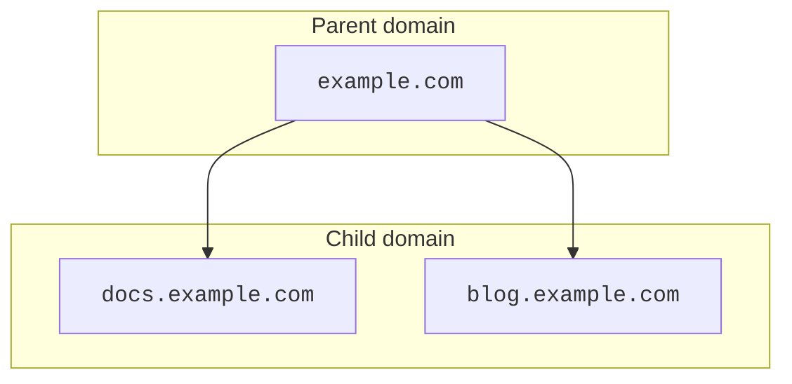

# Set up a child domain

When using a [subdomain setup](/dns/zone-setups/subdomain-setup/), the steps to create a child domain depend on the parent domain's setup and whether the child domain already exists.


Subdomain setup is only available for Enterprise accounts. If you only want to create a subdomain for your site in Cloudflare, refer to [Create a subdomain record](/dns/manage-dns-records/how-to/create-subdomain/).


---

## Available setups

| Parent zone | Child zone | Available |
| --- | --- | --- |
| [Full](/dns/zone-setups/full-setup/) or [Secondary](/dns/zone-setups/zone-transfers/cloudflare-as-secondary/) | [Full](/dns/zone-setups/full-setup/) | Yes |
| [Full](/dns/zone-setups/full-setup/) or [Secondary](/dns/zone-setups/zone-transfers/cloudflare-as-secondary/) | [Secondary](/dns/zone-setups/zone-transfers/cloudflare-as-secondary/) | Yes |
| [Full](/dns/zone-setups/full-setup/) or [Secondary](/dns/zone-setups/zone-transfers/cloudflare-as-secondary/) | [Partial](/dns/zone-setups/partial-setup/) | No |
| [Partial](/dns/zone-setups/partial-setup/) | [Full](/dns/zone-setups/full-setup/) | Yes |
| [Partial](/dns/zone-setups/partial-setup/) | [Secondary](/dns/zone-setups/zone-transfers/cloudflare-as-secondary/) | Yes |
| [Partial](/dns/zone-setups/partial-setup/) | [Partial](/dns/zone-setups/partial-setup/) | Yes |

This table assumes zones are in an active [status](/dns/zone-setups/reference/domain-status/). For example, if you need to add the parent zone to Cloudflare when its child zone already exists in a Partial setup, you can [convert the parent zone to Partial](/dns/zone-setups/partial-setup/setup/#add-your-domain-to-cloudflare) while it is still in pending status.

Although the setup guides in this documentation are focused on both parent domain and child domain existing in Cloudflare, it is also possible to achieve a subdomain setup in Cloudflare while the parent domain exists in a different DNS provider.

---

## SSL/TLS certificates

If the parent domain's SSL/TLS certificate explicitly lists the child domain and is created after the child domain's SSL/TLS certificate, the parent domain's certificate will take precedence over the child domain's certificate.

For instance, if `example.com` [creates an advanced certificate](/ssl/edge-certificates/advanced-certificate-manager/manage-certificates/) that directly lists `docs.example.com`, visitors to `docs.example.com` might see the SSL/TLS certificate for `example.com`.