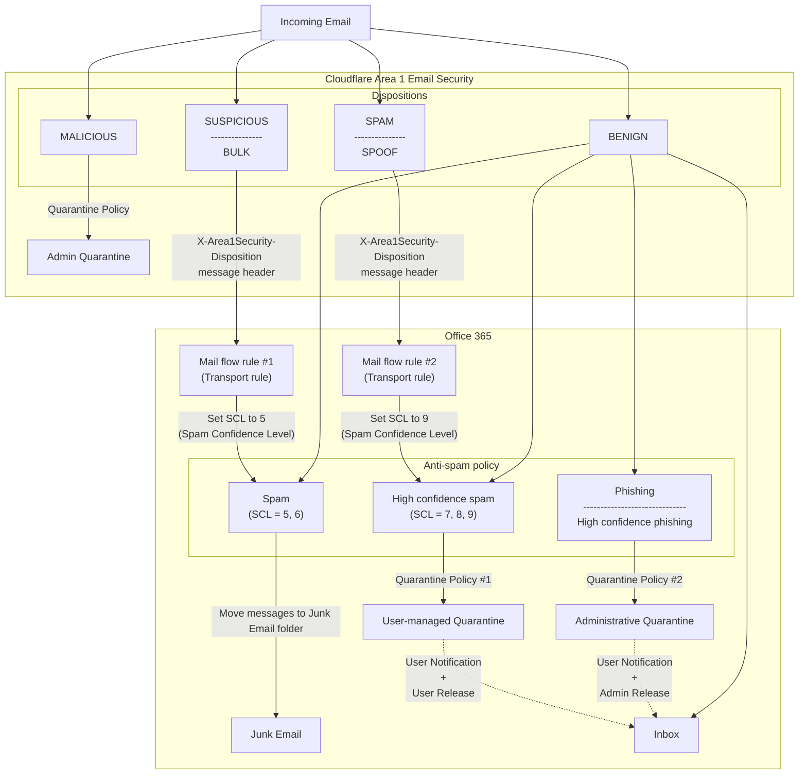

# Deliver emails to the junk email folder and user managed quarantine

In this tutorial, you will learn how to deliver `SUSPICIOUS` and `BULK` messages to the user's junk folder, and `SPAM` and `SPOOF` messages to the user managed quarantine.

## Configure domains



## Create quarantine policies



## Configure quarantine notifications



## Configure anti-spam policies



## Create transport rules


