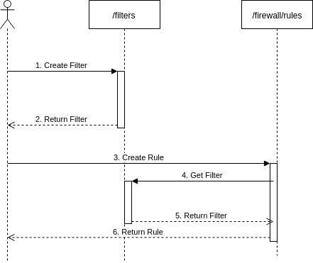
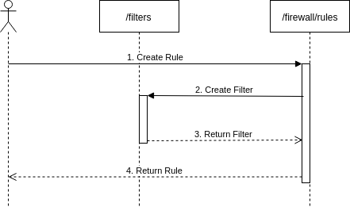

# Call sequence

The API call examples in this site illustrate the **recommended sequence** of calling the two APIs (`/filters` and `/firewall/rules`).

The image below depicts this sequence, which can be applied for creating and editing rules. The reverse would apply for delete operations.



Cloudflare recommends this sequence because it facilitates filter reusability and allows working with either API independently. Thanks to the standalone nature of Cloudflare Filters, the same filter can be shared in multiple Firewall Rules as well as in other future Cloudflare products and features.

For example, a filter that matches all traffic for your API (that is, `http.request.uri.path matches "^/api/.*$"`) may disable caching, disable human CAPTCHAs, configure JSON custom errors, and appear in a Firewall Rule. With the recommended sequence above, you would just repeat steps 3-6 for every Cloudflare feature to configure against the same filter created in steps 1-2.

However, for a `POST` operation, the **simplified sequence** — shown below — allows you to create both a filter and rule in the same call. In this case, the filter and rule only refer to each other.



In this sequence, a single `POST` request to the `/firewall/rules` endpoint takes the filter object in the JSON to create the filter in the Filters API (also via a `POST` request). If successful, the Firewall Rule is created.

Below is an example call and response using this method:

```json
---
header: Request
---
curl -X POST \
"https://api.cloudflare.com/client/v4/zones/<ZONE_ID>/firewall/rules" \
-H "X-Auth-Email: <EMAIL>" \
-H "X-Auth-Key: <API_KEY>" \
-H "Content-Type: application/json" \
-d '[
  {
    "filter": {
      "expression": "http.request.uri.path contains \"/api/\" and ip.src eq 93.184.216.34"
    },
    "action": "block"
  }
]' 
```

```json
---
header: Response
---
{
  "result": [
    {
      "id": "<RULE_ID>",
      "paused": false,
      "action": "block",
      "priority": null,
      "filter": {
        "id": "<FILTER_ID>",
        "expression": "http.request.uri.path contains \"/api/\" and ip.src eq 93.184.216.34",
        "paused": false
      }
    }
  ],
  "success": true,
  "errors": [],
  "messages": []
}
```

However, this approach has some disadvantages:

- The Firewall Rules client has to implement error and exception handling for every potential failure occurring in both the Firewall Rules and the filters APIs.
- To protect against accidentally modifying or deleting filters used by other Cloudflare features, the `PUT` or `DELETE` operations are not allowed.

By default, if either the filter or rule is invalid, neither will be created.

However, one exception applies. If you have exceeded your rule quota, the filter could be created while creating the rule may fail. This is because the rule is created after the filter in the sequence diagram and so, we learn of the quota being exceeded after the filter was created.

After you resolve the issue of exceeding your quota or requesting a feature that is unavailable to your zone, return to the recommended flow to create a rule that references the filter.

In summary, we strongly recommend the sequence with the two API calls. Limit your rule and filter creation using the simplified sequence for emergency situations, and only via `curl` requests.
