import firewallRulesExpressionBuilder10 from '../images/firewall-rules-expression-builder-10.gif'

# Create, edit, and delete rules

The **Create Firewall Rule** page in the Firewall app is a good guide to the parts of a Firewall Rule. When an incoming HTTP request matches the **expression** in a Firewall Rule, the specified **action** is triggered:

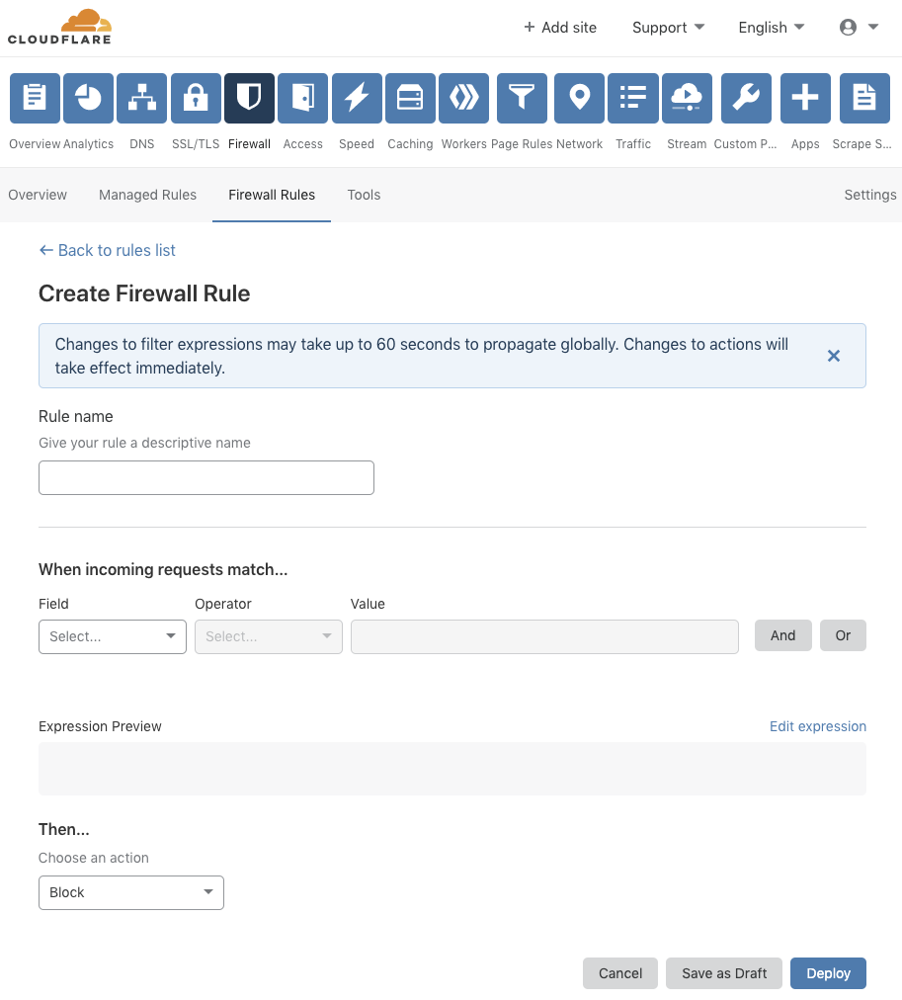

Note that a simple expression has the following syntax:

    <field> <comparison operator> <value>

For more information, refer to [Expressions](https://developers.cloudflare.com/ruleset-engine/rules-language/expressions) and [Actions](/cf-firewall-rules/actions/).

## Expression Builder and Editor

<Aside type='warning' header='Important'>

Firewall Rules expressions have a 4 KB limit (approximately 4,000 text characters).

</Aside>

The Firewall app in the Cloudflare dashboard offers two options for editing expressions.

The **Expression Builder** allows you to create expressions using drop-down lists and emphasizes an intuitive visual approach to creating Firewall Rules:

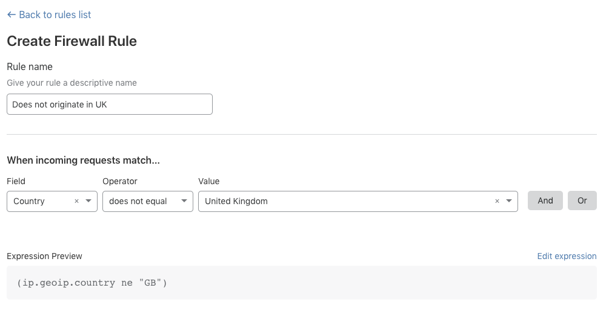

The **Expression Editor** is a text-only interface that supports advanced features, such as grouping symbols and functions for transforming and validating values:

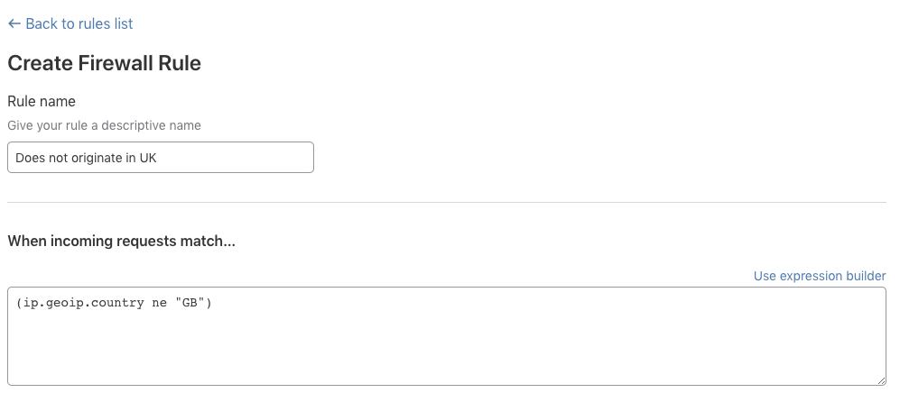

Both interfaces are available in the **Create Firewall Rule** page. This article focuses on using the Expression Builder. For more on using the advanced Expression Editor, refer to [Edit rule expressions](/cf-dashboard/expression-preview-editor/).

## Create a Firewall Rule

<Aside type='note' header='Note'>

Create a Firewall Rule based on the filters and exclusions you select within Firewall Analytics by clicking **Create firewall rule** in **Firewall** > **Overview**.

</Aside>

To create a new Firewall Rule:

1.  Log in to the [Cloudflare dashboard](https://dash.cloudflare.com/), and select your account and website.

2.  Navigate to **Firewall** > **Firewall Rules**.

3.  Click **Create a Firewall Rule**.

4.  In the **Create Firewall Rule** page that displays, use the **Rule name** input to supply a descriptive name. The rule name in this example is "Does not originate in UK."

    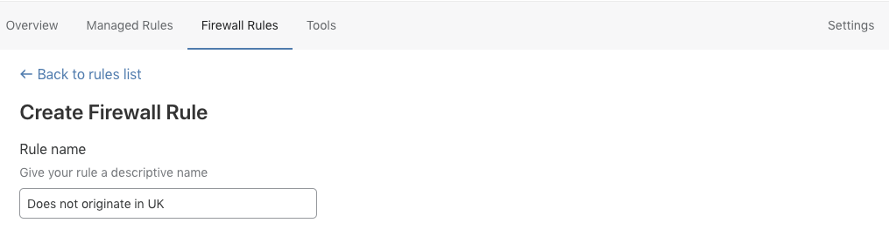

5.  Under **When incoming requests match…**, use the **Field** drop-down list to choose an HTTP property. For each request, the value of the property you choose for **Field** is compared to the value you specify for **Value**.

    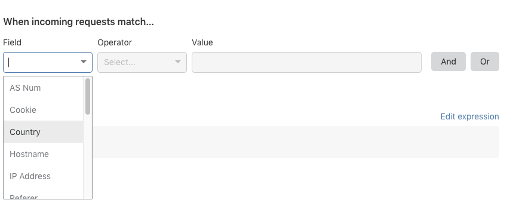

6.  Use the **Operator** drop-down list to choose a comparison operator. For an expression to match, the value of the request **Field** and the value specified in the **Value** input must satisfy the comparison operator.

    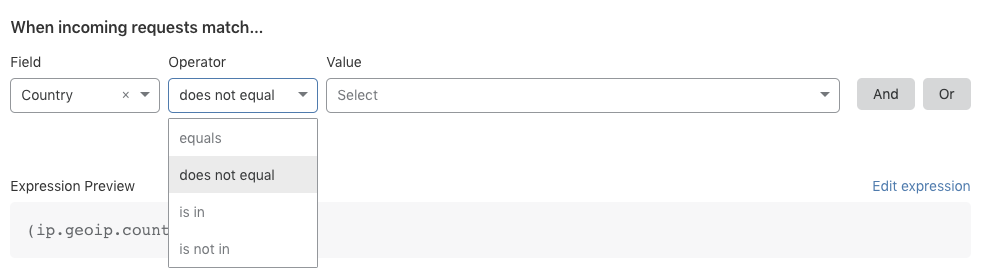

    In the screenshot above, note that the **Expression Editor** area displays a text-only version of your expression. For more on Expression Editor and the Expression Editor, refer to [Edit rule expressions](/cf-dashboard/expression-preview-editor/).

7.  Now specify the value to match. If the value is an enumeration, then the **Value** control will be a drop-down list. Otherwise, it will be a text input. In this example the value *United Kingdom* is set using the **Country** drop-down list.

    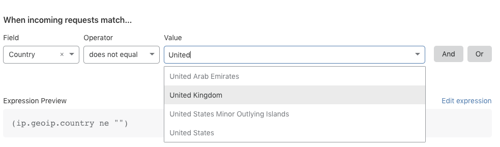

8.  To set an action for your rule, use the **Action** drop-down list. In this example the *Block* action tells Cloudflare to refuse requests that originate from countries other than the United Kingdom.

    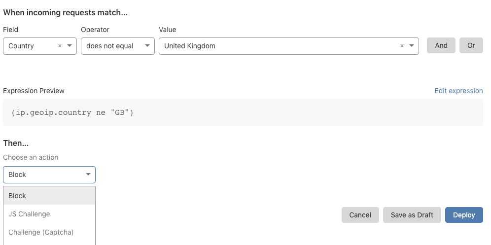

9.  To save and deploy your rule, click **Deploy**. If you are not ready to deploy your rule, click **Save as draft**.

After you choose an option, you are returned to the **Rules List**, which displays your new rule:

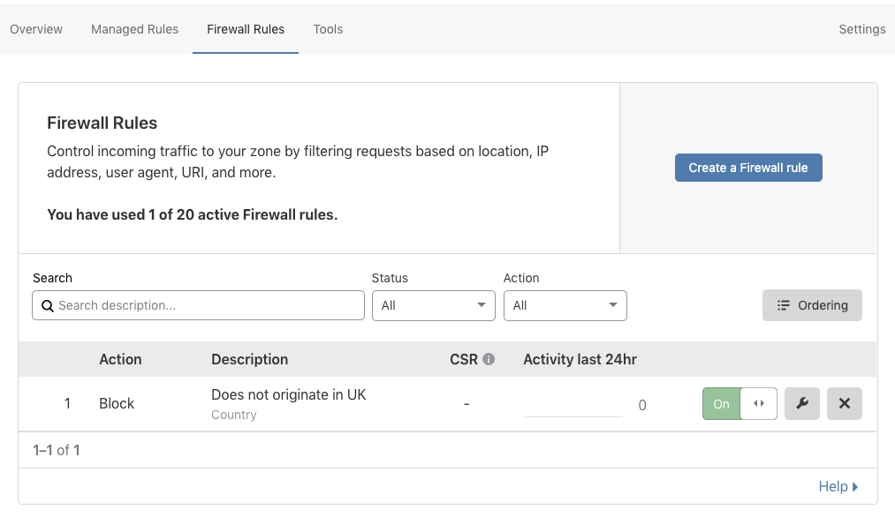

If you choose to deploy your new rule, the toggle switch associated with the rule will be *On*. If you save the rule as a draft, the toggle will be *Off*. Use the toggle to enable or disable your Firewall Rule.

## Manage rules

### Edit rules

You can modify your existing Firewall Rules at any time. Click the **Edit** button (wrench icon) located on the right of your rules in the **Rules List** to open the **Edit Firewall Rule** panel and make the changes you want.

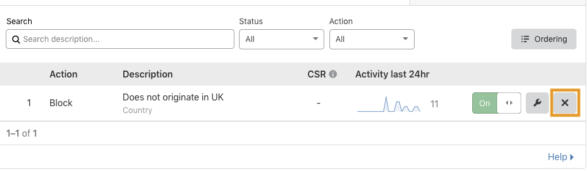

### Delete rules

To delete an existing rule from the **Firewall Rules** panel, use the **Delete** button (**X** icon) associated with the rule you want to remove.

In the confirmation dialog that appears, click **Delete** to confirm and complete the operation.

### Order rules

By default, Cloudflare evaluates Firewall Rules in **list order**, where rules are evaluated in the order they appear in the **Rules List**. When list ordering is enabled, the Rules List allows you to drag and drop Firewall Rules into position, as shown below.

Once there are more than 200 total rules (including inactive rules), you must manage evaluation using **priority ordering**, in which Cloudflare evaluates Firewall Rules in order of their **priority number**, starting with the lowest. When you cross this threshold, the Firewall Rules interface automatically switches to priority ordering. For more on working with priority ordering, refer to [Order and Priority](/cf-firewall-rules/order-priority).

### Enable and disable rules

Use the toggle switch associated with a Firewall Rule to enable or disable it.

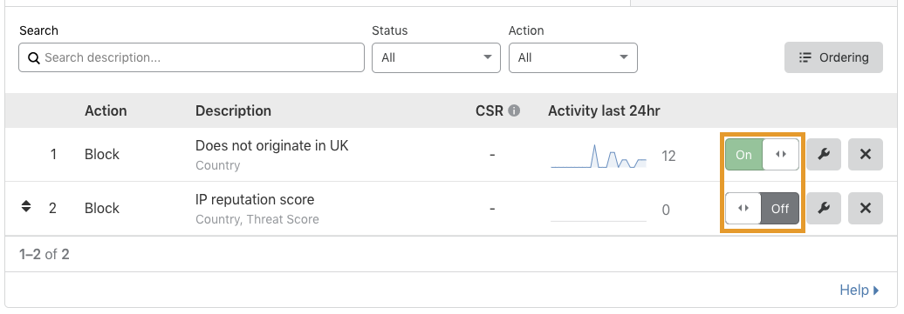

## Test Firewall Rules with Rule Preview

To help customers on an Enterprise plan understand the potential impact of a new Firewall Rule, Cloudflare built **Rule Preview**. With the click of a button, Rule Preview allows you to test a Firewall Rule against a sample of requests drawn from the last 72 hours of traffic. Rule Preview is built into the **Create Firewall Rule** and **Edit Firewall Rule** panels so that you can test a rule as you edit it. For more information, refer to [Preview rules](/cf-dashboard/rule-preview/).
