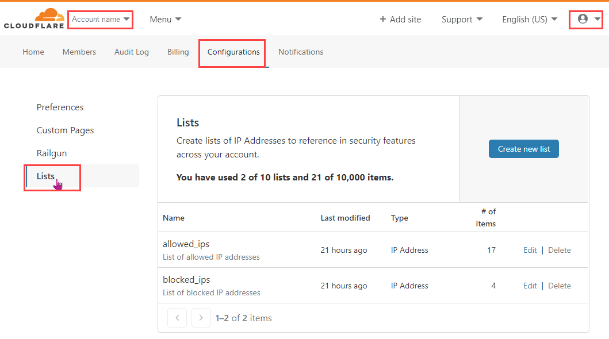

# Use IP Lists

IP Lists allow you to create a group of IP addresses and refer to them collectively, by name, in your Firewall Rule expressions. For an introduction, refer to [IP Lists](/cf-firewall-rules/rules-lists).

## Access the Lists interface

IP Lists are stored at the account level. To access the **Lists** interface, follow these steps:

1.  Log in to the [Cloudflare dashboard](https://dash.cloudflare.com) and select your account.
2.  Go to **Configurations** > **Lists**.

The **Lists** user interface displays.

## Create your first IP List

Creating an IP List involves two steps:

1.  [Create an IP List](/cf-dashboard/rules-lists/manage-lists/#create-an-ip-list).
2.  [Add IP addresses to the list](/cf-dashboard/rules-lists/manage-items/#add-items-to-a-list).

## Use IP Lists in expressions

To use IP Lists in the Cloudflare dashboard, refer to [Use lists in expressions](/cf-dashboard/rules-lists/use-lists-in-expressions).
