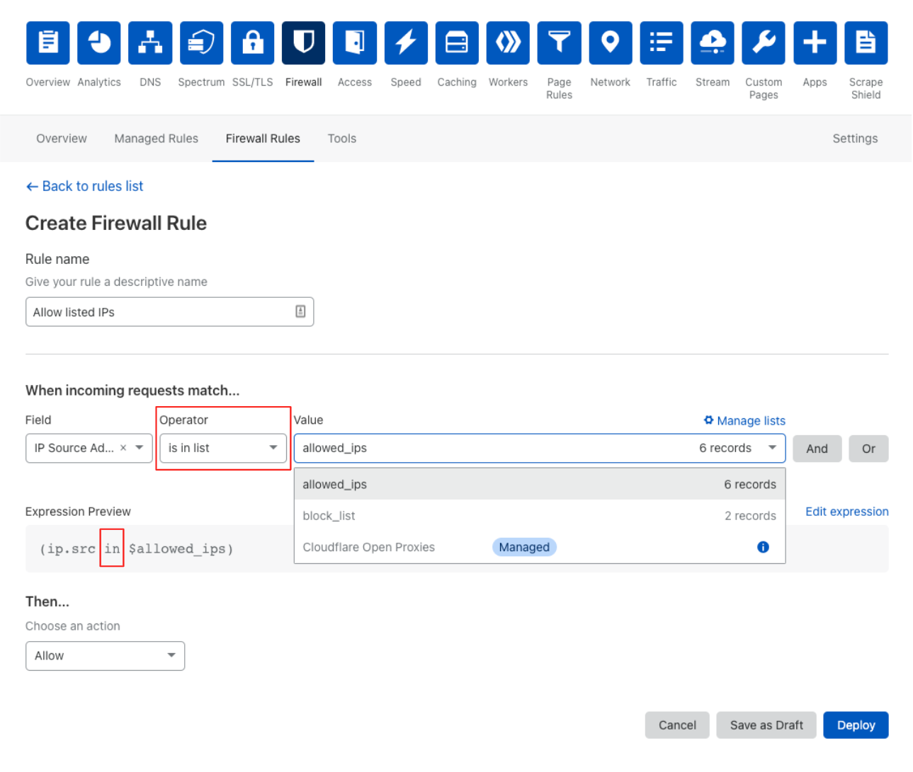

# Use lists in expressions

## Expression Builder

To use an IP List in the [Expression Builder](/cf-dashboard/create-edit-delete-rules/):

1.  Select *is in list* or *is not in list* from the **Operator** drop-down list.

    

2.  Select an IP List from the **Value** drop-down list.

3.  When you are done composing your rule, click **Deploy** to commit your changes and enable your rule. Click **Save as draft** if you are not ready to enable the rule.

## Expression Editor

To use an IP List in the [Expression Editor](/cf-dashboard/expression-preview-editor) specify the `in` operator and use *$\<list\_name>* to specify the name of the list.

This expression filters requests from IP addresses that are in an IP List named *office\_network*:

```sql
(ip.src in $office_network)
```

Note that names for IP Lists can only include lowercase letters, numbers, and the underscore (`_`) character.

For more on creating lists, refer to [Use IP Lists: Manage lists](/cf-dashboard/rules-lists/manage-lists).

To create a new rule via API using the Cloudflare Open Proxies Managed List, use the following expression:

```txt
(ip.src in $cf.open_proxies)
```

<Aside type='warning' header='Important'>

Access to the Open Proxy List requires a Cloudflare Enterprise plan.

</Aside>
