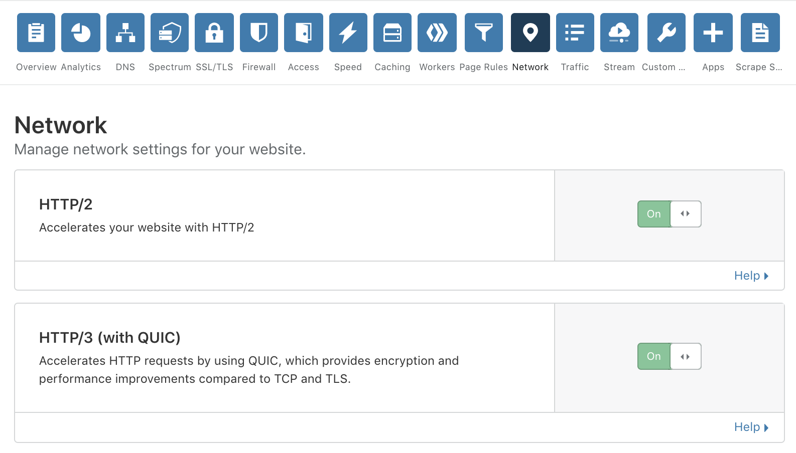

# Get started

Before you enable HTTP/3 on a Cloudflare domain, ensure you are using a supported client from the list below.

*   [Google Chrome](https://www.google.com/chrome/canary/) - [Instructions](/tutorials/chrome)
*   [Microsoft Edge](https://www.microsoftedgeinsider.com/en-us/) - [Instructions](/tutorials/edge)
*   [Mozilla Firefox](https://www.mozilla.org/firefox/channel/desktop/#nightly) - [Instructions](/tutorials/firefox)
*   [cURL](https://curl.haxx.se) + quiche - [Instructions](/tutorials/curl-brew)
*   [Cloudflare quiche-client](https://github.com/cloudflare/quiche) - [Instructions](/tutorials/quiche-http3-client)

<Aside type="note" header="Note">

Cloudflare supports multiple draft versions of HTTP/3 and QUIC. When using a client, verify that it supports one of the versions listed in the [release notes](/release-notes).

</Aside>

## Enable HTTP/3 on a Cloudflare domain

HTTP/3 can easily be turned on for a domain in the dashboard.

1.  Log in to your [Cloudflare dashboard](https://dash.cloudflare.com/).
2.  Click **Network**.
3.  Enable the **HTTP/3 (with QUIC)** toggle.

Enabling the toggle allows compatible clients to connect to it using HTTP/3 but does not affect existing clients using HTTP/1.1 or HTTP/2.

