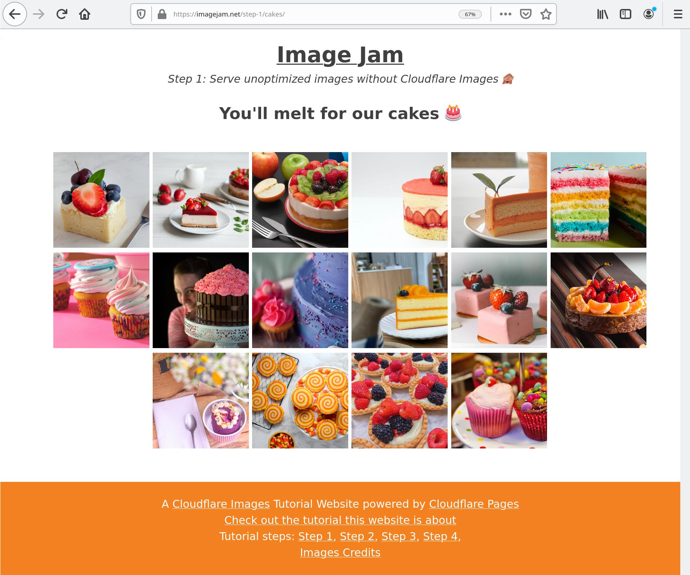
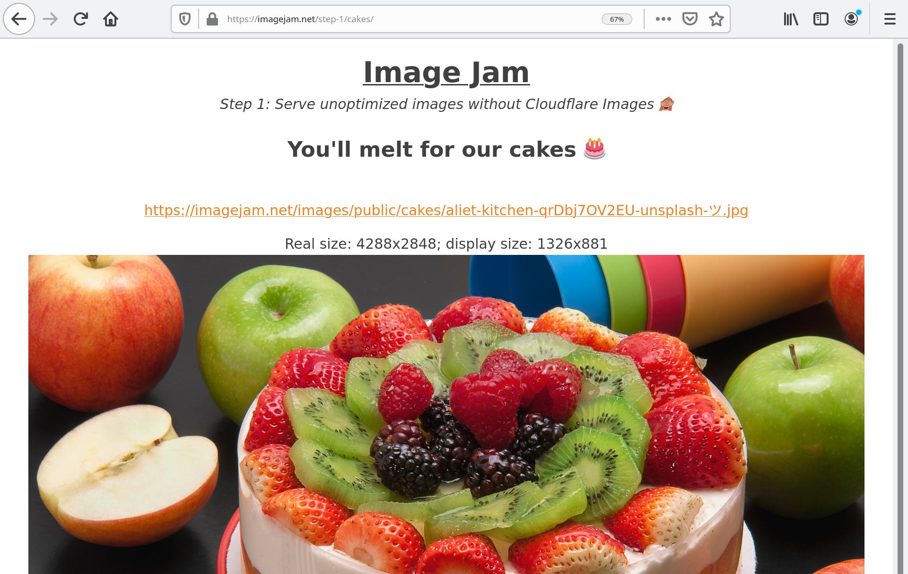
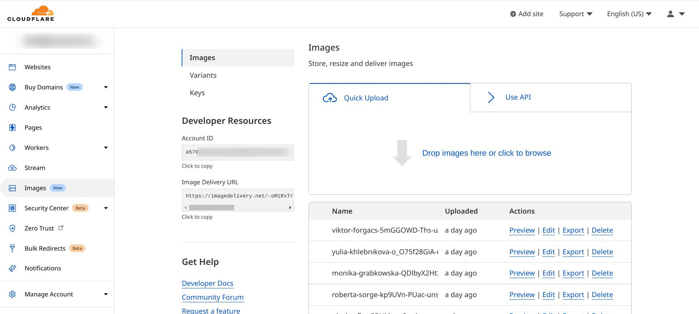
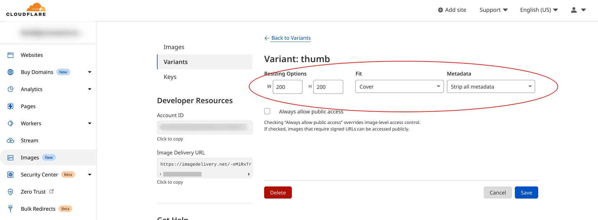
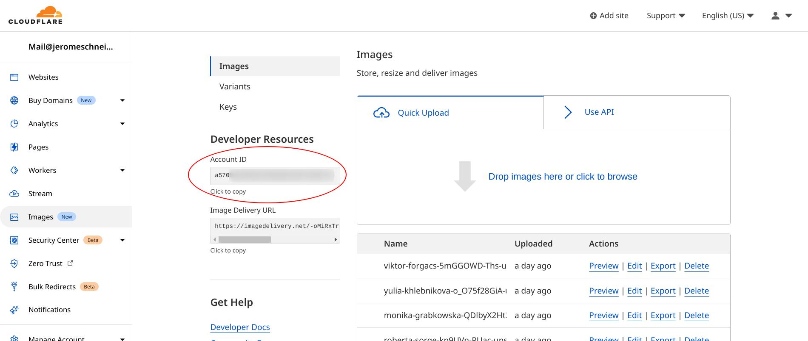
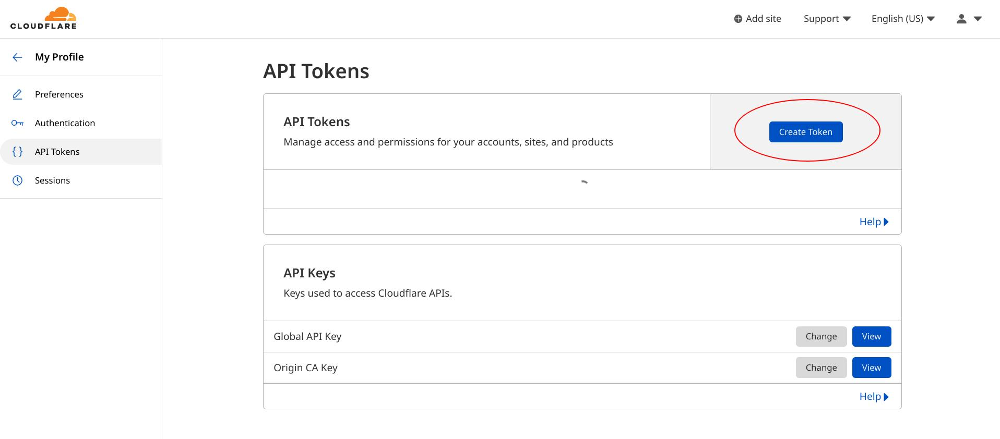
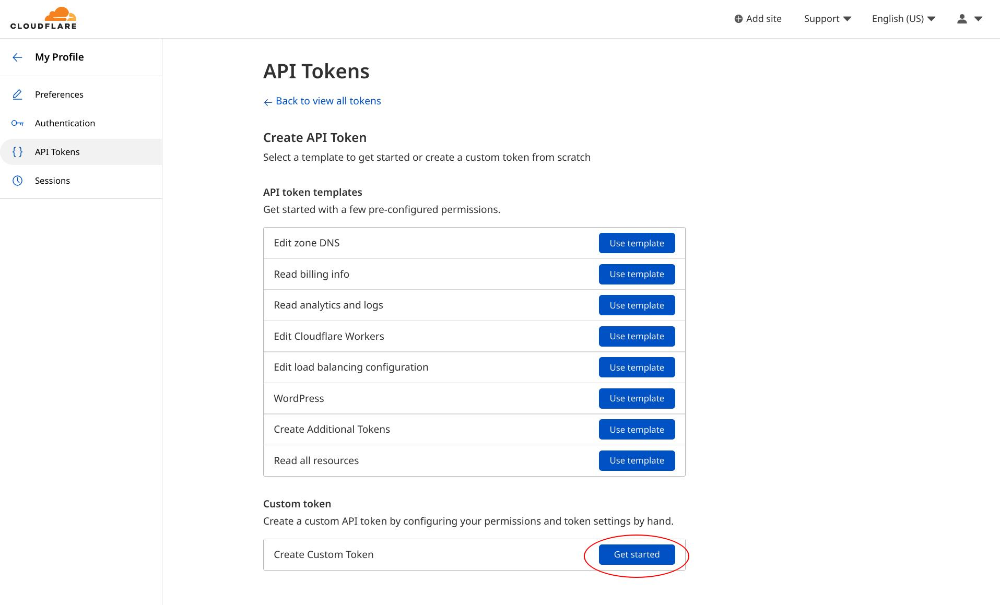
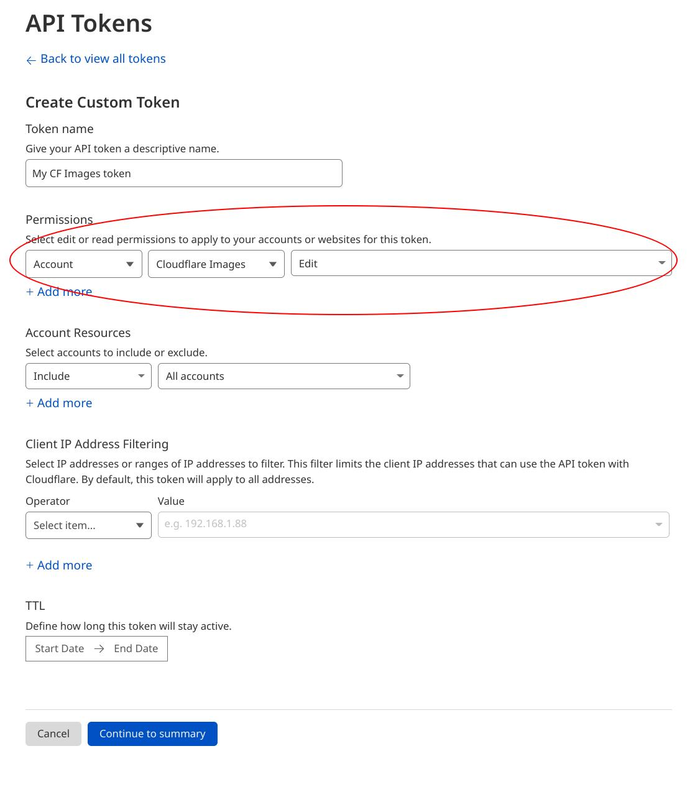

# Leverage Cloudflare Images on your Cloudflare Pages website

## Introduction

In this tutorial, we will update a [Cloudflare Pages](https://developers.cloudflare.com/pages/) website to leverage the powerful features of [Cloudflare Images](https://developers.cloudflare.com/images/cloudflare-images/). Cloudflare Images is a great companion to your front-end applications on Cloudflare Pages as an easy-to-use image storage, transformation and optimized delivery service.

In this tutorial we will see:

* how to migrate the images of the website to Cloudflare images

* how to update the website [to serve images from Cloudflare Images](https://developers.cloudflare.com/images/cloudflare-images/serve-images/), ultimately without changing the existing image URLs

* how to leverage [variants](https://developers.cloudflare.com/images/cloudflare-images/resize-images/) to resize and transform delivered images

Other features we will learn about:

* [Custom Domain Delivery](https://developers.cloudflare.com/images/cloudflare-images/serve-images/#serving-images-from-custom-domains): How to serve Cloudflare Images from your own domain name

* [Custom IDs](https://developers.cloudflare.com/images/cloudflare-images/upload-images/custom-id/): How to store and serve your images under their own, SEO friendly Unicode name and path

* [Flexible Image transformation and metadata filtering](https://developers.cloudflare.com/images/cloudflare-images/resize-images/#flexible-variants): How to use transformation parameters the delivery URL to transform an image on the fly

* Adaptive Optimized Format Delivery: How Cloudflare Images delivers Image Formats optimized to every browser, including WebP and AVIF

### Demo website and source code

For illustrative purposes, this tutorial uses the demo Cloudflare Pages website <https://imagejam.net> as a basis for all examples; you can find the source code for this website on GitHub <https://github.com/netgusto/imagejam.net>

[Learn how to deploy your own Cloudflare Pages website](https://developers.cloudflare.com/pages/get-started/).

## Step 1: Website not using Cloudflare Images

We're starting this tutorial with a demo website not (yet) using Cloudflare Images <https://imagejam.net/step-1/>.

Browsing the cake gallery page for step 1, <https://imagejam.net/step-1/cakes/> we can see many image thumbnails.



Clicking on an image displays a bigger version of it, as well as its URL, real size and display size.



On this example, the image we see has been served with a very high-resolution (`4288x2848`) but displayed at a much lower resolution, which means most of the pixels we downloaded were wasted upon display.

This is because at this step, the website serves unoptimized, unresized images, original images, stored in an online file storage (in our case, S3).

Also, this can't be seen at a glance, but the image is served in a fairly heavy JPG format that's actually not adapted for web purposes, possibly coming straight out of a camera.

The purpose of this tutorial is to showcase how Cloudflare Images can be leveraged on a website to deliver resized and optimized images, adapted to their display on the website, and the capabilities of the browser displaying them.

👉 In step 2 we will integrate Cloudflare Images in our website, but before that we need to upload our images for Cloudflare Images to start serving them.

## Migration to Cloudflare Images

We are going to upload our website images on Cloudflare Images.

For this we need a Cloudflare Account with a Cloudflare Images Subscription. Head over to the [Cloudflare Images sign-up page](https://dash.cloudflare.com/sign-up/images) to sign up.

Once signed up to the service, you'll have access to [the Cloudflare Images dashboard](https://dash.cloudflare.com/?to=/:account/images) inside of the Cloudflare Dashboard.



From there we could upload all our website images manually using the dashboard UI.

It turns out that we have a lot of images on our website, so we are rather going to import them in bulk using the [API upload](https://developers.cloudflare.com/images/cloudflare-images/upload-images/custom-id/).

The demo website source code contains a NodeJS script proposing one way to achieve bulk upload to Cloudflare Images in [`scripts/migrate/bulkupload.js`](https://github.com/netgusto/imagejam.net/blob/production/scripts/migrate/bulkupload.js).

Here's a rendition of this script, slightly edited for illustrative purposes:

```js
---
filename: "scripts/migrate/bulkupload.js"
---

// URL where your original images are accessible
const imageOriginURL = "https://imagejam.s3.amazonaws.com/";
const images = [
    "cakes/aliet-kitchen-qrDbj7OV2EU-unsplash-ツ.jpg",
    "cakes/amirali-mirhashemian-cZFU60dKB6U-unsplash.jpg",
    // obtain the list of images to import in any way...
];

bulkUpload();

async function bulkUpload() {
    for(image_name in images) {
        await upload(image_name, process.env.CF_IMAGES_ACCOUNT_ID, process.env.CF_IMAGES_API_KEY);
    }
}

async function upload(imageName, CF_IMAGES_ACCOUNT_ID, CF_IMAGES_API_KEY) {
    // Upload image to Cloudflare Images
    // CF Images will download the image hosted at the provided URL and store it
    // Leverages Upload by URL and Custom ID features of Cloudflare Images
    // see https://developers.cloudflare.com/images/cloudflare-images/upload-images/custom-id/

    console.log(`Uploading to Cloudflare Images: ${imageName}`);

    const body = new FormData();
    // tell CF Images to fetch this image for us
    body.append("url", imageOriginURL + imageName);
    // tell CF Images that we want our image to have this ID (ie, its current name)
    body.append("id", imageName); 

    try {
        const res = await fetch(
            `https://api.cloudflare.com/client/v4/accounts/${CF_IMAGES_ACCOUNT_ID}/images/v1`,
            {
                method: "POST",
                headers: { "Authorization": `Bearer ${CF_IMAGES_API_KEY}` },
                body,
            }
        );

        if (res.status !== 200 && res.status !== 409) {
            throw new Error("HTTP " + res.status + " : " + await res.text());
        }

        if (res.status === 409) {
            // 409: image already exists, imported by a previous run
            console.log("Already exist: " + imageName);
        }
    } catch (e) {
        console.log("ERROR:" + e);
    }
}
```

In a nutshell, this script does 2 things:

* obtain the list of images to migrate to Cloudflare Images,
* for every image, ask the Cloudflare Images API to import the image by URL, keeping its current name.

[Check out the instructions on how to install and run this script on the demo website GitHub repository](https://github.com/netgusto/imagejam.net#migrating-the-website-images-to-cloudflare-images).

If you need Cloudflare Images API credentials, have a look at the section [Aside: Obtain Cloudflare Images API credentials](#aside-obtain-cloudflare-images-api-credentials) below.

## Steps 2 and 3: Use Cloudflare Images with default delivery URLs

Now that our website images [have been imported](#migration-to-cloudflare-images), it turns out they already accessible on Cloudflare Images. Zero setup required!

For instance, our original image `cakes/aditya-joshi--DUN-_bTO2Q-unsplash-ツ.jpg`: <https://imagedelivery.net/-oMiRxTrr3JCvTMIzx4GvA/cakes/aditya-joshi--DUN-_bTO2Q-unsplash-ツ.jpg/public>

  
(*Photo by Aditya Joshi - Unsplash*)

Let's inspect that URL:

```
https://imagedelivery.net/-oMiRxTrr3JCvTMIzx4GvA/cakes/aditya-joshi--DUN-_bTO2Q-unsplash-ツ.jpg/public
<--  default domain   -->/<-- Account hash   -->/<--        our original image file         -->/<-??->
```

* The first part `https://imagedelivery.net` is the default delivery domain for Cloudflare Images.

* Then we have `-oMiRxTrr3JCvTMIzx4GvA`, a cryptic value representing your Cloudflare Images account ID in an obfuscated way; you can get this value in your Cloudflare Images dashboard.

* Then there is our original file name `cakes/aditya-joshi--DUN-_bTO2Q-unsplash-ツ.jpg`; this is the ID of the image we need to be served.

* The last part `public` [represents the variant](https://developers.cloudflare.com/images/cloudflare-images/resize-images/#supported-properties), and it turns out this is how Cloudflare Images knows what size should the image be served in ([among many other transformation options](https://developers.cloudflare.com/images/cloudflare-images/resize-images/#supported-properties)).

Cloudflare Images ships by default with a single variant named `public`, but you can create many other to fit your needs.

For this tutorial, we created a second variant `thumb`, size `200x200`, fitted with a `cover` crop.



Here is the same image but with the `thumb` variant applied: <https://imagedelivery.net/-oMiRxTrr3JCvTMIzx4GvA/cakes/aditya-joshi--DUN-_bTO2Q-unsplash-%E3%83%84.jpg/thumb>


This will be useful in thumbnails pages of our website gallery.

## Aside: Obtain Cloudflare Images API credentials

The bulk upload script featured in this tutorial expects to be provided with Cloudflare Images API credentials in the form of 2 environment variables `CF_IMAGES_ACCOUNT_ID` and `CF_IMAGES_API_KEY`.

You can get them both in your Cloudflare dashboard; here's how 👇

#### `CF_IMAGES_ACCOUNT_ID`

This is your Cloudflare Image account ID. Get this value in your Cloudflare Images dashboard:



#### `CF_IMAGES_API_KEY`

This value is a Cloudflare API token valid for the account, with Read and Update permissions on Cloudflare Images. See https://developers.cloudflare.com/api/tokens/create/.

On the API tokens page, click on **create token**:



Then click on the button next to **Custom token**:



Fill in the API token form as depicted below, and click on **Continue to summary**.



Then confirm your API token, and copy paste the token value. ***Keep it secret, keep it safe!*** It grants access to your Cloudflare Images account.

# draft below this line
#########################

* what are we doing
* why are we importing; what does it mean to import
* Showcase account, and variants
* showcase Custom IDs and UTF8 support => image names are retained, great for ease of use, semantics and SEO
## Steps 2 and 3: Use Cloudflare Images with default delivery URLs

* What's the default delivery URL
    * On default delivery domain
    On custom delivery domain
* Why it's great => zero setup
* But: requires to change the existing image URLs

## Step 4: Use Cloudflare Images without changing existing image URLs

* Why it's great => zero impact on website HTML / images URLs
* But: requires to change the existing image URLs 

* How is it possible to serve on the same Image URL
    * Intercept images URLs with a Cloudflare Worker

* How to publish the worker
    * Point your domain to Cloudflare
    * Publish a custom image routing worker
    * proxy image URLs to Cloudflare Images

## Other features

### Flexible Image transformation

https://developers.cloudflare.com/images/cloudflare-images/resize-images/#flexible-variants

How to use transformation parameters the delivery URL to transform an image on the fly

### Adaptive Optimized Format Delivery

How Cloudflare Images delivers Image Formats optimized to every browser, including WebP and AVIF