# Integrate Cloudflare Images on your website

## Introduction

In this tutorial, we will update a [Cloudflare Pages](https://developers.cloudflare.com/pages/) website in several iterative steps, to leverage the powerful features of [Cloudflare Images](https://developers.cloudflare.com/images/cloudflare-images/). Cloudflare Images is a great companion to your front-end applications on Cloudflare Pages as an easy-to-use image storage, transformation and optimized delivery service.

We will see:

* how to migrate the images of the website to Cloudflare images

* how to update the website [to serve images from Cloudflare Images](https://developers.cloudflare.com/images/cloudflare-images/serve-images/), ultimately without changing the existing image URLs

* how to leverage [variants](https://developers.cloudflare.com/images/cloudflare-images/resize-images/) to resize and transform delivered images

Other features we will learn about:

* [Custom Domain Delivery](https://developers.cloudflare.com/images/cloudflare-images/serve-images/#serving-images-from-custom-domains): How to serve Cloudflare Images from your own domain name

* [Custom IDs](https://developers.cloudflare.com/images/cloudflare-images/upload-images/custom-id/): How to store and serve your images under their own, SEO friendly Unicode name and path

* [Flexible Image transformation](https://developers.cloudflare.com/images/cloudflare-images/resize-images/#flexible-variants): How to use transformation parameters the delivery URL to transform an image on the fly

* Adaptive Optimized Format Delivery: How Cloudflare Images delivers Image Formats optimized to every browser, including WebP and AVIF

### Demo website and source code

For illustrative purposes, this tutorial uses the demo Cloudflare Pages website <https://imagejam.net> as a basis for all examples; you can find the source code for this website on GitHub <https://github.com/netgusto/imagejam.net>

[Learn how to deploy your own Cloudflare Pages website](https://developers.cloudflare.com/pages/get-started/).

## Step 1: Website not using Cloudflare Images

We're starting this tutorial with a demo website not (yet) using Cloudflare Images <https://imagejam.net/step-1/>.

Browsing the cake gallery page for step 1, <https://imagejam.net/step-1/cakes/> we can see many image thumbnails.

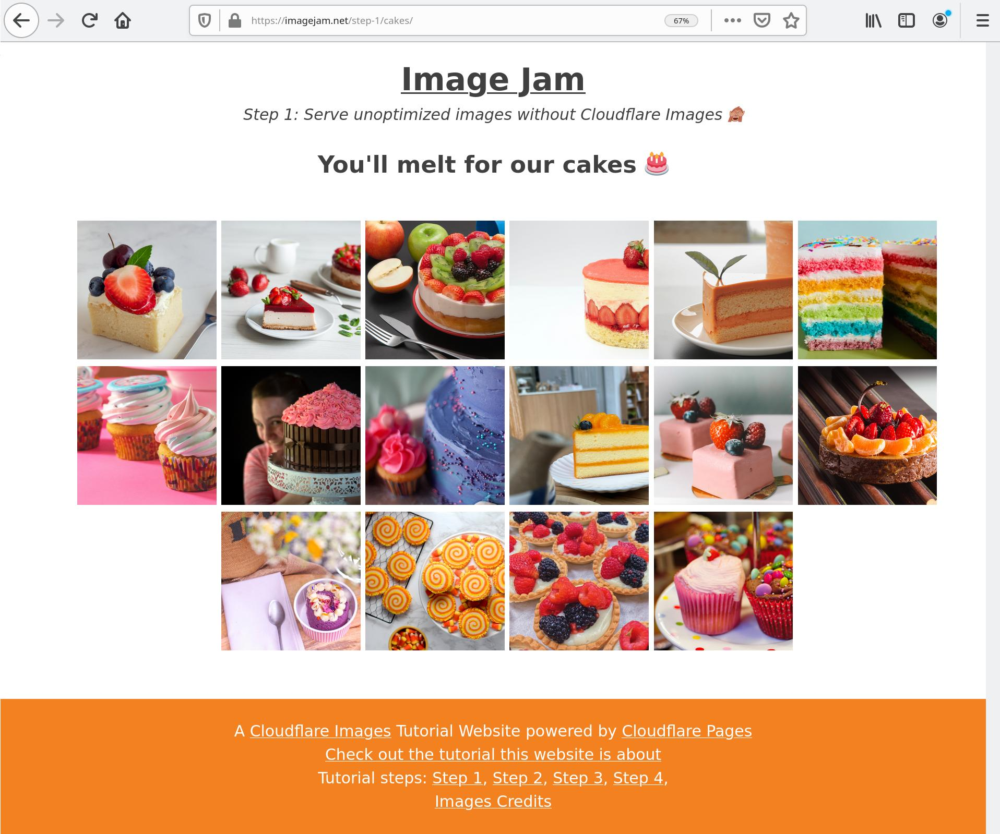

Clicking on an image displays a bigger version of it, as well as its URL, real size and display size.

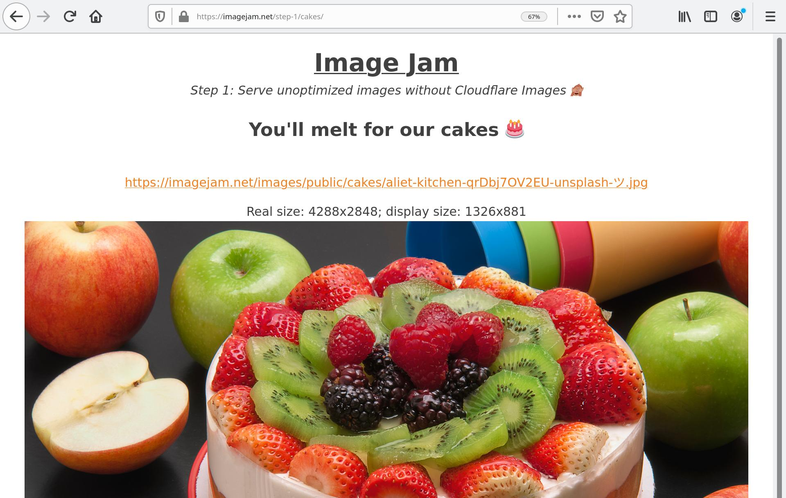

On this example, the image we see has been served with a very high-resolution (`4288x2848`) but displayed at a much lower resolution, which means most of the pixels we downloaded were wasted upon display.

This is because at this step, the website serves unoptimized, unresized images, original images, stored in an online file storage (in our case, S3).

Also, this can't be seen at a glance, but the image is served in a fairly heavy JPG format that's actually not adapted for web purposes, possibly coming straight out of a camera.

In this step, images URLs are currently served on the website domain. For instance, our original image `cakes/aditya-joshi--DUN-_bTO2Q-unsplash-ツ.jpg` is served on this URL: <https://imagejam.net/images/public/cakes/aditya-joshi--DUN-_bTO2Q-unsplash-ツ.jpg>.

In our demo Cloudflare Pages website, URLs for image delivery are defined in [`/config.js`](https://github.com/netgusto/imagejam.net/blob/production/config.js), in the build step configuration for Step 1.

Here's the relevant extract of this file (edited for brevity):

```js
{
    name: "Step 1",
    image_url: function(image_name, variant, config) {
        return config.site_url + "/images/" + variant + "/" + image_name;
    }
},
```

As you can see, this configuration provides an `image_url` function used when building the HTML of the website to generate the URLs to our website images; in this case, served directly by the website, and **not** by Cloudflare Images.

The purpose of this tutorial is to showcase how Cloudflare Images can be integrated on a website to deliver resized and optimized images, adapted to their display on the website, and the capabilities of the browser displaying them.

👉 In step 2 we will integrate Cloudflare Images in our website, but before that we need to upload our images for Cloudflare Images to start serving them.

## Migration to Cloudflare Images

We are going to upload our website images on Cloudflare Images.

For this we need a Cloudflare Account with a Cloudflare Images Subscription. Head over to the [Cloudflare Images sign-up page](https://dash.cloudflare.com/sign-up/images) to sign up.

Once signed up to the service, you'll have access to [the Cloudflare Images dashboard](https://dash.cloudflare.com/?to=/:account/images) inside of the Cloudflare Dashboard.

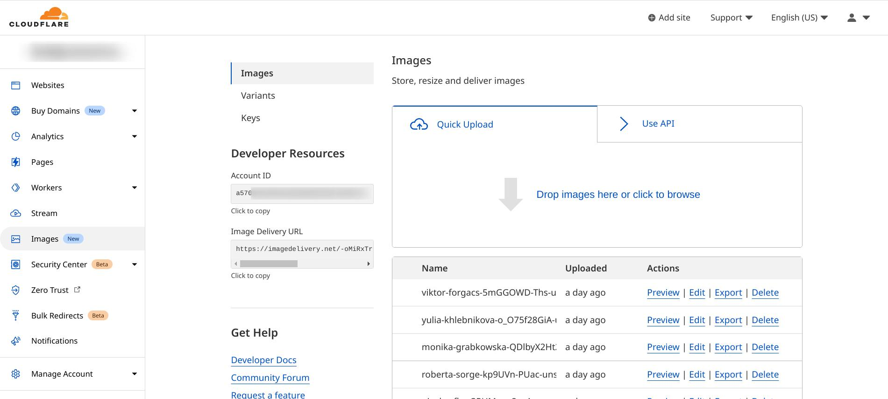

From there we could upload all our website images manually using the dashboard UI.

It turns out that we have a lot of images on our website, so we are rather going to import them in bulk using the [API upload](https://developers.cloudflare.com/images/cloudflare-images/upload-images/custom-id/).

The demo website source code contains a NodeJS script proposing one way to achieve bulk upload to Cloudflare Images in [`scripts/migrate/bulkupload.js`](https://github.com/netgusto/imagejam.net/blob/production/scripts/migrate/bulkupload.js).

Here's a rendition of this script, slightly edited for illustrative purposes:

```js
---
filename: "scripts/migrate/bulkupload.js"
---

// URL where your original images are accessible
const imageOriginURL = "https://imagejam.s3.amazonaws.com/";
const images = [
    "cakes/aliet-kitchen-qrDbj7OV2EU-unsplash-ツ.jpg",
    "cakes/amirali-mirhashemian-cZFU60dKB6U-unsplash.jpg",
    // obtain the list of images to import in any way...
];

bulkUpload();

async function bulkUpload() {
    for(image_name in images) {
        await upload(image_name, process.env.CF_IMAGES_ACCOUNT_ID, process.env.CF_IMAGES_API_KEY);
    }
}

async function upload(imageName, CF_IMAGES_ACCOUNT_ID, CF_IMAGES_API_KEY) {
    // Upload image to Cloudflare Images
    // CF Images will download the image hosted at the provided URL and store it
    // Leverages Upload by URL and Custom ID features of Cloudflare Images
    // see https://developers.cloudflare.com/images/cloudflare-images/upload-images/custom-id/

    console.log(`Uploading to Cloudflare Images: ${imageName}`);

    const body = new FormData();
    // tell CF Images to fetch this image for us
    body.append("url", imageOriginURL + imageName);
    // tell CF Images that we want our image to have this ID (ie, its current name)
    body.append("id", imageName); 

    try {
        const res = await fetch(
            `https://api.cloudflare.com/client/v4/accounts/${CF_IMAGES_ACCOUNT_ID}/images/v1`,
            {
                method: "POST",
                headers: { "Authorization": `Bearer ${CF_IMAGES_API_KEY}` },
                body,
            }
        );

        if (res.status !== 200 && res.status !== 409) {
            throw new Error("HTTP " + res.status + " : " + await res.text());
        }

        if (res.status === 409) {
            // 409: image already exists, imported by a previous run
            console.log("Already exist: " + imageName);
        }
    } catch (e) {
        console.log("ERROR:" + e);
    }
}
```

In a nutshell, this script does 2 things:

* obtain the list of images to migrate to Cloudflare Images,
* for every image, ask the Cloudflare Images API to import the image by URL, keeping its current name.

[Check out the instructions on how to install and run this script on the demo website GitHub repository](https://github.com/netgusto/imagejam.net#migrating-the-website-images-to-cloudflare-images).

If you need Cloudflare Images API credentials, have a look at the section [Aside: Obtain Cloudflare Images API credentials](#aside-obtain-cloudflare-images-api-credentials) below.

## Step 2: Use Cloudflare Images on default delivery domain

Now that our website images [have been imported](#migration-to-cloudflare-images), it turns out they already accessible on Cloudflare Images. Zero setup required!

For instance, our original image `cakes/aditya-joshi--DUN-_bTO2Q-unsplash-ツ.jpg` is served on this URL: <https://imagedelivery.net/-oMiRxTrr3JCvTMIzx4GvA/cakes/aditya-joshi--DUN-_bTO2Q-unsplash-ツ.jpg/public>

  
(*Photo by Aditya Joshi - Unsplash*)

Let's inspect that URL:

```
https://imagedelivery.net/-oMiRxTrr3JCvTMIzx4GvA/cakes/aditya-joshi--DUN-_bTO2Q-unsplash-ツ.jpg/public
<--  default domain   -->/<-- Account hash   -->/<--        our original image file         -->/<-??->
```

* The first part `https://imagedelivery.net` is the default delivery domain for Cloudflare Images.

* Then we have `-oMiRxTrr3JCvTMIzx4GvA`, representing your Cloudflare Images account ID in an obfuscated way; you can get this value in your Cloudflare Images dashboard.

* Then there is our original file name `cakes/aditya-joshi--DUN-_bTO2Q-unsplash-ツ.jpg`; this is the ID of the image we need to be served.

* The last part `public` [represents the variant](https://developers.cloudflare.com/images/cloudflare-images/resize-images/#supported-properties); this is how Cloudflare Images knows what size should the image be served in ([among many other transformation options](https://developers.cloudflare.com/images/cloudflare-images/resize-images/#supported-properties)).

Cloudflare Images ships by default with a single variant named `public`, but you can create many other to fit your needs.

For this tutorial, we created a second variant `thumb`, size `200x200`, fitted with a `cover` crop.

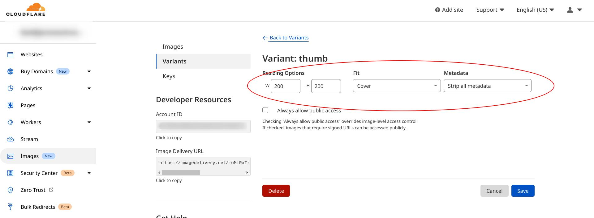

Here is the same image but with the `thumb` variant applied: <https://imagedelivery.net/-oMiRxTrr3JCvTMIzx4GvA/cakes/aditya-joshi--DUN-_bTO2Q-unsplash-%E3%83%84.jpg/thumb>


This variant is used in the thumbnails pages of our website gallery.

### Update the website to use Cloudflare Images

We have seen in the previous section that Cloudflare Images is ready to serve images without further setup.

Let's now update our website to serve images using Cloudflare Images. In our demo Cloudflare Pages website, this is done in [`/config.js`](https://github.com/netgusto/imagejam.net/blob/production/config.js), by adding a build step configuration:

Here's the relevant extract of this file (edited for brevity):

```js
{
    name: "Step 2",
    image_url: function(image_name, variant, config) {
        return "https://imagedelivery.net/" + config.cloudflare_images_account_hash + "/" + image_name + "/" + variant;
    }
},
```

This configuration provides an `image_url` function that used when building the HTML of the website to generate our image URLs; in this case, served by Cloudflare Images on the default delivery domain `https://imagedelivery.net`.

Once deployed, our website now features a Step 2 at <https://imagejam.net/step-2/>.

Browsing the cake gallery page for step 2, <https://imagejam.net/step-2/cakes/>, we can see the thumbnails resized and optimized by Cloudflare Images.

Clicking on an image shows that its URL is as expected <https://imagedelivery.net/-oMiRxTrr3JCvTMIzx4GvA/cakes/aditya-joshi--DUN-_bTO2Q-unsplash-ツ.jpg/public>.

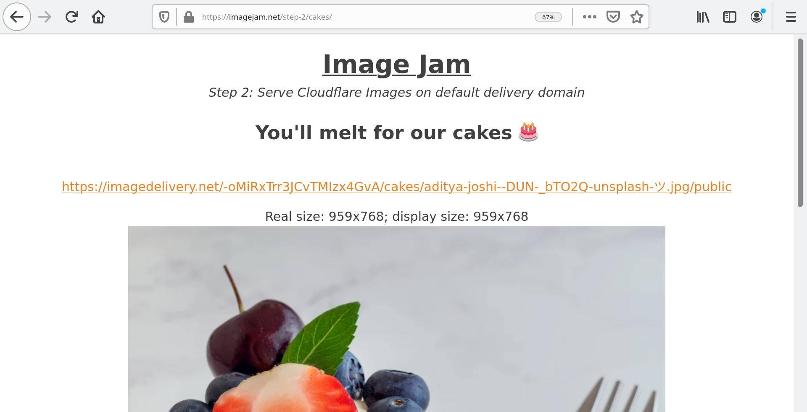

Note as well that the displayed size now matches the real size of the image much more closely, if not perfectly. No more wasted downloaded pixels!

### Adaptive Optimized Format Delivery

Inspecting the details of this image in our browser reveals that Cloudflare Images recompressed our image as AVIF saving close than 50% weight compared to a JPG of the same resolution, while maintaining quality.

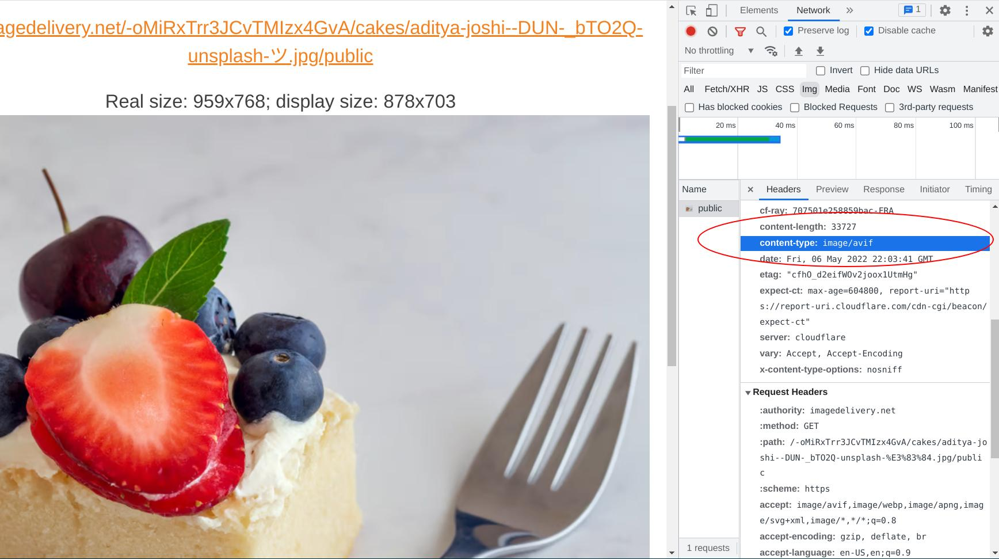

This is because our browser (Google Chrome in the previous screenshot) supports AVIF, and advertises it in the `Accept: image/avif` header it sends to Cloudflare Images while requesting the image.

Another browser not advertising AVIF support (like Firefox) won't get AVIF, but WebP instead.

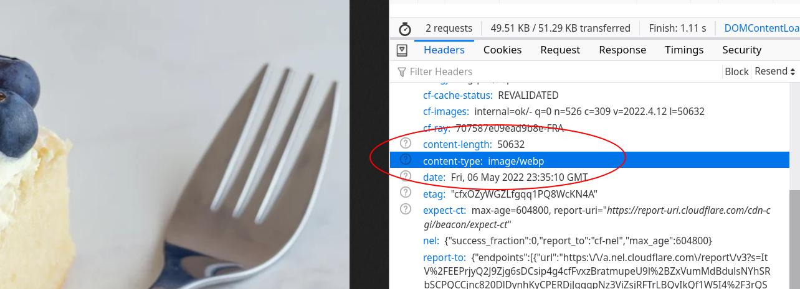

This is another great built-in feature of Cloudflare Images, Adaptive Optimized Format Delivery.

## Step 3: Use Cloudflare Images on custom delivery domain

In [step 2](#step-2-use-cloudflare-images-on-default-delivery-domain), we saw how Cloudflare Images serves images on its default delivery domain.

It turns out that Cloudflare Images can also serve images on your own domain with its [Custom domain](https://developers.cloudflare.com/images/cloudflare-images/serve-images/#serving-images-from-custom-domains) feature, no setup required, provided the domain name is pointing on Cloudflare.

For instance our original image `cakes/aditya-joshi--DUN-_bTO2Q-unsplash-ツ.jpg` can be already be served on this URL: <https://imagejam.net/cdn-cgi/imagedelivery/-oMiRxTrr3JCvTMIzx4GvA/cakes/aditya-joshi--DUN-_bTO2Q-unsplash-ツ.jpg/public>

This URL is similar to those of step 2, with these key differences:

* the domain name is the one of our website `https://imagejam.net` instead of Cloudflare Images default domain `https://imagedelivery.net`

* we have an extra `/cdn-cgi/imagedelivery/` at the beginning of path, allowing Cloudflare to automatically identify this URL as a Cloudflare Image, and serve it accordingly.

### Update the website to use our custom delivery domain

In our demo Cloudflare Pages website, this is done in [`/config.js`](https://github.com/netgusto/imagejam.net/blob/production/config.js), by adding a third build step configuration:

Here's the relevant extract of this file (edited for brevity):

```js
{
    name: "Step 3",
    image_url: function(image_name, variant, config) {
        return config.site_url + "/cdn-cgi/imagedelivery/" + config.cloudflare_images_account_hash + "/" + image_name + "/" + variant;
    }
},
```

Once deployed, our website now features a Step 3 at <https://imagejam.net/step-3/>.

Browsing the cake gallery page for step 3, <https://imagejam.net/step-3/cakes/> and clicking on an image shows that its URL is as expected <https://imagejam.net/cdn-cgi/imagedelivery/-oMiRxTrr3JCvTMIzx4GvA/cakes/aditya-joshi--DUN-_bTO2Q-unsplash-ツ.jpg/public>.

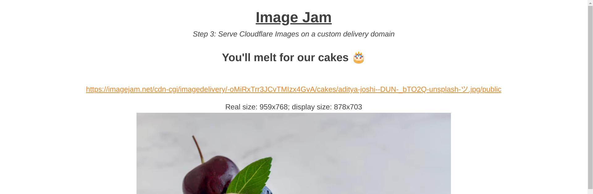

## Step 4: Use Cloudflare Images without changing existing images URLs

So far we integrated Cloudflare Images in our website by **changing** the images URLs to target the Cloudflare Images services.

While this is a great, zero-setup way to optimize your image delivery, you might prefer to have your URLs and website code **unchanged**, and still benefit from all the Cloudflare Images features.

This is possible by having a Cloudflare Worker intercepting the traffic of your unchanged image URLs, transparently relaying it to Cloudflare Images.

The code of our demo Cloudflare Pages website is shipped with such a Worker, [`/images-worker/index.js`](https://github.com/netgusto/imagejam.net/blob/production/images-worker/index.js):

Here's the relevant extract of this file (edited for brevity):

```js
async function handleRequest(request) {
  const url = new URL(request.url);

  const { variant, imageName } = extractVariant(url);
  if (!variant || !imageName) {
    return notFound();
  }

  // Use Cloudflare Images to deliver image ✨
  // by cosntructing the CF Images URL with parts extracted from
  // the original website image URLs that this worker intercepts
  return fetch("https://imagedelivery.net/" + config.cloudflare_images_account_hash + "/" + imageName + "/" + variant, {
    // relay request headers to Cloudflare Images,
    // to inform about the media types accepted by the HTTP client
    headers: request.headers,
  });
}

function extractVariant(url) {
  // takes website URLs like /images/public/cakes/gateau.jpg
  // and identifies the variant (here, "public")
  // and imageName ( here, "cakes/gateau.jpg")
  const parts = url.pathname.replace("/images/", "").split("/");
  const variant = parts.shift();
  return { variant: variant, imageName: parts.join("/") };
}
```

In a nutshell, this code receives HTTP requests for images on they original URLS, and relays them transparently to Cloudflare Images before responding to the HTTP client, effectively proxying traffic between your website and Cloudflare Images.

Once the worker is deployed, our website now uses Cloudflare Images on its original, unchanged URLs. You can see it in effect at <https://imagejam.net/step-4/>.


[See our Workers documentation for instructions on how to publish a worker on your Cloudflare account](https://developers.cloudflare.com/workers/get-started/guide/).

Note: For the worker to intercept trafic on your existing images URLs, it must be mapped to a route matching the URLs of your existing images. This is done in your Workers dashboard, under the tab "Triggers". [See our doc on Workers Routes](https://developers.cloudflare.com/workers/platform/routes/).

In our case, the worker was set up to trigger on the route `imagejam.net/images/*`

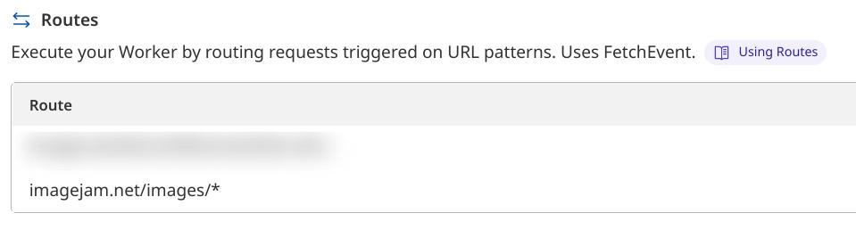

## Conclusion

In this tutorial, we saw how to integrate Cloudflare Images in an existing website.

We saw how low-profile Cloudflare Images can be, requiring zero change on your website HTML or URLs if necessary.

We discovered how Cloudflare Images adapts the format and compression of Images upon delivery depending on the browser capabilities to ensure the best end-user experience possible.

If you enjoyed this tutorial, refer to the [Cloudflare Images Documentation](https://developers.cloudflare.com/images/cloudflare-images/) to learn about the many more features Cloudflare Images has to offer.

## Aside: Obtain Cloudflare Images API credentials

The bulk upload script featured in this tutorial expects to be provided with Cloudflare Images API credentials in the form of 2 environment variables `CF_IMAGES_ACCOUNT_ID` and `CF_IMAGES_API_KEY`.

You can get them both in your Cloudflare dashboard; here's how 👇

#### `CF_IMAGES_ACCOUNT_ID`

This is your Cloudflare Image account ID. Get this value in your Cloudflare Images dashboard:

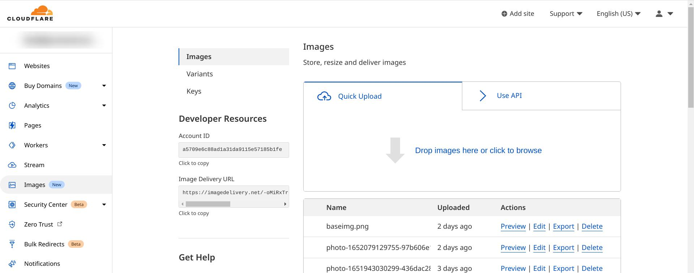

#### `CF_IMAGES_API_KEY`

This value is a Cloudflare API token valid for the account, with Read and Update permissions on Cloudflare Images. See https://developers.cloudflare.com/api/tokens/create/.

On the API tokens page, click on **create token**:

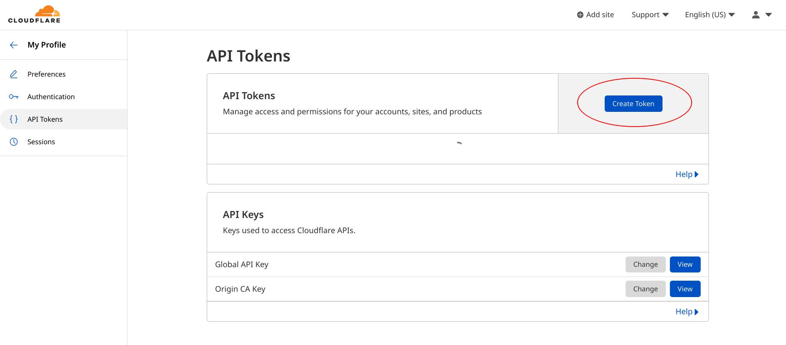

Then click on the button next to **Custom token**:

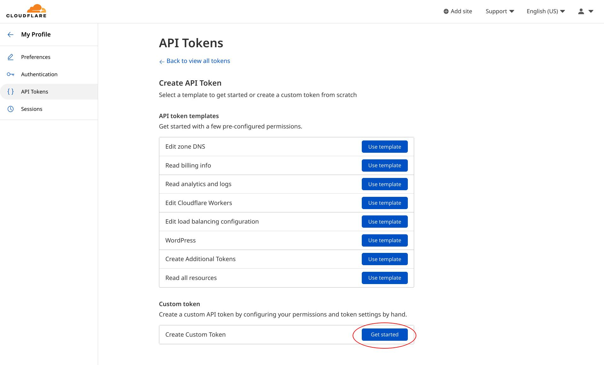

Fill in the API token form as depicted below, and click on **Continue to summary**.

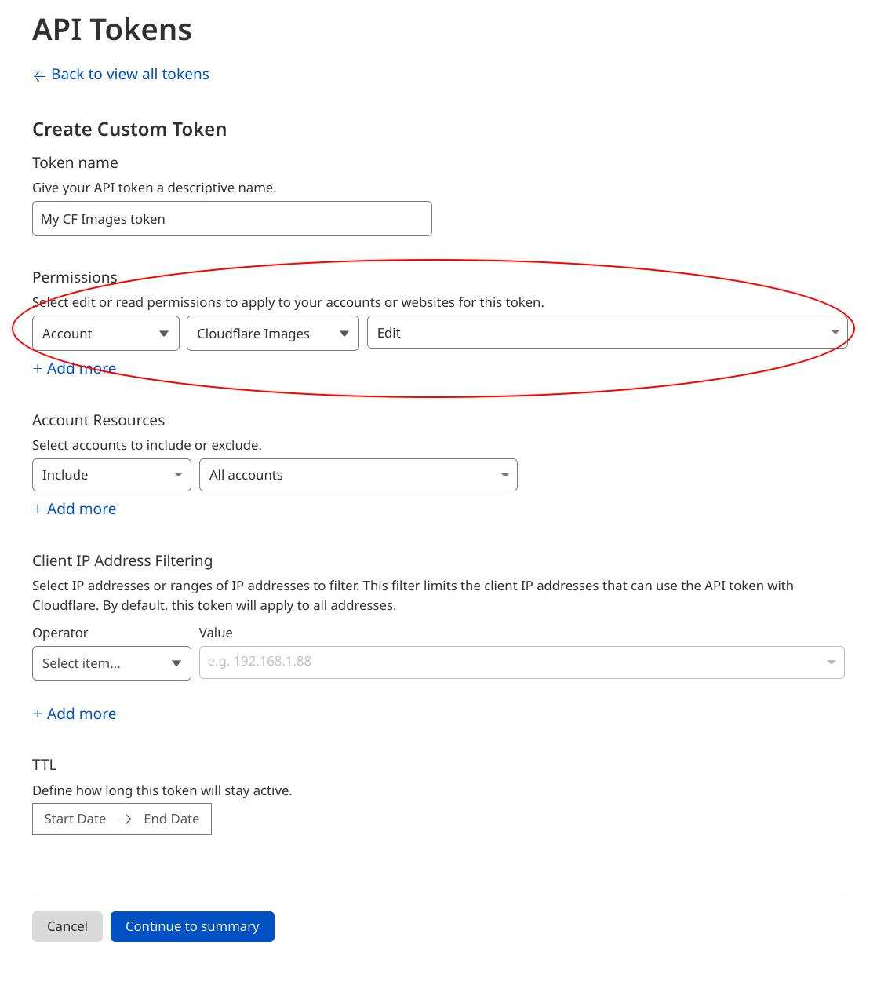

Then confirm your API token, and copy paste the token value. ***Keep it secret, keep it safe!*** It grants access to your Cloudflare Images account.
