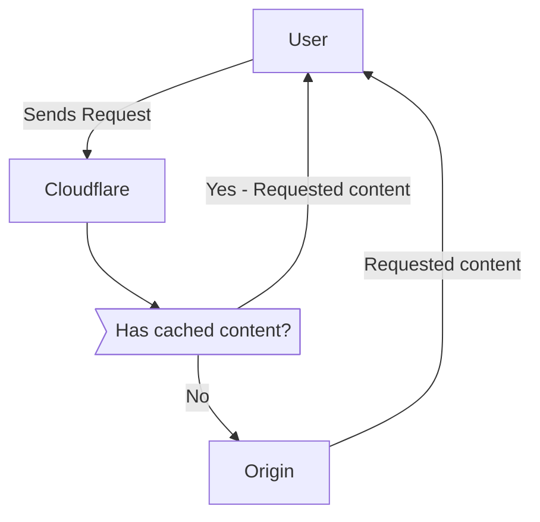

---
_build:
  publishResources: false
  render: never
  list: never
---

```mermaid
flowchart TD;
    User-->|Sends Request|Cloudflare;
    Cloudflare-->B>Has cached content?];
    B-->|Yes - Requested content|User;
    B-->|No|Origin;
    Origin-->|Requested content|User;
```